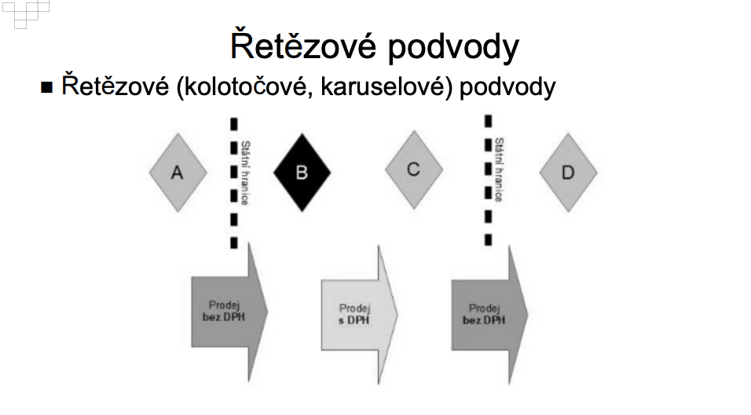

## Zkušební okruhy:

1. Účely daní (fiskální, nefiskální), rovnost ve zdanění - **OK**
2. Fiskální situace států západní civilizace, včetně ČR - **OK**
3. Druhy daní; přehled daňového systému České republiky - **OK**
4. Základní pojmy – předmět daně, základ daně, zdaňovací období, subjekt daně - **OK**
5. Daně z příjmů – charakteristika - **OK**
6. Pojem příjmu, skutečného příjmu, zdánlivého příjmu - **OK**
7. Daňové odpisy – pojem, charakteristika, praktické problémy - **OK**
8. Náklady (výdaje) na dosažení, udržení nebo zajištění příjmu - **OK**
9. Spojené osoby a ceny mezi nimi sjednané z hlediska daní z příjmů - **OK**
10. Pojem „švarcsystému“ a problémy s ním spojené - **OK**
11. Daňový režim při úmrtí daňového subjektu – daň z příjmů fyzických osob, DPH, ostatní daně (dědická aj.) - **OK**
12. Daň z přidané hodnoty – charakteristika, základní pojmy – zdanitelné plnění, odpočet, zdaňovací období, osoba povinná k dani, plátce daně; reverse charge
13. Nejčastější podvody na DPH - **OK**
14. Mezinárodní zdanění – pojem, charakteristika; dohody o zamezení dvojímu zdanění - **OK**
15. ~~Pojistné na sociální zabezpečení - charakteristika~~
16. Spotřební daně, majetkové daně - základní charakteristika - **OK**
17. Právo EU a daně – jakých daní se dotýká, jak se projevuje; přímý a nepřímý účinek - **OK**
18. Pojem zneužití práva, praktické případy - **OK**
19. Daňové tvrzení, důkazní břemeno v daňovém řízení - **OK**
20. Daňová kontrola a jiné instituty pro zjišťování a prověřování daňové povinnosti - **OK**
21. Dokazování v daňovém řízení - **OK**
22. Opravné a dozorčí prostředky v daňovém řízení - **OK**
23. Ochrana daňového subjektu ve správním soudnictví – žaloby a opravné prostředky - **OK**
24. Role judikatury správního, ústavního a evropského soudnictví v daňovém právu - **OK**
25. (Není součástí otázek) Cvičení téma k diskusi - **OK**

## 1. Účely daní (fiskální, nefiskální), rovnost ve zdanění

### Účely daní

- Viz část Co je státní rozpočet?

Obecně se pod pojem účel dá použít pojem funkce, tedy jakou má funkci, za jakým účelem se používá. Tyto účely mohou být:

- fiskální a
- nefiskální.

Samotné funkce pak můžeme rozdělit například na[^1]:

- **FISKÁLNÍ FUNKCE** (fiskální účel)
  - Což je primární funkce daní, mají schopnost naplnit veřejný rozpočet.

- **ALOKAČNÍ FUNKCE** (nefiskální účel)
  - Prostřednictvím daní se můžou dát prostředky tam, kde si stát myslí, že je to potřeba. Stát může poskytovat zvýhodnění prostřednictvím daňových úlev tzv. nepřímou daňovou úlevu nebo usměrnit preference spotřebitelů, kdy např. u očkování – těm, co si ho platí, může snížit daňovou povinnost.

- **REDISTRIBUČNÍ FUNKCE** (nefiskální účel)
  - Daně jsou vhodným nástrojem pro zmírnění rozdílů v důchodech jednotlivých subjektů tím, že se ve větší míře vybírají od bohatších, což umožňuje státu prostřednictvím transferů zvyšovat příjmy chudším.  Vychází se ze základu daně -jestliže roste základ daně pomaleji než daň – progresivní daň. Opakem je pak daň degresivní.

- **STABILIZAČNÍ FUNKCE** (nefiskální účel)
  - Prostřednictvím této funkce mohou daně přispívat např. ke zmírňování cyklických výkyvů v ekonomice. V období konjunktury daně odčerpávají do rozpočtů vyšší díl a zároveň dělají rezervu na horší časy. V období stagnace zase pomáhají ekonomiku nastartovat

- **STIMULAČNÍ FUNKCE** (nefiskální účel)
  - Využívá toho, že daně jsou subjekty vnímány zpravidla jako újma a subjekty jsou ochotny udělat hodně proto, aby svou daňovou povinnost omezily. Stát subjektům poskytuje různé formy daňových úspor anebo naopak je vystavuje vyššímu zdanění, aby podpořil ekonomický růst nebo je motivoval ke spotřebě určitých statků- např.  snižuje podnikatelské riziko tím, že subjektům umožňuje o ztrátu z podnikání v následujících letech snížit základ daně z příjmů nebo existují tzv. „daňové prázdniny“ – forma snížení daně konkrétní osobě za předpokladu, že splní určité podmínky (objem investic, nové technologie, tvorba pracovních míst, …).

- **Další funkce:**
  - Existují i také negativní stimulace, které mají plátce odradit např. vysoké zdanění alkoholu a cigaret - nefiskální účel.

### Co je daň?

- Daň je povinná, nenávratná, zákonem určená platba do veřejného rozpočtu (povinná, nenávratná, neúčelová, neekvivalentní).
- Jde o platbu neúčelovou (v okamžiku platby poplatník neví, na co ji stát použije) a neekvivalentní (to, kolik poplatník na dani zaplatí, není v přímém vztahu s tím, co od státu dostane).
- Jedná se o příjem do veřejného - státního - rozpočtu.

### Co je státní rozpočet?

- Základní funkcí státního rozpočtu je redistribuce národního důchodu (Národní důchod je čistý domácí produkt, měřený důchodovou metodou a po odečtení nepřímých daní z podnikání. (Čistý domácí produkt je hrubý domácí produkt bez odpisů, jež vyjadřují znehodnocení kapitálu.)) související s plněním politických, ekonomických a sociálních úkolů státu.
- Státní rozpočet je centralizovaný peněžní fond, který je vytvářen, rozdělován a používán především s využitím nenávratného a neekvivalentního způsobu rozdělování.

- Státní rozpočet Je schvalován zákonodárnými sbory, a to formou rozpočtového zákona (specifika jsou upravena zákonem 218/2000 Sb. zákon o rozpočtových pravidlech).
- Využití daní (státního rozpočtu):
  - financování provozu státu (obrana státu, školství, zdravotnictví, kultura, státní správa, komunikace a infrastruktura apod.)
  - transferové platby firmám (dotace)
  - transferové platby domácnostem (podpora v nezaměstnanosti, sociální dávky apod.)
  - intervence (náklady na vládní zásahy spojené s řízením a regulací jiných subjektů)
  - platby na úhradu jistiny i úroků z přijatých úvěrů nebo emitovaných státních dluhopisů

### Fiskální a nefiskální účely daní

- Fiskální (veřejný rozpočet) - v podstatě slouží k plnění veřejného rozpočtu.
- Nefiskální - regulace podstaty peněz a peněžního systému[^2]. Dále se za mě může jednat o sociální účely, například přerozdělování v rámci sociální stability a solidarity.

### Výše daní

Otázky:

1. Efektivnost – vliv na ceny ‐ daně mohou  způsobovat velké distorze v cenách a užitku z různých druhů činností
2. Daně – vliv na chování ekonomických subjektů ‐ daně by neměly potlačovat nabídkovou stránku ekonomiky
3. Daňová solidarita – rovnoměrnější rozdělování důchodů než jaké vyplývá z tržních podmínek
4. Působení na makroekonomiku – daně by měly působit pružně a stabilizovat makroekonomiku
5. Právní perfektnost a politická průhlednost – otázka svobody jednotlivce, odkázanost na úřady, nepřehledná pravidla  

## 2. Fiskální situace států západní civilizace, včetně ČR

- Neustálé tlaky na zvyšování výdajů státního rozpočtu
- Rozpočty obvykle deficitní, některé velmi výrazně
- Tlaky na zvyšování příjmů státního rozpočtu:
  - A) zvyšování daní
  - B) efektivnější výběr daní (kontroly finančních orgánů)
  - C) vytváření podmínek pro růst ekonomiky, spotřeby s cílem získat
  - D) zvyšování deficitu
- více prostředků do státního rozpočtu

## 3. Druhy daní; přehled daňového systému České republiky

### Prameny daňového práva

- Nařízení vlády,
- rozhodnutí,
- sdělení,
- usnesení,
- ústavní zákony,
- **vyhlášky** - prováděcí,
- **zákon**,
- zákonné opatření senátu.

Pro zkoušku důležité oblasti jsou napsané **tučně**.

\underline{Vyhlášky:}

Není je třeba znát, důležité je vědět, že určité zákony mají prováděcí vyhlášku, která stanovuje, jak se mají provést.

\underline{Zákony:}

- 280/2009 Sb. daňový řád,
- 353/2003 Sb. zákon o spotřebních daních,
- 235/2004 Sb. zákon o dani z přidané hodnoty,
- 523/1992 Sb. zákon o daňovém poradenství a komoře daňových poradců ČR,
- 243/2000 Sb. zákon o rozpočtovém určení daní,
- 586/1992 Sb. zákon o daních z příjmu,
- 338/1992 Sb. zákon o dani z nemovitých věcí,
- 16/1993 Sb. zákon o dani silniční,
- 563/1991 Sb. zákon o účetnictví.

Existuje samozřejmě další řada zákonů, týkajících se určitým způsobem daní, výše jsou však vyjmenovány ty nejzásadnější.

### Daňová soustava

- Daňová soustava se v Čr dělí na daně:
  - přímé,
  - a nepřímé.

- A) přímé daně ‐ možná přesná definice subjektu, jenž bude tuto daň platit.
  - Její výše bývá stanovována z majetku tohoto subjektu nebo z jeho příjmů.
  - (v posledních létech je tendence  typ daní snižovat na úkor zvyšujícího se podílu nepřímých daní).
  - Přímé daně – dvě skupiny
    - a) Daně z příjmů, (daně z příjmů fyzických i právnických osob)
    - b) Daně majetkové (daň z nemovitostí (jak z pozemků, tak ze staveb), dále daň silniční
  - zrušené daně ‐ daň dědická, darovací a z převodu nemovitostí a daně převodové (daň z nabytí nemovitých věcí)
- B) Nepřímé daně
  - Nepřímá daň je taková daň, kterou státu platí jiná osoba (plátce) než ta, která je této dani podrobena a na kterou účinky daně dopadají (poplatník). Označuje se také jako daň ze spotřeby, neboť daň je zahrnuta v ceně zboží nebo služeb nakupovaných poplatníkem, který tedy tuto daň hradí v rámci úhrady své spotřeby (a státu pak daň zaplatí příslušný obchodník).  
  - Nepřímá daň může být selektivní (např. spotřební daň), která se týká pouze vybraných druhů zboží, nebo univerzální (např. daň z přidané hodnoty), která se týká veškerého zboží - i ta však může být částečně selektivní co se do výše týče, neboť existuje několik stupňů DPH - $10%$, $15%$, $21%$.

### Vlastnosti nepřímých daní

- Vlastnosti nepřímých daní
  - jsou stabilní a předvídatelné, poplatník může změnou svého chování do určité míry ovlivnit výši odvedené daně,
  - jejich výběr je jednodušší než u přímých daní,
  - jsou rovné – pro všechny platí stejná sazba daně,
  - jsou nenápadné, skryté v ceně zboží – vyvolávají tedy u poplatníků méně negativních pocitů.
- Některé vlastnosti však lze z určitých pohledů označit také za nevýhodné:
  - jednorázově zvyšují ceny a krátkodobě zvyšují inflaci
  - deformují ceny
  - jsou nenápadné, skryté v ceně zboží

### Přímé daně

\underline{Daň z příjmu fyzických osob}

- Od zdaňovacího období 2008 byla zavedena jednotná sazba pro daň z příjmů fyzických osob, která je stanovena ve výši $15 %$ (včetně sazby pro výpočet měsíčních záloh u zaměstnanců), u vyšších příjmů sazba
$23 %$ (§16 odst. 1 ZDP - do 48 násobku průměrné mzdy vs nad 48 násobek průměrné mzdy).
- DPFO patří bezesporu k nejsložitějším daním, se kterými se lze setkat.
- Dříve existovala solidární daň - ta byla zrušena a zavedly se dvě sazby.

\underline{Daň z příjmu právnických osob}

- Daňová sazba byla počínaje rokem 2009 stanovena na $20 %$, a od roku 2010 platí tato "firemní (korporátní) daň" ve výši $19 %$ (s výjimkou investičního fondu, podílového fondu, zahraničního fondu kolektivního investování a penzijního fondu, pro které platí 5 procent).
- U příjmů zahrnutých do samostatného základu daně podle § 20b činí sazba daně $15 %$.
  - Do samostatného základu daně se zahrnují veškeré příjmy z podílů na zisku, vypořádacích podílů, podílů na likvidačním zůstatku nebo jim obdobná plnění[^3].
- Od roku 1992, kdy byla sazba $42 %$, do roku 2010 došlo ke snížení daňové sazby o 23 procentních bodů. Ve většině zemí Evropské unie jsou firemní daně o něco vyšší než v ČR.

\underline{Daň silniční}

- Předmětem jsou především vozidla určená k podnikání
- Bez ohledu na to, zda jsou používána k podnikání, jsou předmětem daně vozidla s největší povolenou hmotností alespoň 12 tun určená výlučně k přepravě nákladů a registrovaná v ČR[^4].
- Vozidla používaná výlučně pro osobní potřeby jsou od daně osvobozena.
- Sazby daně jsou stanoveny jako pevně dané roční částky.
- Zákon stanoví také zvláštní poplatek za užívání dálnic, který jsou povinna platit všechna vozidla užívající dálnice bez ohledu na jejich účel (tj. jak vozidla užívaná jak pro účely podnikání, tak i vozidla užívaná pro osobní potřeby)[^5].

\underline{Daň z nemovitých věcí}

- Daní z nemovitých věcí jsou zatíženy pozemky a stavby. Daň z nemovitých věcí nahradila v roce 2014 daň z nemovitostí. Daň je upravena zákonem č. 338/1992 Sb., (ve znění pozdějších předpisů) o dani z nemovitých věcí.

\underline{Zrušená daň: převodové daně}

- Dříve se jednalo o samostatnou daň - daň z převodu nemovitostí - nejdříve platil prodávají, následně byla daňová povinnost přenesena na nabyvatele.
- V současné době podřazena pod daně z příjmu, je možné od ní bý osvobozen - například pokud v ní měl prodávající bydliště nejméně po dobu 2 let bezprostředně před prodejem[^3].

\underline{Daň z nabytí nemovitých věcí‐ v roce 2020 zrušena}

- V souvislosti s rozsáhlými daňovými změnami vznikl nový zákon o dani z nabytí nemovitých věcí, který nahradil dosud existující zákon o dani dědické, darovací a dani z převodu nemovitostí (357/1992 Sb.).  
- **Daň platil nabyvatel nemovitosti**
- Norma k dani z nabytí nemovitých věcí byla přijata Senátem ve formě zákonného opatření č. 340/2013 Sb. na konci roku 2013, vzápětí jej schválila sněmovna a v účinnost vstoupil k 1. lednu 2014 a zrušena 2020. Původní zákon o dani dědické a darovací a dani z převodu nemovitosti byl zrušen. **Zdanění dědictví a darů je nově řešeno v rámci daně z příjmů**.

### Nepřímé daně

\underline{Daň z přidané hodnoty}

- Daň z přidané hodnoty je harmonizována s příslušnými předpisy Evropské unie. Podléhá jí naprostá většina zdanitelného plnění v České republice i zboží z dovozu. Základní sazba daně je aktuálně ve výši $21 %$, snížená sazba daně ve výši $15 %$ (např. vlaky, ubytování v hotelu,  potraviny,, stavební práce týkající se bydlení apod.), druhá snížená ve výši $10 %$ (léky, knihy, kojenecká výživa, noviny, časopisy, jídlo v restauraci, vstupné na kulturní akce).
- Plátci daně (kteří mají registrační povinnost) jsou ti, jejichž  obrat za 12 měs.  přesáhl 1 milion Kč. Daň je placena měsíčně nebo čtvrtletně.
- Drtivá většina zboží a služeb v současnosti podléhá základní sazbě daně.

\underline{Spotřební daň}

- Rovněž spotřební daně jsou harmonizovány s příslušnými směrnicemi EU.
- Spotřebním daním podléhají minerální oleje, líh, pivo, víno a jeho meziprodukty a tabákové výrobky.
- Zdaňovacím obdobím je kalendářní měsíc.
- Daň se stává splatnou, když je zboží uvedeno do volného daňového oběhu, tj. když opustí registrovaný daňový sklad.
- Spotřební daň se řadí mezi nepřímé daně, které jsou státem zaváděny buď za účelem regulace ceny určitých komodit na trhu nebo aby zvýšily příjmy státního rozpočtu.
- Spotřební daně mohou sloužit také jako účinný prostředek ke snižování poptávky po škodlivém zboží, poněvadž spotřební daň v České republice tvoří většinou více jak 50 % ceny zdaněného zboží.
- Plátci daně jsou výrobci a provozovatelé tzv. daňových skladů. Poplatníky jsou pak kupující výrobku, poněvadž daň je obsažena v ceně výrobku. Správu spotřebních daní od roku 2006 vykonává Celní úřad. Daň 
- vychází ze zákona č. 353/2003 Sb. o daních spotřebních, a jeho obsahem je vymezení plátců spotřebních daní a předmětu daně, vznikem daňové povinnosti, metodikou výpočtu a sazbami daně, zdaňovacím obdobím

## 4. Základní pojmy – předmět daně, základ daně, zdaňovací období, subjekt daně

- **Daňový subjekt** – osoba, která je na základě zákona povinna strpět, odvádět nebo platit daň
  - A) poplatník – daňový subjekt, jehož předmět (příjem nebo majetek je podroben dani
  - B) plátce – daňový subjekt, který je na základě zákona daň povinen vybrat od jiných subjektů nebo srazit jiným poplatníkům a pod svou majetkovou odpovědností ji odvést do státního rozpočtu

- **Předmět daně** – jednoznačné a úplné určení rozsahu objektu zdanění
  - Zákonem, kterým se ukládá daňová povinnost
  - **Vynětí z předmětu daně** – deklarace, na co se daň nevztahuje (obvykle pro právní jistotu daňových subjektů
  - X **Osvobození od daně** – daň se na daný předmět daně vztahuje, ale zákonodárce z nejrůznějších důvodů zdaňovat nechce.
  - Osvobození od daně nemusí být jen jednoznačnou výhodou – často má své nevýhody (např.
    - DPH osvobození příjmů z pronájmu nemovitostí zároveň znamená, že plátce si nemůže uplatnit odpočet DPH na vstupu z plnění pořizovaných pro osvobozenou činnost – např. pořízení nemovitosti, vymalování atd.)
    - Daň z příjmů – hmotný majetek, který byl při pořízení osvobozen od daně (např. některý darů) není možno uplatnit z něj do N odpisy tohoto majetku.

- **Základ daně** = předmět daně vyjádřený v měrných jednotkách a upravený
  - podle zákonných pravidel (např. u daně z příjmů příjmy (výnosy) – výdaje
  - (náklady) u podnikatelů, superhrubá mzda u zaměstnanců (= hrubá mzda + sociální a zdravotní pojištění hrazené zaměstnavatelem apod. – superhrubá
  - mzda byla od roku 2021 zrušena)
  - X **odpočet od základu daně** a **odpočet od vyměřené daně**.
- **Zdaňovací období** – časový interval, za který se stanovuje základ daně a výše daně a daň se platí
  - (nejčastěji 1 rok – např. daň z příjmů, daň z nemovitostí, silniční daň),
  - Kratší období – měsíc, čtvrtletí (např. DPH)
  - Bez zdaňovacího období – vážou se na výskyt nějaké skutečnosti – (např. prodej nemovitosti – daň z nabytí nemovitých věcí)

### Zásady správy daní

Správce daně postupuje při správě daní v souladu se zákony a jinými právními předpisy (dále jen „právní předpis“). Zákonem se pro účely tohoto zákona rozumí též mezinárodní smlouva, která je součástí právního řádu.

- Správce daně uplatňuje svou pravomoc pouze k těm účelům, k nimž mu byla zákonem nebo na základě zákona svěřena, a v rozsahu, v jakém mu byla svěřena.
- Správce daně šetří práva a právem chráněné zájmy daňových subjektů a třetích osob (dále jen „osoba zúčastněná na správě daní“) v souladu s právními předpisy a používá při vyžadování plnění jejich povinností jen takové prostředky, které je nejméně zatěžují a ještě umožňují dosáhnout cíle správy daní.
- Osoby zúčastněné na správě daní mají rovná procesní práva a povinnosti.
- Osoby zúčastněné na správě daní a správce daně vzájemně spolupracují.
- Správce daně umožní osobám zúčastněným na správě daní uplatňovat jejich práva a v souvislosti se svým úkonem jim poskytne přiměřené poučení o jejich právech a povinnostech, je‐li to vzhledem k povaze úkonu potřebné nebo stanoví‐li tak zákon.
- Správce daně podle možností vychází osobám zúčastněným na správě daní vstříc. Úřední osoby jsou povinny vyvarovat se při správě daní nezdvořilostí.

- Správce daně postupuje bez zbytečných průtahů.
- Správce daně postupuje tak, aby nikomu nevznikaly zbytečné náklady. Z důvodu hospodárnosti může konat správce daně úkony pro různá řízení společně. Ze spisu, popřípadě z rozhodnutí vydaného na základě těchto úkonů, musí být zřejmé, ke které povinnosti a s jakým výsledkem byly úkony učiněny.
- Správce daně při dokazování hodnotí důkazy podle své úvahy. Správce daně posuzuje každý důkaz jednotlivě a všechny důkazy v jejich vzájemné souvislosti; přitom přihlíží ke všemu, co při správě daní vyšlo najevo.
- Správce daně dbá na to, aby při rozhodování skutkově shodných nebo podobných případů nevznikaly nedůvodné rozdíly.
- Správce daně vychází ze skutečného obsahu právního jednání nebo jiné skutečnosti rozhodné pro správu daní.

- Správa daní je neveřejná. Osoby zúčastněné na správě daní a úřední osoby jsou povinny za podmínek stanovených tímto nebo jiným zákonem zachovávat mlčenlivost o všem, co se v souvislosti se správou daní dozvěděly.

### Daňové principy

TBD.

## 5. Daně z příjmů – charakteristika

### Druhy

- Daň z příjmu fyzických osob,
- daň z příjmu právnických osob,
  - daň z příjmu osob bez právní subjektivity, pro které zákon stanoví daňovou subjektivitu za účelem správy a hrazení daní z příjmu - například svěřenské fondy.

### Poplatníci daně z příjmu FO

- Daňoví rezidenti,
- daňoví nerezidenti - příjmy plynoucí z území Čr.

- Je možné být poplatníkem v paušálním režimu - za splnění zákonem stanovených podmínek - daň se pak hradí paušálně, nikoli ve skutečné výši.

### Předmět daně z příjmu FO

- příjmy ze závislé činnosti - §6 ZDP,
- příjmy ze samostatné činnosti - §7 ZDP,
- příjmy z kapitálového majetku - §8 ZDP,
- příjmy z nájmu - §9 ZDP,
- ostatní příjmy - §10 ZDP.

- Příjem je jak příjem peněžní, tak i nepeněžní, tak i příjem dosažený směnou.
  - Nepeněžní příjem se oceňuje podle právních předpisů upravujících ocenění majetku.

- Zákon definuje taxativně i příjmy, které nejsou předmětem daně z příjmu FO (**vynětí z předmětu daně**):
  - např.
    - úvěry, nebo zápůjčky,
    - vypořádání SJM,
    - vypořádání společného vlastnictví atd.

- Zákon dále definuje příjmy, které jsou od daně osvobozeny (**osvobození od daně**)
  - např.
    - příjem z prodeje nemovitosti, pokud v nich měl prodávající bydliště alespoň podobu 2 let bezprostředně před prodejem
    - přijatá náhrada majetkové, či nemajetkové újmy,
    - příjem ze zvláštních vázaných účtů v bance atd.
  - tento příjem však podléhá oznamovací povinnosti, pokud ve stanoveném období přesáhne částku 5 milionů korun.

- Zákon dále definuje **bezúplatné příjmy**, které jsou rovněž od daně osvobozeny:
  - např:
    - z nabytí dědictví, nebo odkazu,
    - majetek vložen do svěřenského fondu pro případ *mortis causa* atd.

### Základ daně a daňová ztráta

- Základem daně je částka, o kterou příjmy plynoucí poplatníkovi ve zdaňovacím období přesahují výdaje prokazatelně vynaložené na jejich dosažení, zajištění a udržení, pokud dále u jednotlivých příjmů podle § 6 až 10 není stanoveno jinak.
- Pokud poplatníkovi plyne více druhů příjmu, považuje se za základ daně jejich součet.
- Pokud podle účetnictví, daňové evidence nebo podle záznamů o příjmech a výdajích přesáhnou výdaje příjmy uvedené v § 7 a 9, je rozdíl ztrátou. O ztrátu upravenou podle § 23 (dále jen "daňová ztráta") se sníží úhrn dílčích základů daně zjištěných podle jednotlivých druhů příjmů uvedených v § 7 až 10 s použitím ustanovení odstavce 1.

### Příjmy ze závislé činnosti

- Příjmy ze závislé činnosti jsou:
  - příjem z pracovněprávního, služebního nebo členského a podobného poměru (zaměstnanec a zaměstnavatel),
  - funkční požitky - odměna za výkon veřejné funkce - například poslanci[^9].
  - příjmy za práci:
    - člena družstva,
    - společníka společnosti s ručením omezeným,
    - komanditisty komanditní společnosti,
  - odměny:
    - člena orgánu právnické osoby,
    - likvidátora.

Zákon definuje další plnění, které je součástí příjmu ze závislé činnosti, nebo je od něho osvobozeno dále v §6.

### Příjmy ze samostatné činnosti

- příjem ze zemědělské výroby,
- příjem ze živnostenského podnikání,
- příjem z jiného podnikání neuvedeného v písmenech a) a b), ke kterému je potřeba podnikatelské oprávnění,
- podíl společníka veřejné obchodní společnosti a komplementáře komanditní společnosti na zisku,
- příjem z užití nebo poskytnutí práv z průmyslového vlastnictví, autorských práv včetně práv příbuzných právu autorskému, a to včetně příjmů z vydávání, rozmnožování a rozšiřování literárních a jiných děl vlastním nákladem,
- příjem z nájmu majetku zařazeného v obchodním majetku,
- příjem z výkonu nezávislého povolání.

Základem daně (dílčím základem daně) jsou příjmy uvedené v odstavcích 1 a 2 s výjimkou uvedenou v odstavci 6. Tyto příjmy se snižují o výdaje vynaložené na jejich dosažení, zajištění a udržení s výjimkou příjmů uvedených v odstavci 1 písm. d). Pro zjištění základu daně (dílčího základu daně) se použijí ustanovení § 23 až 33.

Výdaje je rovněž možné uplatňovat výdajovým paušálem od 30% až do 80% do maximální výše $600000$ až $1600000$ korun českých.

### Daňová evidence

Daňovou evidencí se pro účely daní z příjmů rozumí evidence pro účely stanovení základu daně a daně z příjmů. Tato evidence obsahuje údaje o

- a) příjmech a výdajích, v členění potřebném pro zjištění základu daně,
- b) majetku a dluzích.

~~Tato je bez dalšího definována předpisy o účetnictví.~~

Daňová evidence je vymezena v ZDP, účetnictví potom v zákoně o účetnictví, určité ustanovení zákona o účetnictví se však subsidiárně použijí i na vedení daňové evidence.

Pod pojmem daňová evidence se rozumí dřívější pojem jednoduchého účetnictví, jedná se tedy stále fakticky o jednodušší formu vedení účetnictví - obsahuje hlavně evidenci příjmů a výdajů a pohledávek a závazků[^10], [^11].

Pokud je subjekt účetní jednotkou, či splní další zákonné předpoklady, musí vést účetnictví podvojné (nově nazývané pouze účetnictví)[^10], [^11].

### Příjmy z kapitálového majetku

Jedná se například o:

- podíly na zisku obchodní korporace nebo podílového fondu, je-li v něm podíl představován cenným papírem, úroky z držby cenných papírů a výnosy dluhopisů podle zákona upravujícího dluhopisy s výjimkou výnosu určeného rozdílem mezi jmenovitou hodnotou dluhopisu a jeho emisním kurzem,
- a jiné obdobné příjmy.

### Příjmy z nájmu

Příjmy z nájmu, pokud nejde o příjmy uvedené v § 6 až 8, jsou

- a) příjmy z nájmu nemovitých věcí nebo bytů,
- b) příjmy z nájmu movitých věcí, kromě příležitostného nájmu podle § 10 odst. 1 písm. a).

### Ostatní příjmy

- Taxativně vymezené zákonem,
  - např:
    - podíl:
      - člena obchodní korporace s výjimkou společníka veřejné obchodní společnosti a komplementáře komanditní společnosti na likvidačním zůstatku, nebo
      - majitele podílového listu z podílu připadajícího na podílový list při zrušení podílového fondu s výjimkou splynutí nebo sloučení podílového fondu.

### Nezdanitelná část základu daně

Od základu daně lze odečíst různé plnění - ty se pak považují za nezdanitelnou část základu daně, jedná se například o:

- sponzoring,
- úvěry ze stavebního spoření, hypotéčního úvěru atd.,
- příspěvky na penzijní připojištění atd.

Tyto hodnoty se odčítají od základu daně.

### Sazba a výpočet pro základ daně

- $15%$ pro příjem, který činí méně než 48 násobek průměrné mzdy,
- $23%$ pro příjem, který činí více než 48 násobek průměrné mzdy.

Daň se vypočte ze základu daně sníženého o nezdanitelné části základu daně a o odčitatelné položky od základu daně a zaokrouhleného na celá sta Kč dolů, a to jako součet součinů příslušné části takového základu daně a sazby pro tuto část základu daně.

Daň poplatníka se vypočte jako součet daně podle § 16 snížené o slevy na dani a daně podle § 16a.

### Zdaňovací období

Zdaňovacím obdobím daně z příjmů fyzických osob je kalendářní rok.

### Poplatníci daně z příjmu právnických osob

Zákon taxativně vymezuje (v §17 ZDP), důležitými poplatníky jsou:

- právnická osoba,
- podílové a investiční fondy,
- svěřenský fond atd.

Mohou být rezidenti a nerezidentni - dle sídla.

Zákon dále upravuje veřejně prospěšného poplatníka (v §17a ZDP) - veřejně prospěšným poplatníkem je poplatník, který v souladu se svým zakladatelským právním jednáním, statutem, stanovami, zákonem nebo rozhodnutím orgánu veřejné moci jako svou hlavní činnost vykonává činnost, která není podnikáním.

Zákon rovněž stanoví taxativně, jací poplatníci nejsou veřejně prospěšným poplatníkem.

### Předmět daně z příjmu právnických osob

- Předmětem daně jsou příjmy z veškeré činnosti a z nakládání s veškerým majetkem, není-li dále stanoveno jinak.
- Zákon taxativně stanoví, jaké příjmy předmětem daně nejsou.
- Zákon dále stanoví, co není předmětem daně u veřejně prospěšného poplatníka (v §18a ZDP), předmětem daně v tomto případě pak není například:
  - příjmy z nepodnikatelské činnosti za podmínky, že výdaje (náklady) vynaložené podle tohoto zákona v souvislosti s prováděním této činnosti jsou vyšší atd.
- zákon dále stanoví (v §18b ZDP) zvláštní ustanovení o předmětu daně osobních společností a jejich společníků.

### Osvobození od daně z příjmu právnických osob

- Zákon stanoví, jaké plnění, či příjmy jsou od daně osvobozeny, jedná se například o členský příspěvek do zájmových sdružení právnických osob, odborových organizací atd.

### Osvobození bezúplatných příjmů od daně z příjmu právnických osob

- Zákon taxativně stanovuje v §19b, jedná se například o:
  - Od daně z příjmů právnických osob se osvobozuje bezúplatný
    - a) příjem z nabytí dědictví nebo odkazu.

### Základ daně a položky snižující základ daně z příjmu právnických osob

- Zákonodárce stanovuje definici základu daně v určitých případech - například pokud je právnická osoba v likvidaci.
- Rovněž taxativně stanovuje položky, které snižují základ daně.

### Samostatný základ daně z příjmu právnických osob

- Zákon stanvuje **základ daně** a odčitatelné položky, nicméně definuje rovněž **samostatný základ daně**, do kterého spadá například:
  - Do samostatného základu daně se zahrnují veškeré příjmy z podílů na zisku, vypořádacích podílů, podílů na likvidačním zůstatku nebo jim obdobná plnění.
- Samostatný základ daně potom představuje společně se základem daně hodnotu použitou pro výpočet daně.

### Sazba a výpočet daně z příjmu právnických osob

- Sazba daně činí 19 %, pokud v odstavcích 2 a 3 není stanoveno jinak. Daň se vypočte jako součin základu daně sníženého o položky snižující základ daně a o odčitatelné položky od základu daně zaokrouhleného na celé tisíce Kč dolů a sazby daně.
- Sazba daně 15 % se vztahuje na samostatný základ daně podle § 20b zaokrouhlený na celé tisícikoruny dolů.
- Zákon dále stanovuje specifickou daňovou sazbu pro jiné poplatníky, jako například pro investiční fond, penzijní společnost atd.

### Zdaňovací období pro daň z příjmu právnických osob

Zdaňovacím obdobím daně z příjmů právnických osob je

- a) kalendářní rok,
- b) hospodářský rok,
- c) období od rozhodného dne fúze nebo rozdělení obchodní korporace nebo převodu jmění na společníka do konce kalendářního roku nebo hospodářského roku, ve kterém se přeměna nebo převod jmění staly účinnými, nebo
- d) účetní období, pokud je toto účetní období delší než nepřetržitě po sobě jdoucích 12 měsíců.

### Daňové přiznání

Pro výpočet samotné daně se podává daňové přiznání.

## 6. Pojem příjmu, skutečného příjmu, zdánlivého příjmu

\underline{Skutečný příjem x zdánlivý příjem x základ daně}

- příjem ve smyslu zákona o daních z příjmů musí být příjmem skutečným, kdy se navýšení majetku musí reálně projevit v právní sféře daňového poplatníka tak, že musí být poplatníkem skutečně využitelné. V opačném případě se jedná pouze o navýšení zdánlivé.
- Je tedy podstatné, zda dochází k navýšení majetku.
- Nemusí jít jen o příjem finanční
- Příklad
- Technické zhodnocení pronajímaného objektu provedeného nájemcem – např. vestavba,  rozhodující pro vznik příjmu  byla právě doba, kdy došlo ke skutečnému obohacení pronajímatelky v důsledku toho, že mohla se svými technicky zhodnocenými nemovitostmi opět volně nakládat (okamžikem ukončení nájemního vztahu)[^6].

- Od pojmu „příjem“ (s jehož existencí je spojena povinnost podání daňového přiznání) je  nutno odlišovat pojem „základ daně“.
  - Základ daně = obvykle příjmy (výnosy) – výdaje (náklady) (u daně z příjmů)
- Fakt, že po odečtení výdajů od příjmů bude základ daně nulový, má důsledek, že poplatníka daně nestíhá žádná daňová povinnost, neznamená to však, že by poplatník žádný příjem nezískal.
- V určitých případech, je možné dosáhnout dokonce daňového zvýhodnění, kdy stát plátci naopak finanční zvýhodnění poskytuje - například pokud má plátce vyživované děti, je třeba to odlišovat od vrácení přeplatku na dani.

- Daním nepodléhají jen peněžní příjmy, ale i nepeněžní
  - Příklad
    - Firma prodá svému zaměstnanci notebook v ceně Kč 30 000 za Kč 1000. Rozdíl 29 000 Kč může být příjem ke zdanění daní z příjmů ze závislé činnosti.
  - Příklad
    - Firma se dohodne se zaměstnancem, že mu kromě jeho běžné mzdy dá každý rok 100 metráků uhlí, protože topí v kamnech. I tento naturální příjem může podléhat zdanění.

### Příjem

Příjem jsou možnosti spotřeby nebo investic, které fyzická nebo právnická osoba získá v určitém časovém období v podobě peněz nebo naturálií. Obvykle se mluví o příjmech u fyzických osob, zatímco u právnických osob se jejich příjem nazývá zisk. Jako jednotlivý příjem se také označuje každá konkrétní částka přijatá fyzickou či právnickou osobou, např. jako protihodnota za práci, služby či zboží[^7].

**Majetková sféra** je souhrn věcí (movitých, nemovitých, hmotných, nehmotných, zastupitelných atd.), které náležejí do majetkové sféry vlastníka a jejíž hodnotu tak úměrně zvyšují. V případě, že se do majetkové sféry dostane nová věc, jedná se o příjem, který může a nemusí podléhat dani.

Tento zastřešující pojem má následně dva zastřešené pojmy, které definují, zda příjem podléhá dani, nebo ne:

- Skutečný příjem - například příjemce plnění[^8] poskytne věc zastupitelnou (subjekt zaplatí za služby, či zboží podnikateli) - toto plnění okamžitě náleží do majetkové sféry podnikatele a ten s ním tak může nakládat - jedná se tedy o skutečný příjem.
- Zdánlivý příjem - viz kapitola níže.

### Skutečný příjem

- Příjmem podléhajícím dani z příjmů  podle zákona  č. 586/1992 Sb., o daních z příjmů, je zvýšení majetku daňového poplatníka.
- Musí se přitom jednat o příjem skutečný, a nikoliv toliko zdánlivý.
- To znamená, že se toto zvýšení majetku musí v právní sféře daňového poplatníka reálně projevit, a to tak, aby bylo pro poplatníka skutečně využitelné.
- Příklad:
  - K nepeněžnímu příjmu vlastníka nemovitosti  nedochází již v okamžiku jejího zhodnocení (zde: rekonstrukce provedená nájemcem na jeho vlastní náklady), nýbrž teprve v okamžiku skutečného obohacení vlastníka, tedy např. v okamžiku ukončení původního nájemního vztahu.

### Zdánlivý příjem

- Příjem zdánlivý je příjem, který se dá považovat jako příjem, nikoli však jako příjem skutečný.
- Příkladem je technické zhodnocení prostor, která poskytovatel přenechává za úplatu k využívání jinému subjektu - nájemci.
- Pokud nájemce zhodnotí pronajímané prostory - tedy zvýší jejich hodnotu - dopadá tato změna do právní majetkové sféry pronajímatele (například za případu, že se nájemce rozhodne technické zhodnocení neodpisovat).
- Toto zhodnocení však nedopadá do majetkové sféry pronajímatele okamžitě - nemůže ho okamžitě využívat, ale až okamžikem ukončení nájemního vztahu - do té doby se tedy jedná o příjem zdánlivý, který nepodléhá dani - je tedy osvobozen od daně[^6].

## 7. Daňové odpisy – pojem, charakteristika, praktické problémy

### Otázky

- výdaj danová povinnost základ daně
- aktiva dlouhodobý hmotný majetek
- aktiva pasiva
- daňová závěrka
- jsou oprávky a odpisy v rozvaze, nebo kde?

### Odpisy

- daňové odpisy
- účetní odpisy

### Účetní odpisy:

- § 28 zákona o účetnictví (č. 563/1991 Sb.)
- § 56 vyhlášky č. 500/2002 Sb.
- Základní charakteristika:
  - účelem účetních odpisů je věrný a poctivý obraz předmětu účetnictví.
  - účetní odpisy si stanovuje účetní jednotka sama ve své interní směrnici[^27]
  - jedná se tedy v podstatě pouze o věrném zobrazení stavu majetku

### Daňové odpisy:

- § 26 - §38fa zákona o daních z příjmů (č. 586/1992 Sb., dále také jen ZDP)
- Základní charakteristika:
  - účelem daňových odpisů je relativně spolehlivě určení daňového základu pro účely výpočtu daně z příjmu
  - daňové odpisy jsou stanoveny přímo zákonem
- S ohledem na výše uvedený rozdílný účel pravidelně dochází k tomu, že daňové odpisy nejsou stejné jako účetní odpisy. V účetnictví se účtují účetní odpisy, daňové odpisy se zohledňují pak přímo až v daňovém přiznání.
- Poznámka: pojem dlouhodobý majetek se používá v účetnictví, pojem hmotný majetek patří do daňové oblasti[^28].

- Odpisuje se hmotný majetek
  - Pojem hmotného majetku - viz § 26/2 ZDP zejména:
    - samostatné movité věci, se vstupní cenou vyšší než 80.000 Kč
    - budovy, jednotky a stavby
    - pěstitelské celky trvalých porostů
    - jiný majetek:
      - technické zhodnocení, pokud nezvyšuje vstupní cenu (viz § 33 ZDP):
      - výdaje na dokončené nástavby, přístavby a stavební úpravy
      - rekonstrukce majetku ( = zásahy do majetku, které mají za následek změnu jeho účelu nebo technických parametrů)
      - modernizace majetku ( = rozšíření vybavenosti nebo použitelnosti majetku).
      - právo stavby (dle § 1240 a násl. občanského zákoníku) (u poplatníka, který nevede účetnictví)

- Hmotným majetkem pro účely tohoto zákona nejsou zásoby, tedy :
  - zboží zakoupené za účelem dalšího prodeje
  - materiál určený k výrobě výrobků nebo jiné spotřebě,
  - rozpracovaná výroba včetně polotovarů a
  - vlastní výrobky určené jednorázově k prodeji

- Odepisovaným hmotným majetkem nejsou pozemky - tj. pozemky se neodepisují (odepisovat lze pouze stavby zřízené na pozemku nebo právo stavby).

- Uvedení do stavu způsobilého obvyklému užívání
  - Odpisováním se pro účely tohoto zákona rozumí:
    - zahrnování odpisů z hmotného majetku do výdajů (nákladů) k zajištění tohoto příjmu.
  - Odpisování lze zahájit po uvedení pořizované věci do stavu způsobilého obvyklému užívání.
    - Uvedení pořizované věci do stavu způsobilého obvyklému užívání = :
      - dokončení věci a
      - splnění technických funkcí a povinností stanovených zvláštními právními předpisy pro užívání

- Hmotný majetek odepisuje vlastník
  - § 28 ZDP
    - Hmotný majetek odepisuje zásadně takový poplatník, který má k němu vlastnické právo.
    - Z této zásady existuje řada výjimek, zejména:
      - Technické zhodnocení pronajatého hmotného majetku, je-li hrazeno nájemcem, může na základě písemné smlouvy odepisovat nájemce, pokud není vstupní cenách u majitele hmotného majetku zvýšena o tyto výdaje

- Odpisování se provádí ze vstupní ceny
  - § 29 ZDP
    - Pokud je majetek pořízen úplatně, vstupní cenou hmotného majetku se rozumí pořizovací cena (cena pořízení + náklady související s pořízením).
    - Pokud byl nemovitý majetek úplatně pořízen fyzickou osobou dříve než 5 let před jeho vložením do obchodního majetku, vstupní cenou hmotného majetku se rozumí reprodukční pořizovací cena (tj. cena určená podle zákona oceňování majetku)
    - Pokud byl movitý majetek úplatně pořízen fyzickou osobou dříve než 1 rok před jeho vložením do obchodního majetku, vstupní cenou hmotného majetku se rozumí reprodukční pořizovací cena (tj. cena určená podle zákona oceňování majetku)

- Pokud je majetek vyroben ve vlastní režii, vstupní cenou hmotného majetku se rozumí vlastní náklady (přímé náklady vynaložené na výrobu, případně i přiřaditelné nepřímé náklady)

- Pokud byl majetek nabyt bezúplatně (například darem), vstupní cenou hmotného majetku se rozumí cena určená ke dni nabytí podle zákona oceňování majetku.

- Odpisové skupiny
  - § 30 ZDP
    - Pro účely odepisování se hmotný majetek v prvním roce odepisování zařídí do odpisových skupiny.
    - Existuje 6 odpisových skupin, které se od sebe liší dobou odpisování. Pro účely určení odpisové skupiny se uplatní přílohač. 1 k zákonu o daních z příjmů.
    - Příklady odpisových skupin:
      - počítač: 1. skupina (doba odpisování 3 roky)
      - osobní automobil: 2. skupina (doba odpisování 5 let)
      - většina budov: 5. skupina (doba odpisování 30 let)
  - Platí (celkem logicky) zásada, že hmotný majetek se odepisuje nejvýše do jeho vstupní ceny.
  - Maximální doba odepisování záleží na odpisové skupině[^29].

- Rovnoměrné nebo zrychlené odpisování
  - Na počátku odepisování každého hmotného majetku má poplatník právo volby vybrat odpisování rovnoměrné nebo zrychlené.
  - Rovnoměrné odpisování je upraveno v § 31 ZDP, zrychlené pak v § 32 ZDP.
  - V obou případech se odepisuje po stejnou celkovou dobu, v případě odpisování zrychleného pouze dochází k tomu, že v prvních letech se odepisuje vyšší než poměrná část, aby pak v závěrečných letech se naopak odepisovalo méně.
    - Zrychlené odpisování je počítáno na základě definovaných koeficientů pro jednotlivé odpisové skupiny.

## 8. Náklady (výdaje) na dosažení, udržení nebo zajištění příjmu

### Daňová uznatelnost výdajů

Je potřeba odlišit příjmy podle §6 ZDP a §7 ZDP (součástí daně z příjmu jsou i další příjmy, jako příjem z kapitálu, z pronájmu atd.).

- Příjem podle §6 ZDP je příjem ze závislé činnosti - zde se nejedná o uznávání výdajů, ~~ale daňový základ lze rovněž snižovat podle §20 ZDP - Základ daně a položky snižující základ daně, popřípadě se~~ (paragraf §20 ZDP se použije pro stanovení daně PO) může se jednat o Nezdanitelnou součást daně (dle §15 ZDP), viz otázka číslo 5.
- Příjem podle §7 ZDP je příjmem ze samostatné činnosti - zde se tedy jedná o daňovou uznatelnost výdajů, neboť v rámci příjmů ze samostatné činnosti existuje stránka příjmová a výdajová a výdaje lze tak definovat jako výdaje snižující daňový základ[^3].

- Za výdaje snižující daňový základ poplatníka lze uznat takové výdaje, které poplatník:
  - 1) skutečně vynaložil,
  - 2) vynaložil v souvislosti se získáním zdanitelných příjmů,
  - 3) vynaložil v daném zdaňovacím období
  - 4) o nichž tak stanoví zákon

- Daňová uznatelnost výdajů
  - V § 24 odst. 1 zákona o daních z příjmů ‐ obecný rámec pro daňovou uznatelnost výdajů.  
    - „Výdaje (náklady) vynaložené na dosažení, zajištění a udržení zdanitelných příjmů se pro zjištění základu daně odečtou ve výši prokázané poplatníkem a ve výši stanovené tímto zákonem a zvláštními předpisy. Ve výdajích na dosažení, zajištění a udržení příjmů nelze uplatnit výdaje, které již byly v předchozích zdaňovacích obdobích ve výdajích na dosažení, zajištění a udržení příjmů uplatněny.“
  - Některé výdaje upravuje konkrétněji §24 odst. 2 zákona o daních z příjmů

### Daňově neuznatelné výdaje

- Především §25 zákona o daních z příjmů
- Např.
  - výdaje na reprezentaci,
  - pokuty od státu,
  - nadlimitní úroky,
  - podíly na zisku,
  - manka a škody nad výši náhrad za ně,
  - výdaje pro osobní potřebu apod.

### Daňové výdaje

- Některé výdaje není možno uznat plně v okamžiku jejich uhrazení, ale rozdělit na více období
  - Pořízení hmotného a nehmotného majetku – odpisy
  - Časové rozlišení nákladů v podvojném účetnictví
  - Nájemné u finančního leasingu

### Ekonomická racionalita

- Stojí proti sobě dva pohledy:
  - a) Nikdo nemůže daňový subjekt (DS) nutit k tomu, aby platil daně v maximální možné míře = právo DS vybrat si z možných zákonných řešení to nejvýhodnější
  - b) Požadavek na ekonomickou racionalitu takových řešení ‐ často je potřeba předložit správci  daně dostatečné důkazy a zdůvodnění, proč  se DS rozhodly právě pro takový postup. Daný postup by měl mít racionální ekonomické zdůvodnění.  (viz též „disimulace právního úkonu“ či „zneužití práva“)

## 9. Spojené osoby a ceny mezi nimi sjednané z hlediska daní z příjmů

### Spojené osoby

- Podklady k přednášce
  - Zákon č. 435/2004 Sb., o zaměstnanosti
  - Zákon č. 280/2009 Sb., daňový řád, zejména §92 a násl. (dokazování), § 98 a násl. (pomůcky a sjednání daně)
  - Zákon č. 586/1992 Sb., o daních z příjmů, zejména § 6, §23/7
  - Burda Zdeněk, Ing., Stanovení daně podle pomůcek, Wolters Kluwer 2010
  - Baxa a kol. Daňový řád – komentář, Wolters Kluwer 2011
  - Burda Zdeněk, Ing., „Švarcsystém“ v daňové judikatuře, Daně a právo v praxi 8/2011
  - Burda Zdeněk, Ing.,  Švarcsystém II ‐ společníci, jednatelé, členové statutárních orgánů a jejich práce pro společnost v daňové judikatuře, Daně a právo v praxi 9/2011
  - BURDA, Zdeněk, Ing., "Švarcsystém" v podmínkách roku 2012. Bulletin Komory daňových poradců  České republiky, 2012, č. 2, s. 14‐16.
  - BURDA, Zdeněk, Ing, "Švarcsystém" v roce 2014“, Bulletin Komory daňových poradců České republiky, 2012, č. 2, s. 10‐18.
  - BURDA, Zdeněk, Ing., Dokazování, Bulletin Komory daňových poradců České republiky, 2013, č. 4, s. 15‐22.

- ~~Struktura přednášky~~
  - ~~Daň z příjmů – vybrané obecné otázky II (spojené osoby a ceny mezi nimi, zneužití práva)~~
  - ~~Daň z příjmů fyzických osob – některé složité případy II (švarcsystém a jeho rozlišení)~~
  - ~~DPH I – podvody na DPH a jak jim čelit, zneužití práva~~
  - ~~DPH II – evropské a vnitrostátní právo a praktické dopady dvouúrovňového právního systému, eurokonformní výklad, přímý a nepřímý účinek evropského práva~~
  - ~~Procesní otázky I – důkazní břemeno, dokazování a pomůcky, dokazování ve vybraných případech (zprostředkování, reklama, manažerské služby aj.)~~
  - ~~Judikatura soudů a její význam pro daňovou praxi~~

- Daň z příjmů – vybrané obecné otázky II (spojené osoby a ceny mezi nimi, zneužití práva)

- Spojené osoby 
  - Spojenými osobami se pro účely tohoto zákona rozumí
    - a) kapitálově spojené osoby, přitom
      - 1) jestliže se jedna osoba přímo podílí na kapitálu nebo hlasovacích právech druhé osoby, anebo se jedna osoba přímo podílí na kapitálu nebo hlasovacích právech více osob; a přitom tento podíl představuje alespoň 25 % základního kapitálu nebo 25 % hlasovacích práv těchto osob, jsou všechny tyto osoby vzájemně osobami přímo kapitálově spojenými,
      - 2) jestliže se jedna osoba nepřímo podílí na kapitálu nebo hlasovacích právech druhé osoby, anebo se jedna osoba přímo nebo nepřímo podílí na kapitálu nebo hlasovacích právech více osob; a přitom tento podíl představuje alespoň 25 % základního kapitálu nebo 25 % hlasovacích práv těchto osob, jsou všechny tyto osoby vzájemně osobami kapitálově spojenými,
    - b) jinak spojené osoby, kterými jsou osoby
      - 1) kdy se jedna osoba podílí na vedení nebo kontrole jiné osoby (např. jednatel),
      - 2) kdy se shodné osoby nebo osoby blízké podílejí na vedení nebo kontrole jiných osob, tyto jiné osoby jsou vzájemně osobami jinak spojenými. Za jinak spojené osoby se nepovažují osoby, kdy je jedna osoba členem dozorčích rad obou osob,
      - 3) ovládající a ovládaná a také osoby ovládané stejnou ovládající osobou, (§74 a násl. zákona o obchodních korporacích - Ovládající osobou je osoba, která může v obchodní korporaci přímo či nepřímo uplatňovat rozhodující vliv – např. většinový společník). Ovládanou osobou je obchodní korporace ovládaná ovládající osobou)
      - 4) blízké, (§22 NOBCZ - Osoba blízká je příbuzný v řadě přímé, sourozenec a manžel nebo partner podle jiného zákona upravujícího registrované partnerství (dále jen „partner“); jiné osoby v poměru rodinném nebo obdobném se pokládají za osoby sobě navzájem blízké, pokud by újmu, kterou utrpěla jedna z nich, druhá důvodně pociťovala jako újmu vlastní. Má se za to, že osobami blízkými jsou i osoby sešvagřené nebo osoby, které spolu trvale žijí.
      - 5) které vytvořily právní vztah převážně za účelem snížení základu daně nebo zvýšení daňové ztráty.

- Spojené osoby
  - Podíl na základním kapitálu nebo podíl s hlasovacím právem ve zdaňovacím období nebo období, za něž je podáváno daňové přiznání, se stanoví jako aritmetický průměr měsíčních stavů.
  - Účast v kontrolní komisi nebo obdobném kontrolním orgánu a provádění kontroly za úplatu se nepovažuje za podílení se na kontrole.

- Cena obvyklá
  - § 23/7 ZDP
    - (7) Liší-li se ceny sjednané mezi spojenými osobami od cen, které by byly sjednány mezi nespojenými osobami v běžných obchodních vztazích za stejných nebo obdobných podmínek, a není-li tento rozdíl uspokojivě doložen, upraví se základ daně poplatníka o zjištěný rozdíl. Nelze-li určit cenu, která by byla sjednávána mezi nespojenými osobami v běžných obchodních vztazích za stejných nebo obdobných podmínek, použije se cena určená podle právního předpisu upravujícího oceňování majetku. Ustanovení věty první a druhé se nepoužije v případě uzavření smlouvy o výprose nebo o výpůjčce a v případě, kdy sjednaná výše úroků z úvěrového finančního nástroje mezi spojenými osobami je nižší, než by byla cena sjednaná mezi nespojenými osobami, a věřitelem je daňový nerezident nebo člen obchodní korporace, který je daňovým rezidentem České republiky nebo poplatník daně z příjmů fyzických osob.

- Cena obvyklá
  - Rozdíl „ceny obvyklé“ u DPH a daně zpříjmů (NSS 7 Afs 102/2006-132 z 10. května 2007)
    - Oba předpisy pro stanovení ceny odkazují na zákon o oceňování majetku. Zákon o DPH v případech specifikovaných v §36a odkazuje na tento zákon přímo jako jediný způsob stanovení základu daně. Zákon o daních z příjmů však nejprve preferuje možnost zjištění „obvyklé“ ceny na trhu, v další fázi pak možnost daňového subjektu správce daně přesvědčit o důvodech „odklonu“ od běžných cen a teprve v případě, že není možno využít těchto postupů, přichází na řadu zákon o oceňování majetku. Zákon o daních z příjmů tak dává podstatně větší prostor pro vyjednávání se správcem daně než zákon o DPH.

- Cena obvyklá
  - Cena obvyklá v intervalu nejčastějších cen (NSS 8 Afs 80/2007 – 105 z 31.3.2009, Sbírka NSS 7/2009 č. 1852/2009)
    - Stanovení ceny obvyklé u nájemného.
    - Sjednaná cena činila v případě prvé smlouvy 2.090 Kč a v případě druhé smlouvy 1.500 Kč. Správce daně provedl sedm místních šetření u jiných daňových subjektů, u kterých zjistil výše nájemného v rozpětí od 747 Kč do 2.727 Kč za 1 m2/rok; průměrná cena nájemného tedy činila 1.466 Kč za 1 m2/rok.

- Cena obvyklá
  - NSS 8 Afs 80/2007 pokrač.:
    - Správce daně jako cenu obvyklou použil aritmetický průměr zjištěných nájmů u dalších („nespojených“) subjektů. Tento postup však nebyl shledán jako správný. Jestliže se totiž ceny ostatních subjektů pohybují v určitém rozpětí, měl by správce daně případný doměrek odvozovat nikoli z rozdílu ceny sjednané průměru ostatních cen „nespojených“ subjektů, ale od ceny na horním rozpětí intervalu cen „nespojených“ subjektů.

- Cena obvyklá
  - 8 Afs 80/2007 – pokrač.II:
    - Určení výše ceny nezávisí na libovůli správce daně.
    - Je na jeho uvážení, které subjekty zahrne do vzorku pro zjištění ceny obvyklé, na druhou stranu však zvolené subjekty musí korespondovat se situací daňového subjektu (osoby blízké či jinak spojené), a své úvahy o výběru musí odůvodnit. Jsou na něj kladeny takové požadavky, aby případné zvýšení daňové povinnosti bylo zákonné a spravedlivé a jeho rozhodnutí přezkoumatelné.

- Cena obvyklá
  - 8 Afs 80/2007 – pokrač.III:
    - V ideálním stavu by proto měl pro výpočet volit subjekty provozující stejnou či alespoň obdobnou podnikatelskou činnost, a to ve stejném čase a po stejně dlouhé období, v prostorách obdobného stavebně technického stavu a polohy v obci a velikost pronajímaných prostor.
    - Dále musí zohlednit, zda jsou v ceně nájemného zahrnuty pouze prostory nebo i vybavení a služby, a nesmí opomenout ani výši nájemného, jaké určil tentýž pronajímatel v jiných případech, kdy druhou smluvní stranou není osoba blízká nebo jinak spojená. Přitom musí vybrat dostatečné množství subjektů, aby na základě jejich údajů mohl učinit dostatečně objektivní a spravedlivý závěr.

- Cena obvyklá
  - 8 Afs 80/2007 – pokrač. IV:
    - Právní věta
      - „Cenu sjednanou nezávislými osobami v běžných obchodních vztazích za stejných nebo obdobných podmínek ve smyslu § 23 odst. 7 zákona č. 586/1992 Sb., o daních z příjmů, nelze obvykle stanovit jediným číslem, ale intervalem nejčastěji realizovaných cen.“

- Cena obvyklá
  - Rozdílné znalecké posudky (NSS 7 Afs 50/2010 – 60 z 1. 7. 2010, Sbírka NSS 11/2010 pod č. 2138/2010)
    - Zveřejněné právní věty
      - I. Stanoví-li zákon o dani z přidané hodnoty, že základ daně je určen hodnotou „ceny zjištěné podle zvláštního právního předpisu bez daně“ (§ 14 odst. 7 zákona č. 588/1992 Sb., o dani z přidané hodnoty), není v kompetenci správního orgánu podle § 31 odst. 4 zákona č. 337/1992 Sb., o správě daní a poplatků, rozhodovat, který znalecký posudek je důkazem v daňovém řízení a který nikoliv.

- Cena obvyklá
  - 7 Afs 50/2010 pokrač.:
    - II. Má-li k téže otázce správce daně k dispozici dva rovnocenné, ale co do závěru odlišné znalecké posudky, nepřísluší mu, aby sám bez dalšího uvážil, který z nich použije pro rozhodná skutková zjištění a který nikoliv. Naopak je povinen odstranit jejich vzájemné rozpory a nesrovnalosti, a to především prostřednictvím výslechu znalce, popřípadě znalců obou. Nevedly-li by tyto výpovědi k ozřejmění vzešlých nejasností, bylo by namístě přistoupit k dalšímu znaleckému zkoumání nebo reviznímu znaleckému posouzení.

- Cena obvyklá
  - Zjištění referenčních cen a důkazní břemeno správce daně (NSS čj. 7 Afs 74/2010 – 81 z 27. ledna 2011, Sbírka NSS 4/2012 pod č. 2548/2012)
    - Správce daně musí prokázat:
      - a) že jde o vzájemně spojené osoby,
      - b) výši „ceny obvyklé“.
    - Jestliže v daném případě byla vzata jako srovnatelná cena pronájmu obdobných prostor, přičemž daňový subjekt tvrdil, že jeho prostory byly v mnohem horším stavu než ty srovnávané, musí skutečnost, že tomu tak nebylo prokázat správce daně a nikoli daňový subjekt!
    - I poté, co tuto skutečnost správce daně prokáže, je třeba dát možnost daňovému subjektu rozdíl odůvodnit, důkazní břemeno zde však již nese DS.

- Cena obvyklá
  - 7 Afs 74/2010 pokrač
    - I. K prokázání, že se liší ceny sjednané mezi spojenými osobami od cen, které by byly sjednány mezi nezávislými osobami v běžných obchodních vztazích za stejných nebo obdobných podmínek (referenční ceny), musí správce daně na základě zjištění výše obou těchto cen provést mezi nimi srovnání. Důkazní břemeno ke všem skutečnostem, které jsou pro to rozhodné, nese správce daně (§ 23 odst. 7 zákona č. 586/1992 Sb., o daních z příjmů)

- Cena obvyklá
  - 7 Afs 74/2010 pokrač.II:
    - II. Referenční cenu může správce daně určit porovnáním skutečně dosažených cen shodné nebo podobné komodity mezi reálně existujícími nezávislými subjekty nebo (zejména pro neexistenci nebo nedostupnost dat o takových cenách) jen jako hypotetický odhad opřený o logickou a racionální úvahu a ekonomickou zkušenost. Referenční cena je v podstatě simulace ceny vytvořená na základě úvahy, jakou cenu by za situace shodné se situací spojených osob tyto osoby sjednaly, nebyly-li by spojené a měly-li by mezi sebou běžné obchodní vztahy.

- Cena obvyklá
  - 7 Afs 74/2010 pokrač. III:
    - III. Pokud správce daně zjišťuje referenční cenu na základě údajů o skutečně dosažených cenách shodné nebo podobné komodity mezi reálně existujícími nezávislými subjekty, musí pečlivě zkoumat, do jaké míry byly tyto ceny dosaženy za stejných nebo obdobných podmínek, za nichž cenu sjednávaly spojené osoby, a pokud se tyto podmínky liší, provést patřičnou korekci (§ 23 odst. 7 zákona č. 586/1992 Sb. zákon o dani z příjmu.).

- Cena obvyklá
  - Prodej automobilu zaměstnanci za neobvykle nízkou cenu a způsob zdanění (NSS 7 Afs 110/2007 – 55 z 26. 2. 2009, Sbírka NSS 10/2011 pod č. 2402/2011)
  - DS požadoval po správci dodanění do ceny obvyklé a navýšení základu daně zpříjmů. Prodal totiž svůj majetek zaměstnancům za nižší než obvyklou cenu a předmětný rozdíl nechtěl zdanit daní z příjmů fyzických osob ze závislé činnosti, ale daní z příjmů právnických osob (z titulu, že prodal spojeným osobám za cenu nižší než obvyklou). Finanční orgány ani soudy jeho názor neakceptovaly a daly přednost zdanění daní z příjmů fyzických osob ze závislé činnosti.

- Cena obvyklá
  - 7 Afs 110/2007 pokrač.:
    - Zveřejněná právní věta:
      - „Skutečnost, že daňový subjekt na základě vlastního rozhodnutí (byť správcem daně aprobovaného ve formě konkludentně vyměřené daně; § 46 odst. 5 ZSDP) nesprávně zdanil předmět daně, nemůže, s poukazem na zásadu zákazu dvojího zdanění, ve výsledku vyloučit možnost provést řádné zdanění v souladu se zákonem. V opačném případě by vyvstala situace, kdy by daňovým subjektem nesprávně zdaněný předmět daně vylučoval provedení zdanění v souladu se zákonem.

- Cena obvyklá
  - 7 Afs 110/2007 pokrač.II:
    - Vzniklý stav, kdy jedna a tatáž hodnota byla zdaněna dvakrát - jednou bez právního důvodu a podruhé v souladu se zákonem, musí být jako neudržitelný napraven, a to cestou dodatečného daňového přiznání podle § 41 citovaného zákona nebo cestou obnovy řízení podle § 54 tohoto zákona; tato náprava je však možná jen v rámci řízení o daňové povinnosti, v němž byl předmět daně nesprávně zdaněn.“

### Zneužití práva

- Zneužití práva
  - Disimulace právního úkonu (§ 2 odst. 7 ZSDP, § 8 odst. 3 DŘ)
  - Zneužití práva (§8 odst. 4 DŘ)
  - Obcházení zákona

- Disimulace
  - § 8 odst. 3 DŘ:
    - „Správce daně vychází ze skutečného obsahu právního úkonu nebo jiné skutečnosti rozhodné pro správu daní.“

- disimulace
  - NSS č. j. 7 Afs 72/2008 – 101 z 15. 1. 2009:
    - „O zakrývání (dissimulaci) ve smyslu ustanovení § 2 odst. 7 ZSDP může jít jen tehdy, pokud účastníci předstírají (simulují) určitý právní úkon, ač jej nechtějí, a zastírají tím právní úkon jiný, který ve skutečnosti chtějí, popř. jím zastírají jinou právní skutečnost; zkoumání poměru mezi vůlí a projevem vůle účastníků právního vztahu je proto pro použití tohoto ustanovení určující. (…)
    - Pouze za situace, kdy je dostatečně jasně prokázáno, že účastníci určitý právní úkon uzavřít nechtěli a zastřeli jím jiný právní úkon (právní skutečnost), který chtěli skutečně uzavřít – tedy je-li prokázána neshoda mezí vůlí a jejím projevem – přichází do úvahy aplikace ustanovení § 2 odst. 7 ZSDP.

- disimulace
  - 7 Afs 72/2008 – 101 – pokrač.:
    - Správce daně až v takovém případě vychází z obsahu dissimulovaného právního úkonu (právní skutečnosti) rozhodného pro stanovení daňové povinnosti.
    - Ustanovení § 2 odst. 7 ZSDP tak proto nemůže zcela logicky dopadat na případy, kdy projev a vůle jsou ve shodě, tedy na případy, kdy účastníci mají skutečný zájem učinit právní úkon, činí tak však z důvodu obcházení zákona.“

- disimulace II.
  - NSS 8 Afs 31/2006‐59 ze dne 16. 8 2007
    - „Pokud se finanční orgány domnívají, že formálně bezvadný právní úkon daňového subjektu je úkonem zastírajícím právní úkon jiný, je na nich, aby tuto skutečnost prokázaly.
    - O takovou situaci se jedná pouze tehdy, pokud účastníci právního úkonu předstírají určitý úkon, ač jej nechtějí, a zastírají tím právní úkon, který ve skutečnosti chtějí, popřípadě jinou právní skutečnost.
    - Jedná se tedy o rozpor mezi vůlí účastníků právního úkonu a jejím projevem, přičemž tato neshoda vůle a jejího projevu je u obou stran právního úkonu stejná a je vědomá.“

- disimulace II.
  - 8 Afs 31/2006-59 – pokrač.:
    - O zastřený právní úkon se naopak nejedná, pokud daňový subjekt nečinil své právní úkony na oko, nepředstíral je a nesnažil se jimi zastřít právní úkony jiné, byť by i svými úkony obcházel zákon či práva zneužil. Povinností finančních orgánů je uvést nejen zjištěný, formálně právním úkonem zakrývaný skutečný stav, ale i přezkoumatelným způsobem uvést úvahy, které je k takovému závěru vedly, včetně označení a zhodnocení důkazů, o které svá zjištění opírají.“

- Zneužití práva – daňový řád
  - Od 1. 4. 2019 novela §8 odst. 4 DŘ:
    - „(4) Při správě daní se nepřihlíží k právnímu jednání a jiným skutečnostem rozhodným pro správu daní, jejichž převažujícím účelem je získání daňové výhody v rozporu se smyslem a účelem daňového právního předpisu.“

- Zneužití práva – pojem, obcházení zákona
  - „Zneužití práva jako chování zdánlivě dovolené, jímž má být dosaženo výsledku nedovoleného.
  - O chování toliko zdánlivě dovolené jde z toho důvodu, že objektivní právo nezná chování zároveň dovolené a zároveň nedovolené; ze zásady lex specialis derogat generali vyplývá, že zákaz zneužití práva je silnější, než dovolení dané právem.
  - Obcházení zákona – podobný pojem – někdo se chová podle právní normy, ale tak, aby záměrně dosáhl výsledku právní normou nepředvídaného a nežádoucího. (KNAPP, Viktor. Teorie práva).

- Zneužití práva – daně v maximální výši?
  - V daňové oblasti v obecné rovině platí, že neexistuje žádná povinnost podnikat takovým způsobem, aby se zvýšil daňový příjem státu. Daňoví poplatníci si mohou uspořádat svoje podnikání tak, aby si snížili svou daňovou povinnost. (NSS 5 Afs 75/2011 – 57 12. prosince 2012 - DS ale stejně prohrál)

- Zneužití práva – kritéria - Halifax
  - ESD C‐255/02 Halifax ze dne  21. 2. 2006
    - a) výsledkem dotčených plnění přes formální použití podmínek stanovených relevantními ustanoveními šesté směrnice (resp. směrnice 2006/112) a vnitrostátních předpisů provádějících tuto směrnici bylo získání daňového zvýhodnění, jehož poskytnutí by bylo v rozporu s cílem sledovaným těmito ustanoveními a
    - b) ze všech objektivních okolností musí vyplývat, že hlavním účelem dotčených plnění je získání daňového zvýhodnění.

- Zneužití práva - kritéria
  - Halifax – pokrač.:
    - Zákaz zneužití přitom není relevantní, pokud dotčená plnění mohou mít jiné odůvodnění než pouhé dosažení daňových zvýhodnění vůči daňovým orgánům.

## 10. Pojem „švarcsystému“ a problémy s ním spojené

### Švarcsystém

- Vymezení švarcsystému
  - Dva subjekty uzavřou obchodní smlouvu, přičemž příslušné úřady mají podezření, že jde o obcházení či zastírání pracovněprávního vztahu nebo o zneužití práva.

- Švarcsystém a související problematika
  - Švarcsystém a zákon o zaměstnanosti
  - Švarcystém v daních
  - definice závislé činnosti
  - disimulace právního úkonu x zneužití práva
  - smluvní volnost
  - dvojí zdanění jednoho příjmu
  - fakturace členů a jednatelů korporace
  - fakturace mezi manžely
  - Švarcsystém mimo vztahy s úřady
  - Budoucnost švarcsystému

- Švarcsystém a zákon o zaměstnanosti
  - č. 435/2004 Sb., o zaměstnanosti - §5 písm. e) nelegální práce (kromě cizinců):
  - výkon závislé práce fyzickou osobou mimo pracovněprávní vztah.
    - Závislá práce je pak definována v zákoníku práce jako práce, která je vykonávána (všechny podmínky najednou):
      - ve vztahu nadřízenosti zaměstnavatele a podřízenosti zaměstnance,
      - jménem zaměstnavatele,
      - podle pokynů zaměstnavatele,
      - a zaměstnanec ji pro zaměstnavatele vykonává osobně.

- Švarcsystém a zákon o zaměstnanosti
  - Závislá práce pak musí být vykonávána za mzdu, plat nebo odměnu za práci, na náklady a odpovědnost zaměstnavatele, v pracovní době na pracovišti zaměstnavatele, popřípadě na jiném dohodnutém místě.
  - Základními pracovněprávními vztahy jsou pracovní poměr a právní vztahy založené dohodami o pracích konaných mimo pracovní poměr (dohoda o pracovní činnosti a dohoda o provedení práce).

- Švarcsystém a zákon o zaměstnanosti
  - a) fyzická osoba – nepodnikatel – pokuta za přestupek do výše 5 mil. Kč (spodní hranice není stanovena),
  - b) fyzická osoba – podnikatel či právnická osoba – pokutu do výše 10 mil. Kč (spodní hranice 50 000)
  - c) fyzická osoba vykonávající nelegální práci (tedy myšlena jako „zaměstnanec“) – hrozí udělení pokuty do Kč 100 000, spodní hranice není stanovena + bude vyřazen krajskou pobočkou Úřadu práce z evidence uchazečů o zaměstnání.

- Švarcsystém a zákon o zaměstnanosti
  - nález pléna Ústavního soudu Pl. ÚS 52/13 ze dne 9. 9. 2014
    - Ústavně nepřípustné jsou přitom takové pokuty, jež mají likvidační charakter, čímž se rozumí i takové případy, v nichž pokuta natolik přesáhne možné výnosy z podnikání, že se podnikatelská činnost v podstatě stává bezúčelnou (tj. směřující pouze k úhradě uložené pokuty).

- Švarcsystém a daň z příjmů
  - § 6 odst. 1, písm. a) bod 1 zákona o daních z příjmů:
    - „*Příjmy ze závislé činnosti jsou plnění v podobě příjmu ze současného nebo dřívějšího pracovněprávního, služebního nebo členského poměru a obdobného poměru, v nichž poplatník při výkonu práce pro plátce příjmu je povinen dbát příkazů plátce*“.

- Vztah zákona o zaměstnanosti a zákona o daních z příjmů
  - NSS 5 Afs 61/2012:
    - „*Eventuální porušení zákona o zaměstnanosti nemůže mít samo o sobě vliv na posouzení, zda jsou předmětné smluvní vztahy zastřenými právními úkony z hlediska daně z příjmů ze závislé činnosti.*“

- Švarcsystém a daň z příjmů
  - Pokyn D 285 MF
    - Zákonné vymezení prostřednictvím pouhého plnění příkazů plátce, se totiž ukázalo a ukazuje jako nedostačující
    - nezbytné stanovit materiální kritéria

- Švarcsystém a daň z příjmů
  - Pokyn D 285 MF – pokrač.:
    - plátce příjmu přímo či nepřímo ukládá úkoly, řídí a kontroluje fyzickou osobu a nese odpovědnost související s její činností, fyzická osoba má ve vztahu k plátci příjmu obdobné postavení jako zaměstnanec,
    - odměna za práci je vypočítána na základě délky pracovní doby nebo obdobným způsobem běžným při odměňování osoby v pracovněprávním vztahu, materiál, pracovní pomůcky, stroje a zařízení potřebné pro výkon činnosti jsou fyzické osobě poskytovány plátcem příjmu,

- Švarcsystém a daň z příjmů
  - Pokyn D 285 MF – pokrač. II:
    - vztah mezi plátcem příjmu a fyzickou osobou je dlouhodobý anebo soustavný, resp. fyzická osoba vykonává činnost dlouhodobě pouze pro jednoho plátce příjmu, a to osobně nebo prostřednictvím spolupracující osoby ve smyslu § 13 zákona o daních z příjmu

- Švarcsystém a daň z příjmů – druhy činnosti
  - NSS 6 Afs 85/2014
    - a) činnosti provozovatelné výlučně jako nezávislá činnost, ať již kvůli zákonné úpravě (např. soudní exekutor, notář) či z povahy věci (s ohledem na rozsah, druh činnosti, např. komplexní výrobní činnosti, určité typy obchodní činnosti, velká realitní kancelář aj.),
    - b) činnosti ryze závislé (např. pokladní supermarketu).

- Švarcsystém a daň z příjmů – druhy činnosti
  - c) činnosti „obojetné“ povahy (drtivá většina menších živnostníků jako zedník, instalatér; svobodná povolání, asistenční činnosti; nejrůznější služby jako účetní, kadeřník atd.),
  - Nejednoznačné spory se pochopitelně z povahy věci vedou zejména o „obojetnou“ kategorii.

- Zneužití práva - švarcsystém
  - NSS č. j. 7 Afs 72/2008 – 101 z 15. 1. 2009:
    - Pokud se smluvní strany rozhodnou, v souladu s obecnými principy (smluvní svoboda, dobrá víra, nezneužívání ekonomicky silnějšího postavení apod.) do právního vztahu vstoupit se všemi důsledky z toho plynoucími a dojde k jeho skutečné realizaci, nejedná se o právní úkon zastřený. Jinak by tomu ovšem bylo, pokud by stěžovatel např. přiměl k uzavření smluv o dílo druhou smluvní stranu za pomoci ekonomického nátlaku, zneužívaje jejich faktické ekonomické závislosti, a přiměl je tak uzavřít takovou smlouvu, kterou ve skutečnosti neměli zájem uzavřít.

- Zneužití práva – švarcsystém I.
  - 7 Afs 72/2008 – 101 – pokrač.:
    - V daném případě nedošlo ani ke zneužití práva. Snaha o minimalizaci nákladů a maximalizaci zisku realizovaná tím, že podnikatel zajišťuje specifické činnosti na základě smluv o dílo uzavřených s reálně ekonomicky samostatnými, i když z hlediska objemu tržeb a vlastního kapitálu nepoměrně slabšími zhotoviteli, je racionálním, nikoho nepoškozujícím, a tedy i právem dovoleným chování.

- Zneužití práva – švarcsystém I.
  - 7 Afs 72/2008 – 101 – pokrač. II.:
    - Aby mohla být činnost považována za závislou, musí být vztah podřízenosti založen přímo, tj. obsahem dvoustranného právního vztahu. V uvedených smluvních vztazích nebyla koordinace a kontrola provádění díla zhotoviteli stěžovatelem prováděna z titulu nadřízeného postavení smluvních stran.

- Zneužití práva – švarcsystém II.
  - NSS 2 Afs 173/2005-69 z 27. 7. 2006
    - Smluvní partneři (bývalí zaměstnanci) pracovali s vlastními pracovními prostředky (např. motorové pily, motyčky, vidle, kosy, ochranné pomůcky), na svoje náklady pořizovali benzín, olej apod. Samostatně se též dopravovali na místo, kde bylo dílo prováděno. Sami si zajišťovali školení potřebné k výkonu své profese.
    - To, že se jedná o vztah trvající povahy, ještě neznamená, že se nutně musí jednat o závislou činnost.

- Zneužití práva – švarcsystém II.
  - NSS 2 Afs 173/2005-69 – pokrač.:
    - koordinace a kontrola provádění díla smluvních partnerů jednateli prováděna z titulu nadřízeného postavení těchto osob
    - dílem může být provedení těžebních činností byť i na jediném stromu a je možné dílčí části díla upřesnit ústně na místě,
    - cenu za provedení díla či jeho částí je možno určit podle odpracovaných hodin,

- Zneužití práva – švarcsystém II.
  - NSS 2 Afs 173/2005-69 – pokrač. II.:
    - Racionálním ekonomickým chováním podnikatele je i snaha o minimalizaci nákladů a maximalizaci zisku. Přirozeným projevem tohoto chování je i snaha o optimalizaci povinností vůči státu
    - Případné porušení zákona o zaměstnanosti nemůže mít vliv na daňové posuzování
    - Ke zneužití práva zde tedy nedošlo

- Zneužití práva – judikatura - OSVČ pracující vedle zaměstnanců
  - NSS 5 Afs 65/2010 – 138 ze dne 30. září 2011 (Sbírka NSS 2/2012 č. 2488/2012)
    - „Nejedná-li se o zneužití daňového práva, nelze náklady vynaložené v souvislosti s výrobou produktů, jejichž prodej je hlavním zdrojem zdanitelných příjmů daňového subjektu, vyloučit z daňově uznatelných výdajů podle § 24 zákona č. 586/1992 Sb., o daních z příjmů, jen z toho důvodu, že se na této výrobě podílely vedle zaměstnanců daňového subjektu také osoby samostatně výdělečně činné.“

- Dvojí zdanění jednoho příjmu
  - Příjem zdanila FO ve svém daňovém přiznání
  - Kontrola doměřila zaměstnavateli švarcsystém
  - Daň tedy zaplacena 2 x
  - Dá se řešit dodatečným DP fyzickou osobou

- Švarcsystém – shrnutí zákl. kritérií
  - Formální znaky závislé práce (pro posouzení závislosti poskytované činnosti nejsou rozhodné formální znaky vztahu mezi poskytovatelem a příjemcem práce, tzn. smluvní typ podle soukromého práva)

- Švarcsystém – shrnutí zákl. kritérií II.
  - Materiální kritéria závislé činnosti
    - typicky práce vykonávaná na jednom místě výhradně pro jednoho zaměstnavatele
    - činnost dlouhodobá
    - a pokud k uzavření pracovněprávního vztahu mělo dojít především v zájmu osoby tuto činnost vykonávající, jejíž právní sféru neuzavření tohoto vztahu v konečném důsledku poškozuje.

- Švarcsystém – shrnutí zákl. kritérií III.
  - o závislou činnost zpravidla nejde:
    - jedná-li se o specializovanou činnost vykonávanou pouze krátkodobě či nesoustavně,
    - jejíž výkon je podmíněn faktory do značné míry nezávislými na vůli zadavatele (např. sezónní práce, práce závislé na počasí, práce podmíněné realizací jednorázově získané zakázky apod.).

- Švarcsystém – shrnutí zákl. kritérií IV.
  - Délka trvání vztahu, pracovní doba
    - To, že se jedná o vztah trvající povahy, ještě neznamená, že se nutně musí jednat o závislou činnost
    - malý podnikatel, který nemá zaměstnance, má velmi podobný fond pracovní doby, respektive fond své podnikatelské činnosti, kterou má k dispozici zaměstnanec
    - Není nutně na závadu ani fakturace podle hodin

- Švarcsystém – shrnutí zákl. kritérií V.
  - Ekonomický nátlak, smluvní svoboda
    - Nepřípustné, pokud by např. smlouva o dílo byla uzavřena pomocí ekonomického nátlaku, zneužívaje faktické ekonomické závislosti jedné smluvní strany na druhé, a uzavření takové smlouvy, kterou ve skutečnosti neměli zájem uzavřít.

- Švarcsystém – shrnutí zákl. kritérií VI.
  - Důležitým faktorem je i materiální samostatnost (vlastní nářadí, materiál, kancelář, automobil, hrazení si nákladů na školení atd. – nemusí být splněno vše najednou)

- Švarcsystém – shrnutí zákl. kritérií VII.
  - ustanovení § 2 odst. 3 zákona č. 262/2006 Sb., zákoník práce - závislá práce - nadřízenost zaměstnavatele a podřízenosti zaměstnance:
  - výlučně osobní výkon práce zaměstnance pro zaměstnavatele, podle pokynů zaměstnavatele, jeho jménem, za mzdu, plat nebo odměnu za práci, v pracovní době nebo jinak stanovené nebo dohodnuté době na pracovišti zaměstnavatele, popřípadě na jiném dohodnutém místě, na náklady zaměstnavatele a na jeho odpovědnost.
  - § 3 ZP - závislá práce může být vykonávána výlučně v pracovněprávním vztahu podle tohoto zákona, není-li upravena zvláštními právními předpisy.

- Švarcsystém – shrnutí zákl. kritérií VIII.
  - Mezí přípustnosti přijímání práce mimo závislou činnost je tak zejména kombinace „podezřelých“ činností (typicky závislých dělnických činností) a ekonomického nátlaku na slabší stranu (typická situace přechodu pracovních vztahů s dřívějšími zaměstnanci na jiné formy poskytování práce).

- Švarcsystém u společníků a jednatelů
  - § 6 odst. 1 písm. b) do příjmů ze závislé činnosti zařazuje: příjmy za práci
    - člena družstva,
    - společníka společnosti s ručením omezeným,
    - komanditisty komanditní společnosti.
  - Podle písm. c) téhož ustanovení pak i odměny člena orgánu právnické osoby (zde se již nehovoří ani o nutnosti pracovat).

- Švarcsystém u společníků a jednatelů
  - zákaz konkurence (§432 nového občanského zákoníku):
  - „Osoba, která vystupuje jako podnikatelův zástupce při provozu obchodního závodu, nesmí bez souhlasu podnikatele činit na vlastní nebo cizí účet nic, co spadá do oboru obchodního závodu. Stane-li se tak, může se podnikatel domáhat, aby se jeho zástupce takového jednání zdržel.“ Může též požadovat náhradu škody apod.

- Švarcsystém u společníků a jednatelů
  - Příklad NSS 6 Afs 9/2003 + IV. ÚS 385/04 advokát:
    - Společník společnosti – advokát, vykonával pro svoji společnost práce, které jí fakturoval. Práce byly vykonávány v prostorách společnosti a s použitím jejích prostředků (telefon, fax apod.). Jeho činnost byla finančními orgány posouzena jako příjem ze závislé činnosti, to potvrdil i NSS a ÚS
    - Na druhé straně ale ÚS konstatoval, že překvalifikování na závislou činnost není ve všech případech automatické - jinak by zřejmě bylo třeba hodnotit situaci, pokud by advokát - ač společník - vykonával pro společnost právní služby na základě mandátní smlouvy, aniž by byl při výkonu této činnosti úzce propojen s obchodní společností.

- Švarcsystém u společníků a jednatelů
  - NSS 2 Afs 4/2005
    - Pokud společníky a jednateli auditorské obchodní společnosti byli za účinnosti zákona ČNR č. 524/1992 Sb., o auditorech a Komoře auditorů České republiky, auditoři s oprávněním podle tohoto zákona, představovaly částky jim vyplacené za auditorskou činnost příjem ze závislé činnosti podle ustanovení § 6 odst. 1 písm. b) zákona ČNR č. 586/1992 Sb., o daních z příjmů.“

- Švarcsystém u společníků a jednatelů
  - NSS 2 Afs 22/2005 Autobazar a příprava vozidel k prodeji prováděná firmou společníka
  - činnost společníka a jednatele s.r.o., byla vyhodnocena jako jiná činnost než je předmět činnosti s.r.o. a byla vykonávána v provozovnách a prostřednictvím zaměstnanců společníka (nikoli tedy v provozovnách či prostřednictvím zaměstnanců s.r.o.).

- Švarcsystém u společníků a jednatelů
  - NSS 2 Afs 24/2010
    - „Pokud společník a jednatel společnosti poskytuje společnosti služby prostřednictvím své živnosti s odlišným předmětem činnosti, kterou provozuje v samostatných provozovnách, vlastními pracovníky a na vlastní náklady, není cena společností jemu zaplacená příjmem ze závislé činnosti ve smyslu § 6 odst. 1 písm. b) zákona č. 586/1992 Sb., o daních z příjmů“

### Fakturace mezi manžely

- Fakturace mezi manžely
  - Společné jmění manželů a fakturace mezi nimi v případě, že jeden z manželů nepodniká (podle rozsudku Nejvyššího správního soudu ze dne 27. 10. 2004, čj. 5 Afs 21/2003-66, zveřejněno ve Sbírce rozhodnutí Nejvyššího správního soudu 9/2006 pod č. 935/2006) Veškeré úvahy a závěry o neuznání výdaje vedl soud teprve poté, co vyloučil, že by mezi manžely šlo v daném případě o podnikatelský vztah. (Přitom obecnou možnost existenci podnikatelského vztahu mezi manžely nevyloučil!)
  - Manželka připravovala pro manžela účetní doklady a vyfakturovala mu tuto práci.

- Fakturace mezi manžely
  - 5 Afs 21/2003-66 pokrač.:
    - Zveřejněné právní věty:
      - I. Jestliže daňový subjekt netvrdil, že smlouvou upravil rozsah společného jmění manželů ve smyslu § 143a a § 144 občanského zákoníku, ani takovou smlouvu nedoložil, musí správce daně za součást společného jmění manželů považovat i prostředky daňového subjektu určené k podnikání. V důsledku toho nemohlo dojít k plnění ze smlouvy o dílo uzavřené mezi daňovým subjektem a jeho manželkou.

- Fakturace mezi manžely
  - NSS 5 Afs 21/2003-66 pokrač. II:
  - II. V případě, kdy daňový subjekt nerozdělí své příjmy z podnikání nebo z jiné samostatné činnosti dle § 13 zákona ČNR č. 586/1992 Sb., o daních z příjmů, je správce daně oprávněn zkoumat, zda výdaj daňového subjektu, tj. částka uhrazená na základě účetního dokladu manželce daňového subjektu za provedené práce (služby), není výdajem na osobní potřebu poplatníka [§ 25 odst. 1 písm. u) citovaného zákona].

- Fakturace mezi manžely
  - NSS 5 Afs 113/2006-70 ze dne 5. září 2007
  - „Úvaha stěžovatele, že zásada rovnosti mezi manžely a institut společného jmění v podstatě brání jejich vzájemné fakturaci, tedy není správná.
  - V dalším řízení bude proto nutné se zaměřit na to, zda byl žalobkyní deklarovaný výdaj skutečně vynaložen v rámci její podnikatelské činnosti (tedy posoudit, zda manžel fakturoval manželce v rámci své podnikatelské činnosti, či zda se pouze podílel na podnikání žalobkyně, a šlo toliko o spolupráci mezi manžely)“

- Fakturace mezi manžely
  - NSS 8 Afs 64/2005-66 ze dne 3. 5. 2007, Sbírka NSS 9/2007 pod č. 1305/2007
    - „Dohodli-li se manželé - podnikatelé na tom, že ve zdaňovacím období roku 1999 jeden bude spolupracovat na podnikání druhého a tuto spolupráci daňově uplatňovat, mohli postupovat jen způsobem upraveným v § 13 zákona ČNR č. 586/1992 Sb., o daních z příjmů, a jen v souladu s tímto ustanovením příjmy a výdaje rozdělit. Dosáhli-li proto manželé příjmů jak z vlastní podnikatelské činnosti, a navíc se podíleli na podnikání druhého, v daňovém přiznání uvedou výši daňových příjmů a výdajů z vlastního podnikání a vykáží i podíl příjmů a výdajů ze spolupráce na podnikání druhého z manželů.“

- Fakturace mezi manžely
  - NSS 8 Afs 64/2005-66 pokrač.:
    - Předmětem fakturace byla spolupráce na odkupu akcií a ve fakturované částce jsou zahrnuty úhrady na cestovné, odpisy automobilu a výplata za uzavřené smlouvy.
    - konkrétní podklady pro fakturaci s manželem nebyly, neboť vycházeli z nákladů na cestovné a z objemu uzavřených smluv.
    - Veškeré smlouvy byly uzavřeny manželovým jménem.
    - Žalobkyně v předmětném zdaňovacím období vystavila pouze tuto jedinou fakturu, jinou podnikatelskou činnost odrážející se v příjmech a výdajích již nevykonávala.

- Fakturace mezi manžely - shrnutí
  - Vztahy mezi manžely:
    - 1) dosahování příjmů za spolupráce druhého z manželů,
    - 2) podnikatelská činnost obou manželů (dříve v rámci sdružení bez právní subjektivity podle ustanovení § 829 a násl. občanského zákoníku) dnes § 2716 a násl obč. zák- - společnost, nebo
    - 3) manžel i manželka provozují vlastní podnikatelskou činnost nezávisle na sobě (a vzájemně si fakturují).

- Fakturace mezi manžely - shrnutí
  - V případě fakturace je vhodné:
    - mít více zákazníků než jen svého manžela,
    - mít vlastní nářadí, materiál, počítač, kancelář apod. a nebude jen využívat majetek, který ve svém podnikání vykazuje manžel, kterému je fakturováno,
    - manželovi nebude fakturovat „spolupráci“, ale konkrétní činnosti či zboží, které fakturuje i ostatním zákazníkům,
    - pokud bude mít stejný předmět činnosti, jako manžel, kterému je fakturováno, tak opět bude vhodné, aby všechny smlouvy se zákazníky nebyly uzavřeny jen na druhého z manželů, ale některé i na fakturujícího manžela.

### Švarcsystém mimo spory s úřady

- NS 21 Cdo 2687/2012 – fotograf v ateliéru
  - nastolen vztah nadřízenosti právního předchůdce žalovaného a podřízenosti žalobce, fotograf vykonával práce podle pokynů žalovaného a jeho jménem, předmětem smlouvy byla opětující se činnost ("práce"), kterou byl žalobce povinen vykonávat osobně, po předem stanovenou dobu a za sjednanou "úplatu", žalovaný poskytoval 4 týdny placeného volna (dovolené) v kalendářním roce" a že evidoval jeho docházku "do zaměstnání – vráceno k dalšímu řízení

- Švarcsystém mimo spory s úřady
  - NS 21 Cdo 920/2010 řidiči České televize
    - Propuštění řidiči nadále pracovali pro ČT jako živnostníci, autoobily však byly vlastnictvím ČT, ta nesla též náklady na údržbu, PHM CCS karty patřící ČT), pojištění atd.
    - Nebylo uznáno jako podnikání

- Švarcsystém mimo spory s úřady
  - Souběh pracovních a obchodních smluv k témuž zaměstnavateli
  - NS 21 Cdo 3862/2012
  - Zaměstnanec dostal výpověď, soudil se úspěšně o vyslovení její neplatnosti.
  - Náležela mu proto náhrada mzdy. V rámci posuzování náhrady mzdy došlo i na zkoumání uzavřené obchodní smlouvy, která byla posouzena jako zastírání reálné pracovní smlouvy.
  - Zaměstnanec měl proto při výpočtu průměrného výdělku pro účely jeho nároků z neplatné výpovědi nárok i na náhradu z „obchodní“ smlouvy, která byla posouzena jako švarcsystém.

- Švarcsystém mimo spory s úřady
  - Švarcsystém a náhrada škody za úraz NS 25 Cdo 5262/2008
    - Živnostník pracoval na stavbě, měl uzavřenou obchodní smlouvu a své činnosti fakturoval. Poté utrpěl na stavbě úraz, změnil názor a tvrdil, že jeho smlouva byla zastřenou pracovní a požadoval náhradu škody podle zákoníku práce. Soudy mu nevyhověly, došly k závěru, že v jeho případě šlo o skutečný obchodní vztah a nikoli o zastřený pracovní.

### Švarcsystém – možný budoucí vývoj

- Omezování výdajových paušálů
- Kontroly
- Další zpřísňování zákonů

## 11. Daňový režim při úmrtí daňového subjektu – daň z příjmů fyzických osob, DPH, ostatní daně (dědická aj.)

- Příjmy v podobě dědictví jsou zcela osvobozeny od daně z příjmů (§4a/a) ZDP)
  - Nevztahují se zde ani dědické třídy
- Daňová povinnost zůstavitele = daňová povinnost do dne předcházejícího dni skončení řízení o pozůstalosti (§ 98-288 zák. č. 292/2013 Sb. - Zákon o zvláštních řízeních soudních)
  - Přechází na dědice rozhodnutím soudu o dědictví – dědic získává postavení DS (§ 239a/3 daňového řádu, dále také DŘ)
- Osoba spravující pozůstalost (správce pozůstalosti, vykonatel závěti, potenciální dědic) - DPH, Silniční daň, Daň z příjmu:
  - Plní po smrti zůstavitele jeho daňové povinnosti, a to vlastním jménem na účet zůstavitele
  - Podat přiznání do 3 měsíců od smrti zůstavitele (§ 239b/4 DŘ)
    - za období přede dnem smrti
  - V průběhu řízení o pozůstalosti
    - Standardní přiznání (do 3 měsíců po uplynutí zdaňovacího období – viz § 136 DŘ)
  - Podat přiznání do 30 dnů ode dne skončení řízení o pozůstalosti (§ 239b/5 DŘ)
    - za období před dnem skončení řízení o pozůstalosti
    - Provedou se zde úpravy dle § 23/8 ZDP
      - (+) Zásoby, (+) Pohledávky
      - (-) Závazky

## 12. Daň z přidané hodnoty – charakteristika, základní pojmy – zdanitelné plnění, odpočet, zdaňovací období, osoba povinná k dani, plátce daně; reverse charge

TBD

## 13. Nejčastější podvody na DPH

- DPH I – podvody na DPH a jak jim čelit, zneužití práva
  - Podvody na DPH
    - Falešné doklady
    - Fiktivní plnění
    - Cena obvyklá
    - Řetězové podvody
    - Zneužití práva

- **Falešné doklady**
  - Falšovaná razítka, podpisy
  - Jednání jménem neexistující firmy
  - Jménem existující firmy jedná neoprávněná osoba, kterou ve firmě neznají

- Fiktivní plnění
  - Doklady obvykle formálně v pořádku
  - Deklarované plnění se neuskutečnilo nebo uskutečnilo v podstatně menším rozsahu

- Cena obvyklá
  - § 36a ZDPH - Základ daně ve zvláštních případech
  - Základem daně je cena obvyklá bez daně, určená ke dni uskutečnění zdanitelného plnění, je-li zdanitelné plnění uskutečněno pro vybrané osoby v případech specifikovaných v tomto ustanovení.

- Cena obvyklá
  - Těmito osobami jsou:
    - a) kapitálově spojené osoby podle s tím, že výše podílu představuje alespoň 25 % základního kapitálu nebo 25 % hlasovacích práv těchto osob,
    - b) jinak spojené osoby (osoby, na jejichž vedení se podílí alespoň jedna shodná osoba) za jinak spojené osoby se nepovažují osoby, kdy je jedna osoba členem dozorčích rad obou osob,
    - c) osoby blízké,
    - d) společníci téže společnosti, jsou-li plátci.

- Řetězové podvody
  - Řetězové (kolotočové, karuselové) podvody

- Řetězové podvody – poctivé subjekty
  - Jak to funguje při poctivých účastnících obchodu
    - Subjekt A prodává subjektu B telefony 100 mil. Kč. Dodání zboží do jiného členského státu je pro něj osvobozeným plněním, uplatní si nárok na odpočet DPH ve svém státě.
    - Subjekt B nakupuje telefony za 100 mil. Kč, vyměří daň 21 mil., současně uplatní nárok na odpočet. Potud daňově neutrální
    - Subjekt B prodává telefony za 100 mil. Kč tuzemskému subjektu C + 21 mil. Kč DPH v běžném režimu.

- Řetězové podvody – poctivé subjekty
  - Subjekt B inkasuje platbu za telefony ve výši 121 mil. Kč od tuzemského subjektu C. V daňovém přiznání uvede 21 mil. Kč DPH na výstupu a daň odvede finančnímu úřadu.
  - Subjekt C prodává subjektu D telefony 100 mil. Kč. Dodání zboží do jiného členského státu je pro něj osvobozeným plněním, uplatní si nárok na odpočet DPH ve svém státě. Finanční úřad pravděpodobně prověřuje situaci a vrací 21 mil. Kč.

- Řetězové podvody – nepoctivé subjekty
  - Jak to funguje při nepoctivých účastnících obchodu
    - Subjekt A prodává subjektu B telefony 100 mil. Kč. Dodání zboží do jiného členského státu je pro něj osvobozeným plněním, uplatní si nárok na odpočet DPH ve svém státě.
    - Subjekt B nakupuje telefony za 100 mil. Kč, vyměří daň 21 mil., současně uplatní nárok na odpočet. Potud stejné a v pořádku

- Řetězové podvody – nepoctivé subjekty
  - Subjekt B prodává telefony za 100 mil. Kč tuzemskému subjektu C + 21 mil. Kč DPH v běžném režimu.
  - Subjekt B inkasuje platbu za telefony ve výši 121 mil. Kč od tuzemského subjektu C. Daňové přiznání buď vůbec nepodává nebo daň nezaplatí. Subjekt zaniká a získaných 21 mil. se ztrácí.
  - Subjekt C prodává subjektu D telefony 100 mil. Kč. Dodání zboží do jiného členského státu je pro něj osvobozeným plněním, uplatní si nárok na odpočet DPH ve svém státě. Finanční úřad váhá, zda mu vrátí 21 mil. Kč. Pokud se prokáže, že o podvodu nevěděl a vědět nemohl, je to stát, kdo tratí.

- Podvody na DPH – obrana státu
  - Daňová přiznání a souhrnná hlášení (když jsme dodali zboží do jiné země EU podnikateli nebo firmě registrovanému/registrované k DPH v jiném státě EU, když jsme poskytli službu s místem plnění v jiné zemi EU)[^25]
  - Přenos daňové povinnosti
  - Nespolehlivý plátce a ručení za daň
  - Zveřejňování účtů pro platbu DPH
  - „Věděl nebo vědět mohl“
  - Od roku 2016 – kontrolní hlášení, elektronická evidence tržeb - některé operace se uvádějí jednotlivě[^26]
  - Zajišťovací příkazy
  - Postupy k odstranění pochybností
  - Kontroly před vyměřením i po vyměření daně

- Nespolehlivý plátce
  - DPH vyměřena/doměřena podle pomůcek opakovaně (min. za 2 zdaňovací období z šesti po sobě jdoucích)
  - byl vydán zajišťovací příkaz (po 1. 1. 2013) na DPH a tento nebyl ve lhůtě uhrazen
  - po dobu nejméně 3 kalendářních měsíců po sobě jdoucích evidován kumulativní nedoplatek na DPH ve výši 500 tis. Kč
  - Nekontaktní DS

- Nespolehlivý plátce
  - § 106a ZDPH:
    - (1) Poruší-li plátce závažným způsobem své povinnosti vztahující se ke správě daně, správce daně rozhodne, že tento plátce je nespolehlivým plátcem.
  - §109 odst. 3 ZDPH:
    - (3) Příjemce zdanitelného plnění ručí za nezaplacenou daň z tohoto plnění, pokud je v okamžiku jeho uskutečnění nebo poskytnutí úplaty na něj o poskytovateli zdanitelného plnění zveřejněna způsobem umožňujícím dálkový přístup skutečnost, že je nespolehlivým plátcem.

- Nespolehlivý plátce
  - neuznání plátcem deklarovaného nároku na odpočet, který byl v důsledku porušení povinností snížen správcem daně minimálně o 500.000,- Kč a související vyměřená/doměřená daň není zcela uhrazena
  - plátce nepodá opakovaně povinná podání na DPH ani na základě výzvy správce daně (DAP DPH/výpis/SH – nepodání 2x v období 12ti měsíců bez řádného odůvodnění).
  - uvedení nepravdivého údaje ohledně skutečného (reálného) sídla – zaměřeno na virtuální a „home-office“ společnosti

- Nespolehlivý plátce
  - Zveřejnění na webu daňové správy
  - Možnost eliminace rizika ručení:
    - Příjemce zdanitelného plnění může vždy využít tzv. „zvláštní způsob zajištění daně“ (§ 109a ZDPH) a uhradit daň, kterou platí v ceně za přijaté plnění přímo Finančnímu úřadu poskytovatele.

- Ručení příjemce zdanitelného plnění
  - DS věděl nebo vědět měl a mohl, že
    - a) daň uvedená na daňovém dokladu nebude úmyslně zaplacena,
    - b) poskytovatel zdanitelného plnění se úmyslně dostal nebo dostane do postavení, kdy nemůže daň zaplatit, nebo
    - c) dojde ke zkrácení daně nebo vylákání daňové výhody.

- Ručení příjemce zdanitelného plnění
  - Příjemce zdanitelného plnění ručí také za nezaplacenou daň z tohoto plnění, pokud je úplata za toto plnění
    - a) bez ekonomického opodstatnění zcela zjevně odchylná od obvyklé ceny,
    - b) poskytnuta bezhotovostním převodem na účet vedený poskytovatelem platebních služeb mimo tuzemsko, nebo
    - c) poskytnuta bezhotovostním převodem na jiný účet než účet poskytovatele zdanitelného plnění, který je správcem daně zveřejněn způsobem umožňujícím dálkový přístup, a pokud úplata za toto plnění překračuje dvojnásobek částky podle zákona upravujícího omezení plateb v hotovosti, (= 2 x 270 000 Kč = Kč 540 000)

- Ručení příjemce zdanitelného plnění
  - Příjemce zdanitelného plnění ručí za nezaplacenou daň z tohoto plnění, pokud je o poskytovateli zdanitelného plnění zveřejněna na internetu finanční správy zveřejněno, že je nespolehlivým plátcem.
  - Příjemce pohonných hmot od distributora pohonných ručí za nezaplacenou daň z tohoto plnění, pokud není o poskytovateli zdanitelného plnění zveřejněna na internetu skutečnost, že je registrován jako distributor pohonných hmot podle zákona upravujícího pohonné hmoty.

## 14. Mezinárodní zdanění – pojem, charakteristika; dohody o zamezení dvojímu zdanění

Mezinárodní právo daňové má stejnou základní charakteristiku jako jakékoliv jiné mezinárodní právo: tvoří jej síť mezinárodních smluv. Současně pak také platí, že mezinárodní smlouvy mají aplikační přednost. To konkrétně znamená, že ustanovení národního zákona o dani z příjmu se nepoužije v rozsahu, v jakém je v rozporu s mezinárodní smlouvou.

- Čl. 10 Ústavy:
  - „Vyhlášené mezinárodní smlouvy, k jejichž ratifikaci dal Parlament souhlas a jimiž je Česká republika vázána, jsou součástí právního řádu; stanoví-li mezinárodní smlouva něco jiného než zákon, použije se mezinárodní smlouva.“
  - => aplikační přednost mezinárodních smluv

- V oblasti daně z příjmu se jedná prakticky o celou řadu bilaterálních smluv, které spolu jednotlivé státy uzavírají za účelem stanovení pravidel zdanění při ekonomických činnostech s mezinárodním prvkem.
- Konkrétně se jedná o tzv. smlouvy o zamezení dvojímu zdanění (Double Tax Treate), jejíž hlavním deklarovaným cílem, jak vyplývá už z jejich názvu, je zabránit tomu, aby jeden a tentýž příjem byl zdaněný dvakrát, tj. aby byl efektivně (tj. zejména bez následných kompenzací) zdaněn ve dvou zemích.
- Samozřejmým současným cílem zúčastněných národních daňových správ je zabránit i tomu, aby docházelo k tzv. dvojímu nezdanění, tj. aby některý příjem nebyl zdaněn v žádné zemi (nebo konkrétněji: nebyl zdaněn ani v jedné ze smluvních zemí).
- ČR má v současné době uzavřenou smlouvu o zamezení dvojímu zdanění s téměř 100 zeměmi světa.
- Pro uzavírání bilaterálních smluv o zamezení dvojího zdanění v současné době se používá zejména model OECD.
- Text vzorové smlouvy OECD spolu s Komentářem ke smlouvě tak představuje podrobný návod ke sjednávání takových smluv a zejména pak jejich interpretaci.

- Systém dohod o zamezení dvojího zdanění:
  - Přehled smluv – viz https://www.mfcr.cz/cs/legislativa/dvojizdaneni/prehled-platnych-smluv
  - OECD: Doporučení Rady týkající se vzorové smlouvy o zamezení dvojího zdanění – viz Sdělení MF čj. 251/15 082/96 ve Finančním zpravodaji 4/1996

- **Princip zdanění v místě zdroje příjmů**
  - Základním dosavadním principem mezinárodního práva daňového v oblasti daně z příjmu je to, že by se každý příjem měl zdanit v zemi svého zdroje.
  - Tedy u každého druhu příjmu je potřeba určit místo (tedy stát) jeho zdroje, a zde (tedy v tomto státě) by pak tento příjem měl být zdaněn.

- **Zdanění celosvětových příjmů v zemi daňového domicilu**
  - Současně by mělo platit, že každý jednotlivý poplatník daně z příjmu by měl mít právě v jedné zemi svůj tzv. daňový domicil (je zde „daňovým rezidentem“), a v této zemi by zdaňována veškeré své celosvětové příjmy.
  - Část těchto příjmů, která má svůj zdroj v druhé zemi, může být současně zdaněna v druhé zemi - takto odvedená daň v druhé zemi pak bude určitým způsobem započtena (nebo celý tento příjem vyňat) vůči celkové dani v zemi daňového domicilu. Tímto způsobem efektivně dojde k vyloučení dvojího zdanění.

- Základní pojmy:
  - **Daňový rezident** (daňový tuzemec) – má celosvětovou daňovou povinnost vůči
  - **Daňový nerezident** (daňový cizozemec) – má pouze omezenou daňovou povinnost: pouze z příjmů ze zdrojů na území státu a z majetku na území státu

- Daňový rezident - fyzická osoba:
  - Určení, v které zemi má osoba daňový domicil, tzn. v které zemi je daňovým rezidentem, spočívá obvykle (podle vzorové smlouvy OECD) zejména na těchto kritériích (uplatňování v tomto pořadí):
    - kde má stálý byt
    - kde má užší osobní a hospodářské vztahy
    - kde se obvykle zdržuje
    - kde státním příslušníkem
  - Úprava daňového rezidenta je obvykle v článku 4 smlouvy o zamezení dvojího zdanění.

- Daňový rezident - právnická osoba:
  - Sídlo skutečného vedení
    - Viz také § 17 odst. 3 ZDP: místo vedení = adresa místa, ze kterého je poplatník řízen
    - místo, kde jsou ve skutečnosti prováděna klíčová řídící a obchodní rozhodnutí, která jsou nezbytná k provádění průmyslové a obchodní činnosti podniku jako celku a která nemohou být na nižších úrovních řízení měněna
    - Obvykle ho tvrdí FÚ, tedy to musí i prokázat

- Zdaňování nerezidentů
  - Pouze příjmy ze zdrojů na území ČR
    - § 22 ZDP + Smlouvy o zamezení dvojího zdanění
    - Smlouvy dá ČR právo + musí být zakotven v českém zákoně
  - Klíčová kritéria:
    - Kde je vykonávána činnost
    - Kdo tento příjem vyplácí
    - Kde je umístěn či využíván majetek

- Zdaňování nerezidentů
  - Příjmy z podnikání
    - Pokud „stálá provozovna“:
      - např. dílna, kancelář, místo k těžbě přírodních zdrojů, místo prodeje (odbytiště),
    - Staveniště: pouze tehdy, pokud splní časový test (3/6/9/12 měsíců):
      - Německo, Rakousko, Polsko, Slovensko: nad 12 měsíců; Rumunsko: nad 9 měsíců; Norsko: nad 6 měsíců
  - „Službová“ stálá provozovna:
    - Německo, Velká Británie, Španělsko: nestanoví
    - Rakousko, Polsko, Slovensko: 6 za 12 měsíců
  - Zdanění: pouze v rozsahu přičitatelném provozovně

- Stálá provozovna
  - Jestliže osoba vykonává svoji podnikatelskou činnost v druhém smluvním státě, mohou být zisky takového podniku zdaněny ve druhém státě.
  - Podmínkou je, že činnost je ve druhém státě vykonávána prostřednictvím tzv. stále provozovny.

- Pojem **stála provozovna** zahrnuje zejména místo vedení části podniku,
  - pobočku, kancelář, továrnu, dílnu a důl (či jakékoliv jiné místo, kde se těží přírodní zdroje).
  - Výraz stála provozovna rovněž zahrnuje staveniště (nebo stavební, montážní nebo instalační projekt nebo dozor), avšak pouze pokud takové staveniště, projekt nebo dozor trvá déle než 12 měsíců (toto období bývá v různých smlouvách upraveno různě).
  - Výraz **stála provozovna** rovněž může zahrnovat (záleží na té které konkrétní smlouvě) poskytování služeb (včetně poradenských nebo manažerských) prostřednictvím zaměstnanců nebo jiných najatých pracovníků, pokud tyto služby trvají na území druhého smluvního státu v úhrnu 6 měsíců jakémkoliv 12 měsíčním období (nebo v závislosti na textu té které konkrétní smlouvy).
  - Smluvní normy týkající se stálé provozovny se obvykle nacházejí v článku 5 smlouvy o zamezení dvojího zdanění.

- **Příjmy ze závislé činnosti**
  - Platy, mzdy a jiné podobné odměny ze zaměstnání, které je vykonáváno ve druhém smluvním státě, mohou být (za splnění určitých podmínek) zdaněny v tomto druhém státě.
  - Úprava zdanění příjmů ze závislé činnosti je obvykle obsahem článku 14 smlouvy o zamezení dvojímu zdanění.

## 16. Spotřební daně, majetkové daně - základní charakteristika

### Spotřební daně

Spotřební daň je nepřímá selektivní daň, kterou zavádí stát za účelem regulovat cenu určitých komodit na trhu. Účelem může být buď zvýšit příjmy státního rozpočtu, nebo snížit prodávané množství zboží, jehož spotřeba je považovaná za škodlivou pro jednotlivce a/nebo pro společnost.

Spotřební daň bývá využívána k politickým či finančním potřebám. Důvodem vedle naplnění státního rozpočtu je i řešení problémů ohledně zdraví a bezpečnosti společnosti, ochrany životního prostředí a v některých zemích i společenské morálky. Vyšší cenou klesá poptávka po výrobcích zasažených touto daní. Příjem putuje zpátky do systému a je využit v oblastech týkajících se stejné tematiky, například odvykací centra pro závislé, protitabákové kampaně, léčba nemocných postižených rakovinou jater, plic, vysazování nových stromů, atd.

### Rozdíl mezi spotřební daní a DPH

Spotřební daň se liší od dani z přidané hodnoty ve dvou důležitých bodech. Je zpravidla selektivní: tzn. platí na nějakou skupinu specifických výrobků, které většinou souvisí se zdravotními riziky nebo s nebezpečím pro životní prostředí. Zatímco DPH se vztahuje na většinu produktů pro spotřebitele v různých výších nebo se jedná o výjimky.

Druhým rozdílem je, že DPH se počítá jako procentuální částka ze základu, který zahrnuje i spotřební daň. Ta je přičítána fixní částkou podle naturální jednotky zboží (resp. minimální částkou). Na fakturách a účtenkách pak DPH lze vidět zvlášť a snadno vyčíst hodnotu, ale u spotřební daně to není možné.

### Spotřební daň v česku

Je definována zákonem o spotřebních daních.

V Česku jsou předmětem daně tabák, alkohol a pohonné hmoty (tvoří většinou více než 50 % ceny zdaněného zboží). Zdaňovací období pro tuto daň je jeden měsíc, pokud ale v tomto měsíci nevznikne povinnost daň přiznat, nemusí se podávat daňové přiznání. Plátci daně jsou výrobci a provozovatelé tzv. daňových skladů. Poplatníky jsou pak kupující výrobku, daň je obsažena v ceně výrobku, jako je tomu například i u DPH. Daň se započítává do základu pro výpočet DPH, tedy nezvyšuje cenu samotného výrobku, ale i hodnotu DPH. Sazby daně jsou většinou stanoveny samostatně pro každý typ výrobku v závislosti na měrných jednotkách (l, kg, ks, ...) a nezáleží na kvalitě surovin a výrobku takového. Od roku 2004 vykonává její správu Celní úřad, do konce roku 2003 správu vykonával Finanční úřad. Spotřební daň tvoří přibližně 14 % státního rozpočtu ČR[^18].

Jednotlivými spotřebními daněmi dle zákona o spotřební dani jsou:

- a) daň z minerálních olejů,
- b) daň z lihu,
- c) daň z piva,
- d) daň z vína a meziproduktů,
- e) daň z tabákových výrobků,
- f) daň ze surového tabáku,
- g) daň ze zahřívaných tabákových výrobků,
- h) daň z elektřiny,
- i) daň z pevných paliv,
- j) daň ze zemního plynu a některých dalších plynů.

Od daně jsou osvobozeny

- tabákové výrobky určené k použití pro zkoušky týkající se kvality výrobku a zkoušky související se zabezpečením kvality měření, nebo nezbytné výrobní zkoušky za podmínky, že tyto tabákové výrobky budou v průběhu zkoušek prokazatelně spotřebovány, zničeny nebo znehodnoceny, a to v technologicky odůvodněném množství. Zkoušky mohou být prováděny pouze v laboratořích akreditovaných podle technické normy ČSN EN ISO/IEC 17025 pro předmět zkoušení tabák nebo tabákové výrobky.
- odebrané jako vzorky celním úřadem, nebo znehodnocené podle pokynů a za přítomnosti úředních osob celního úřadu, nebo zničené za jejich přítomnosti (to se týká pouze tabákových výrobků určených pro vývoz nebo pro dopravu v režimu podmíněného osvobození od daně do jiného členského státu, které současně nejsou způsobilé pro uvedení do volného daňového oběhu na území jiného členského státu nebo třetí země).

Vybrané výrobky, které byly uvedeny do volného daňového oběhu v jiném členském státě a které fyzické osoby nabyly v tomto členském státě pro osobní spotřebu a jsou jimi dopravované na daňové území České republiky, jsou osvobozeny od daně - zákon definuje množství a typ.

### Mechanismus spotřební daně

Spotřební daň se vybírá prodejem kolků pro označení lahví lihovin nebo krabiček od cigaret. Bez těchto kontrolních prvků je zakázané produkty nabízet k prodeji. Výrobce si od státu koupí větší množství tabákových nálepek nebo kontrolních pásků (alkohol), které pak nalepuje na místa tak, aby při otevření produktu došlo k viditelnému poškození. Tyto kolky jsou tisknuty Státní tiskárnou cenin a obsahují mnoho bezpečnostních prvků.

### Majetkové daně

Majetkové daně jsou přímé daně, které se platí v Česku i v jiných státech. Patří sem podle českých právních předpisů daň silniční, daň z nemovitých věcí, která zahrnuje daň z pozemků a daň ze staveb a jednotek, a daň z nabytí nemovitých věcí.

Majetkové daně jsou v českém právu nejstaršími daněmi, neboť na rozdíl od jiných, které prošly na počátku 90. let 20. století bouřlivými změnami, tyto zůstaly z velké části stejné. Zásadnější změny nastaly od 1. 1. 2014, kdy byla zrušena tzv. trojdaň (daň dědická, darovací a z převodu nemovitosti) a namísto ní byla zavedena daň z nabytí nemovitých věcí. Jejich výnosy jsou pro stát malé, avšak stálé; na rozdíl od daní z příjmu či spotřebních daní. Jsou tedy daněmi doplňkovými[^19].

Dělí se do tří kategorií:

- daň z nemovitých věcí (do roku 2014 daň z nemovitostí):
  - daň z pozemků
  - daň ze staveb a jednotek
- daň z nabytí nemovitých věcí (do roku 2014 daň z převodu nemovitostí)
- daň silniční
- (daň dědická, darovací a z převodu nemovitosti tato trojdaň byla zrušena v roce 2014)

### Typy daněného majetku

Čtyři typy daněného majetku jsou pozemek, pozemková úprava (imobilní člověkem vytvořený objekt, např. dům), osobní majetek (mobilní fyzický majetek) a nehmotný majetek. Nemovitost (Real property z Angloamerického práva) je kombinace pozemku a jeho úprav.

Formy majetkové daně se liší podle spadající jurisdikce. Nemovitost je daněna dle toho do jaké skupiny nemovitostí patří. Skupina se určuje podle toho jak se nemovitost používá. Příkladem skupiny nemovitostí jsou např. residenční nemovitosti, komerční nemovitosti, průmyslové nemovitosti a dále volné (prázdné) nemovitosti. Míra zdanění je jiná pro každou skupinu.

Občas se majetková daň zaměňuje s daní zvláštního vyměření (anglicky special assessments tax). Toto jsou dvě různé daně. Majetková daň plyne z tržní hodnoty, zatímco zvláštní vyměřovací daň plyne z speciálního obohacení tzv. „výhody“ pro své ospravedlnění.

### Daň z nemovitých věcí

Výlučným příjemcem výnosů daně jsou obce, zatímco správu daně zajišťuje stát prostřednictvím finančních úřadů.

Každá z uvedených daní se stanovuje samostatně.

Předmětem daně jsou nemovité věci (pozemky, stavby, jednotky), které se nacházejí na českém území a které jsou evidované v katastru nemovitostí.

Zdaňovací období je jeden rok.

Na základě zákona o dani z nemovitých věcí.

Pro daň z pozemků je daň určena jako druh pozemku - na základě toho se určuje sazba a velikosti pozemku.

Pro daň ze staveb je daň určena podle zastavěne plochy v $m^2$.

### Daň z nabytí nemovitosti - soušástí daně z příjmu

Již se neplatí - součástí daní z příjmu.

### Daň silniční

- Předmětem této daně jsou všechna motorová vozidla, která jsou používána k podnikání, a to i když jsou vlastněna soukromými osobami. Poplatníkem i plátcem této daně je provozovatel vozidla, který je zapsán v jeho technickém průkazu.
- Sazba daně je u osobních automobilů stanovena podle objemu motoru, u nákladních automobilů závisí na hmotnosti celého vozidla a počtu náprav. Dříve bylo možné u nákladních vozidel uplatnit slevu dle emisní normy. V současné době se uplatňuje sleva na všechna vozidla dle data registrace – první tři roky 48 %, další tři roky 40% a další tři roky 25 %; u vozidel s první registrací do 31. prosince 1989 se naopak na silniční dani připlácí 25 %.
- Zdaňovacím obdobím je 1 rok, daň se platí ve 4 zálohách (15. dubna, 15. července, 15. října a 15. prosince). Majitel vozidla je povinen do konce ledna následujícího roku podat daňové přiznání[^20].
- Zároveň silniční daň platí provozovatel vozidla s minimální přípustnou technickou hmotností 12 tun.

### Trojdaň

Již se naplatí - součástí daní z příjmu.

## 17. Právo EU a daně – jakých daní se dotýká, jak se projevuje; přímý a nepřímý účinek

- DPH II – evropské a vnitrostátní právo a praktické dopady dvouúrovňového právního systému, eurokonformní výklad, přímý a nepřímý účinek evropského práva

- Evropské a vnitrostátní právo a praktické dopady dvouúrovňového právního systému
  - Evropské právo je na území České republiky bezprostředně použitelné v tom rozsahu, ve kterém není nutné začlenění příslušné normy do národního právního řádu. Evropské právo musí být rovněž přednostně aplikováno v případech rozporu s národní právní normou. Všechny členské státy jsou povinny zajistit aplikaci evropského práva na svém území.

- Evropské a vnitrostátní právo a praktické dopady dvouúrovňového právního systému
  - Nejčastějším právním nástrojem používaným v oblasti nepřímých daní jsou směrnice, jako právní normy závazné pro členské státy, a to svým obsahem a cílem, kterého je nutno dosáhnout.
  - V oblasti DPH to byla tzv. „Šestá směrnice“ 77/388/EHS ‐ byla nahrazena směrnicí 2004/112/ES ze dne 28. 11. 2006, o společném systému DPH (tzv „recast“).
  - Vytyčeného cíle má být dosaženo přijetím příslušné národní právní normy ve lhůtě dané pro implementaci směrnice.
  - Způsob a forma implementace směrnice záleží na rozhodnutí členského státu a na tom, co je v daném členském státě obvyklé při aplikaci obdobných právních norem (ať už se jedná o zákon, vyhlášku, nařízení vlády či jinou formu).

- DPH II – evropské a vnitrostátní právo a praktické dopady dvouúrovňového právního systému, eurokonformní výklad, přímý a nepřímý účinek evropského práva
  - Eurokonformním výkladem nebo také nepřímým účinkem práva Evropské unie (EU) označujeme povinnost soudů členských států vykládat a aplikovat vnitrostátní předpisy v souladu s požadavky práva EU. Povinnost konformního výkladu byla stanovena rozhodovací činností Soudního dvora Evropské unie (SDEU). Nepřímý účinek společně s dalšími principy práva EU, slouží k napomáhání dosahování cílů EU. Meze užití nepřímého účinku práva EU je nutné sledovat nejen v judikatuře SDEU, ale zároveň je užití souladného výkladu limitováno i ústavně konformním výkladem práva jednotlivých členských států

- Přímý a nepřímý účinek evropského práva
  - Přímý účinek směrnice
    - Situace, která umožňuje i jednotlivci se dovolávat ‐ ve zdánlivém rozporu se standardním přístupem ke směrnicím ‐ příslušného ustanovení směrnice a dosáhnout přímé aplikace jejích ustanovení na daný případ při vyloučení rozporných norem národního práva.  
    - Členský stát, který je vázán provést určitou směrnici, a tuto povinnost v dané lhůtě  nesplní, nemůže mít z této okolnosti prospěch, a to zejména tehdy, kdy by tak omezoval subjektivní práva, která komunitární právo zakládá jednotlivci.
    - Z judikatury ESD je rovněž zřejmé, že příslušné ustanovení směrnice, aby mohlo být přímo aplikováno, musí být bezpodmínečné, dostatečně jasné a přesné.

- Přímý a nepřímý účinek evropského práva
  - Přímý účinek směrnice – pokrač.:
  - přímého účinku směrnic se může dovolávat jednotlivec vůči členskému státu, nikoli naopak, protože aplikace přímého účinku je v podstatě proces, který nahrazuje nečinnost nebo nedostatečně kvalitní činnost členského státu při plnění jeho vlastních povinností.

- Přímý a nepřímý účinek evropského práva
  - Nepřímý účinek směrnice
  - Institut eurokonformního výkladu, na jehož základě je možno dle judikatury ESD dosáhnout vyšší účinnosti směrnic, pokud nebyly řádně transponovány do národního práva.
  - Členské státy jsou povinny zajistit řádnou a úplnou implementaci příslušné směrnice do svého národního právního řádu, tj. jsou povinny zajistit realizaci cíle sledovaného směrnicí. 

- Přímý a nepřímý účinek evropského práva
  - Nepřímý účinek směrnice – pokrač.:
  - Národní právní norma, která byla přijata za účelem transpozice příslušné směrnice, musí být v maximální možné míře vykládána ve světle znění a účelu dotčené směrnice, tj. tak, aby bylo dosaženo cíle stanoveného směrnicí, a tak byla naplněna povinnost vyplývající ze Smlouvy o EU.
  - Výklad v této formě je v zásadě založen na fikci, že členský stát měl v úmyslu řádně splnit své povinnosti vyplývající ze Smlouvy o EU a eurokonformní řešení by se mělo uplatnit bez ohledu na jiné možnosti interpretace takové normy.

- Eurokonformní výklad
  - Je povinný nejen pro soudy, ale i pro správce daně a podobné orgány
  - Občan, podnikatel, daňový subjekt:
    - a) bude se řídit tuzemskou právní úpravou
    - b) bude trvat na aplikaci eurokonformního výkladu

- Eurokonformní výklad u soudu
  - a) národní soud je schopen aplikovat sám
  - b) položení předběžné otázky SDEU
  - U ESD (SDEU)  se řeší nejrůznější oblasti (např. provozování hracích automatů x nájem prostoru pro automat, možnost být přítomen výslechu svědka v zahraničí, nárok na úrok v případě včasného nevrácení odpočtu DPH apod.)

## 18. Pojem zneužití práva, praktické případy

Rozdíl mezi:

- **disimulace právního úkonu** - (§2 odst. 7 ZSDP, §8 odst. 3 DŘ) - prokazuje finanční úřad - švarcsystém
  - O zakrývání (dissimulaci) ve smyslu § 2 odst. 7 zákona ČNR č. 337/1992 Sb., o správě daní a poplatků, může jít jen tehdy, pokud účastníci předstírají (simulují) určitý právní úkon, ač jej nechtějí, a zastírají tím právní úkon jiný, který ve skutečnosti chtějí
  - Příklad:
    - Finanční úřad v Třebíči vyměřil žalobci dne 10. 4. 2001 dodatečně za zdaňovací období roku 1996 daň z příjmů právnických osob ve výši 926 640 Kč, neboť posoudil transakci žalobce – ten vložil do nově vzniklé společnosti P. pohledávky evidované ve svém účetnictví a tímto způsobem splatil svůj obchodní podíl, který pak následující den prodal společnosti D. za cenu ve výši 1 % hodnoty těchto pohledávek, a v jejímž důsledku vykázal účetní ztrátu, kterou byl snížen hospodářský výsledek za rok 1996 – podle § 2 odst. 7 d. ř. tak, že šlo o dopředu naplánovanou a účelovou transakci, provedenou se záměrem snížit daňovou povinnost, kdy formálním vložením pohledávek a následným prodejem došlo k zastřenému postoupení nedobytných a obtížně vymahatelných pohledávek a ve své podstatě k zastřenému odpisu těchto pohledávek do nákladů, ve snaze vyloučit postup podle § 24 odst. 2 písm. a) a § 25 odst. 1 písm. z) zákona ČNR č. 586/1992 Sb., o daních z příjmů (dále též „zákon o daních z příjmů“)[^23].
- **zneužití práva** (§8 odst. 4 DŘ) - prokazuje finanční úřad
  - (1) Správce daně při dokazování hodnotí důkazy podle své úvahy. Správce daně posuzuje každý důkaz jednotlivě a všechny důkazy v jejich vzájemné souvislosti; přitom přihlíží ke všemu, co při správě daní vyšlo najevo.
  - (2) Správce daně dbá na to, aby při rozhodování skutkově shodných nebo podobných případů nevznikaly nedůvodné rozdíly.
  - (3) Správce daně vychází ze skutečného obsahu právního jednání nebo jiné skutečnosti rozhodné pro správu daní.
  - (4) Při správě daní se nepřihlíží k právnímu jednání a jiným skutečnostem rozhodným pro správu daní, jejichž převažujícím účelem je získání daňové výhody v rozporu se smyslem a účelem daňového právního předpisu.
  - § 92 odst. 5 písm. f) DŘ – správce daně prokazuje: „f) skutečnosti rozhodné pro posouzení účelu právního jednání a jiných skutečností rozhodných pro správu daní, jejichž převažujícím účelem je získání daňové výhody v rozporu se smyslem a účelem daňového právního předpisu.”[^22]
  - Příklad:
    - Konkrétní aplikace zneužití práva můžeme zatím vysledovat z judikatury soudů k této oblasti. Tak např. poprvé se zneužití práva v daňové oblasti v ČR objevilo v rozsudku Nejvyššího správního soudu v roce 2005, za zneužití práva označil případ, kdy fyzické osoby založily občanské sdružení, kde byly členové opět ony a jejich rodinní příslušníci. Následně tomuto občanskému sdružení poskytly jako fyzické osoby dary na charitativní účely a odečetly si je od základu daně. Občanské sdružení pak z těchto darů financovalo aktivity jeho členů, tedy v podstatě členů rodiny dárců. Text zákona porušen nebyl. Nejvyšší správní soud ale konstatoval, že u charitativních darů jako odečitatelné položky od základu daně není smyslem zákona použít je v konečném důsledku na spotřebu členů rodiny dárců[^22].
- **obcházení zákona** - prokazuje finanční úřad
  - Pojem obcházení zákona je zobecněn v Nálezu Ústavního soudu ze dne 1. dubna 2003, sp. zn. II. ÚS 119/01 jako „vyloučení závazného pravidla záměrným použitím prostředku, který sám o sobě není zákonem zakázaný… postup, kdy se někdo chová podle práva, ale tak, aby záměrně dosáhl výsledku právní normou nepředvídaného a nežádoucího.“ Obcházením zákona lze např. chápat prodej a následný zpětný nákup akcií za nižší cenu, kdy dochází k účelnému obcházení povinnosti vyplývající ze zákona č. 563/1991 Sb., o účetnictví, ve znění pozdějších předpisů (dále jen „zákon o účetnictví“), konkrétně z § 26 odst. 3, dle kterého by mělo být znehodnocení akcií upraveno o opravné položky. Prodej a zpětný nákup akcií v tomto případě není v rozporu s žádnou právní normou, ale slouží jako záměrný prostředek k vyloučení závazného pravidla stanoveného zákonem o účetnictví a k dosažení výsledku právní normou nepředvídaného a nežádoucího[^21].

## 19. Daňové tvrzení, důkazní břemeno v daňovém řízení

- §70 - §77 DŘ
  - Řízení se zahajuje podáním (například formulářové podání - například daň z příjmu - daňové přiznání)
  - Podání je úkonem osoby zúčastněné na správě daní směřujícím vůči správci daně.
  - Podání se činí u příslušného správce daně. Podání je učiněno dnem, kdy tomuto správci daně došlo.
  - Ne všechny podání musí nutně zahájit řízení
  - Pokud má podání vady - osoba vyzvána k nápravě
  - Pokud je podáno k nepříslušnému správci daně - postoupí podání příslušnému správci daně

- Vyhledávací postupy §78 - §79 DŘ[^24]
  - Vyhledávací činnost:
    - Správce daně vyhledává důkazní prostředky a daňové subjekty a zjišťuje plnění jejich povinností při správě daní před zahájením řízení i v jeho průběhu.
    - Vyhledávací činnost provádí správce daně i bez součinnosti s daňovým subjektem.
    - V rámci vyhledávací činnosti správce daně
      - a) ověřuje úplnost evidence či registrace daňových subjektů,
      - b) zjišťuje údaje týkající se příjmů, majetkových poměrů a dalších skutečností rozhodných pro správné zjištění, stanovení a placení daně,
      - c) shromažďuje a zpracovává informace a využívá informační systémy v rozsahu podle § 9 odst. 3,
      - d) opatřuje nezbytná vysvětlení,
      - e) provádí místní šetření.
    - (4) Správce daně, který není místně příslušný, může provádět místní šetření i bez dožádání.
  - Vysvětlení:
    - (1) Správce daně v rámci vyhledávací činnosti opatřuje nezbytná vysvětlení k prověření skutečností rozhodných pro naplnění cíle správy daní, pokud tyto skutečnosti nelze prověřit jiným úředním postupem.
    - (2) Každý je povinen podat správci daně vysvětlení; pro odepření vysvětlení se obdobně použije § 96 odst. 2 až 4.
    - (3) Podané vysvětlení nelze použít jako důkazní prostředek.
    - (4) O podaném vysvětlení sepíše správce daně podle povahy vysvětlení protokol nebo úřední záznam.

- §91 - §107
  - Zahájení řízení
    - Řízení je zahájeno dnem, kdy příslušnému správci daně došlo první podání ve věci učiněné osobou zúčastněnou na správě daní, nebo dnem, kdy byl správcem daně vůči osobě zúčastněné na správě daní učiněn první úkon ve věci.
    - Nesplní-li daňový subjekt svou povinnost učinit podání zahajující řízení, zahájí správce daně toto řízení z moci úřední, jakmile zjistí skutečnosti zakládající tuto povinnost.
  - Dokazování
    - Dokazování provádí příslušný správce daně nebo jím dožádaný správce daně.
    - Správce daně dbá, aby skutečnosti rozhodné pro správné zjištění a stanovení daně byly zjištěny co nejúplněji, a není v tom vázán jen návrhy daňových subjektů.
    - Daňový subjekt prokazuje všechny skutečnosti, které je povinen uvádět v daňovém tvrzení a dalších podáních.
    - Pokud to vyžaduje průběh řízení, může správce daně vyzvat daňový subjekt k prokázání skutečností potřebných pro správné stanovení daně, a to za předpokladu, že potřebné informace nelze získat z vlastní úřední evidence.
    - Zákon taxativně definuje, co prokazuje správce daně, například:
      - Oznámení vlastních písemností,
      - skutečnosti vyvracející věrohodnost úředních záznamů atd.
    - Je možné navrhnout účast třetí osoby v řízení.
    - Správce daně po provedeném dokazování určí, které skutečnosti považuje za prokázané a které nikoliv a na základě kterých důkazních prostředků; o hodnocení důkazů sepíše úřední záznam, pokud se toto hodnocení neuvádí v jiné písemnosti založené ve spise.
  - Důkazní prostředky
    - Jako důkazních prostředků lze užít všech podkladů, jimiž lze zjistit skutečný stav věci a ověřit skutečnosti rozhodné pro správné zjištění a stanovení daně a které nejsou získány v rozporu s právním předpisem, a to i těch, které byly získány před zahájením řízení. Jde zejména o tvrzení daňového subjektu, listiny, znalecké posudky, svědecké výpovědi a ohledání věci.
    - Jedná se tak například o:
      - Listiny,
      - Znalecký posudek,
      - Svědky,
      - Záznamní povinnost - Daňový subjekt, který v rámci své podnikatelské nebo jiné samostatně výdělečné činnosti uskutečňuje platby v hotovosti, je povinen vést průběžně evidenci těchto plateb, pokud nezaznamenává údaje o těchto platbách v jiné evidenci stanovené zákonem.
  - Pomůcky a sjednání daně
    - Nesplní-li daňový subjekt při dokazování jím uváděných skutečností některou ze svých zákonných povinností, a v důsledku toho nelze daň stanovit na základě dokazování, správce daně stanoví daň podle pomůcek, které má k dispozici nebo které si obstará, a to i bez součinnosti s daňovým subjektem. Uplatnění tohoto postupu při stanovení daně se uvede ve výroku rozhodnutí.
    - Pomůckami jsou zejména
      - a) důkazní prostředky, které nebyly správcem daně zpochybněny,
      - b) podaná vysvětlení,
      - c) porovnání srovnatelných daňových subjektů a jejich daňových povinností,
      - d) vlastní poznatky správce daně získané při správě daní.
    - Neprokázal-li daňový subjekt svá tvrzení vztahující se k jeho daňové povinnosti, a daň nelze dostatečně spolehlivě stanovit ani podle pomůcek, které má správce daně k dispozici, správce daně s daňovým subjektem daň sjedná. Sjednání daně se zaprotokoluje a výše sjednané daně se uvede v rozhodnutí, které má náležitosti rozhodnutí o stanovení daně a které je součástí tohoto protokolu; proti tomuto rozhodnutí nelze uplatnit opravné prostředky.
  - Předběžná otázka
    - Správce daně je vázán rozhodovací praxí
    - Může však podat podnět na zahájení řízení
    - Určité otázky může posoudit sám, jiné nemůže - §99 DŘ
  - Předvolání a předvedení
    - Je možné předvolat - do vlastních rukou s poučením,
    - pokud se osoba nedostaví, je možné jí předvést - §100 DŘ.
  - Rozhodnutí
    - Správce daně ukládá povinnosti nebo přiznává práva anebo prohlašuje práva a povinnosti stanovené zákonem rozhodnutím.
    - Rozhodnutí je vydané okamžikem doručení, pokud se nedoručuje je vydané okamžikem podepsání daného rozhodnutí úřední osobou - §101 DŘ.
    - Zákon vymezuje co rozhodnutí obsahuje, především se jedná o určení stran, výrok s odůvodnění, lhůty, poučení, podpis úřední osoby a datum.
    - Rozhodnutí, které je účinní a proti kterému se nelze odvolat, je v právní moci.
    - Rozhodnutí, které je účinné, je vykonatelné, jestliže se proti němu nelze odvolat, nebo jestliže odvolání nemá odkladný účinek, a uplynula-li lhůta k plnění, pokud byla stanovena.
  - Opravy zřejmých nesprávností
    - Správce daně může v rozhodnutí opravit zřejmé nesprávnosti.
  - Nicotnost rozhodnutí
    - Nicotnost rozhodnutí zjišťuje a prohlašuje z moci úřední, a to kdykoliv, správce daně nejblíže nadřízený správci daně, který rozhodnutí vydal.
    - Důvody pro nicotnost zákon stanovuje, jedná se například o - věcnou příslušnost, trpí zásadními vadami, je vydáno na základě nicotného rozhodnutí.
  - Zastavení řízení
    - Správce daně rozhodnutím může zastavit řízení, pokud:
      - osoba zůčastněná na správě daní vzala své podání zpět,
      - jde o zjevně nepřípustné podání,
      - ten, o jehož právech a povinnostech má být rozhodnuto, zanikl bez právního nástupce,
      - o věci již bylo pravomocně rozhodnuto,
      - nelze v řízení pokračovat z důvodů, které stanoví zákon, nebo,
      - řízení se stalo bezpředmětným. - §106 DŘ
  - Náklady řízení
    - Náklady řízení nese příslušný správce daně, s výjimkou nákladů na vymáhání nedoplatků a nákladů, které vznikly osobě zúčastněné na správě daní, nebo ke kterým byla osoba zúčastněná na správě daní povinna.

## 20. Daňová kontrola a jiné instituty pro zjišťování a prověřování daňové povinnosti

- Místní šetření (§ 80-84 DŘ)
  - (1) Správce daně může provádět místní šetření. V rámci tohoto postupu správce daně zejména vyhledává důkazní prostředky a provádí ohledání u daňových subjektů a dalších osob zúčastněných na správě daní, jakož i na místě, kde je to vzhledem k účelu místního šetření nejvhodnější.
  - (2) K provedení místního šetření může správce daně přizvat osobu, jejíž přítomnost je podle povahy věci potřebná.
  - (3) O průběhu místního šetření sepíše správce daně podle povahy šetření protokol nebo úřední záznam.
  - (4) Správce daně může pořizovat obrazový nebo zvukový záznam o skutečnostech dokumentujících průběh úkonu, o čemž předem uvědomí osoby, které se tohoto úkonu účastní.
  - Úřední osoba provádějící kontrolu má možnost vstupovat do všech potřebných prostor a vyžádat si věškeré věci, které potřebuju k provedení šetření.
  - Kontrolovaná osoba má povinnost šetření strpět a poskytnou potřebnou součinnost.
  - Správce daně může v případě potřeby určité věci potřebné k šetření zajistit.

- Daňová kontrola (§ 85-88a DŘ)
  - (1) Předmětem daňové kontroly jsou daňové povinnosti, tvrzení daňového subjektu nebo jiné okolnosti rozhodné pro správné zjištění a stanovení daně vztahující se k jednomu daňovému řízení.
  - (2) Daňová kontrola se provádí u daňového subjektu nebo na místě, kde je to vzhledem k účelu kontroly nejvhodnější.
  - (3) Správce daně předmět daňové kontroly prověřuje ve vymezeném rozsahu. Rozsah daňové kontroly lze v jejím průběhu rozšířit nebo zúžit doručením oznámení o změně rozsahu daňové kontroly.
  - (4) Daňovou kontrolu lze provádět společně pro více daňových řízení týkajících se jednoho daňového subjektu.
  - (5) Oznámení doručované v souvislosti s daňovou kontrolou neobsahuje odůvodnění a nelze proti němu uplatnit opravné prostředky.
  - Daňovou kontrolu ze opakovat - například pokud vyšly najevo nové skutečnosti či důkazy.
  - Daňový subjekt je povinnen poskytnou správci daně veškerou součinnost.
  - Daňový subjekt má v rámci daňové kontroly právo
    - a) být přítomen jednání se svými zaměstnanci nebo dalšími osobami, které vykonávají jeho činnosti,
    - b) předkládat důkazní prostředky nebo navrhovat provedení důkazních prostředků, které on sám nemá k dispozici,
    - c) vyvracet pochybnosti vyjádřené správcem daně.
  - Daňová kontrola je zahájena doručením oznámení o zahájení daňové kontroly, ve kterém je vymezen předmět a rozsah daňové kontroly.
  - Dojde-li k zahájení daňové kontroly bez předchozí výzvy k podání daňového tvrzení, ačkoli byl naplněn důvod pro vydání této výzvy, nemá tato skutečnost vliv na účinky tohoto zahájení. Daňovému subjektu nevzniká povinnost uhradit penále z částky daně stanovené na základě takto zahájené daňové kontroly.
  - (1) Správce daně na základě provedené kontrolní činnosti sepíše dosavadní výsledek kontrolního zjištění, jehož součástí je hodnocení dosud zjištěných důkazů.
  - (2) Pokud z dosavadního výsledku kontrolního zjištění vyplývá, že na jeho základě dojde k vydání rozhodnutí o stanovení daně, správce daně sdělí daňovému subjektu tento výsledek a současně mu stanoví přiměřenou lhůtu pro případné vyjádření.
  - (4) Daňový subjekt je v rámci vyjádření k dosavadnímu výsledku kontrolního zjištění oprávněn zejména
    - a) vznést výhradu k dosavadnímu výsledku kontrolního zjištění,
    - b) podat návrh na doplnění dosavadního výsledku kontrolního zjištění.
  - (1) Daňová kontrola je ukončena doručením oznámení o ukončení daňové kontroly, k němuž je přiložena zpráva o daňové kontrole podepsaná úřední osobou.
  - (2) Zpráva o daňové kontrole obsahuje
    - a) odkaz na oznámení o zahájení daňové kontroly, popřípadě oznámení o změně rozsahu daňové kontroly, a
    - b) konečný výsledek kontrolního zjištění, včetně
      - 1) hodnocení zjištěných důkazů,
      - 2) stanoviska správce daně k vyjádření daňového subjektu k výsledku dosavadního kontrolního zjištění.
  - (3) Pokud z konečného výsledku kontrolního zjištění nevyplývá, že v dané věci dojde k vydání rozhodnutí o stanovení daně, je vyměřovací nebo doměřovací řízení ukončeno doručením oznámení o ukončení daňové kontroly, nejedná-li se o řízení, které bylo zahájeno podáním daňového tvrzení.
  - (4) Dojde-li ke stanovení daně výlučně na základě výsledku daňové kontroly, může správce daně doručit rozhodnutí o stanovení daně spolu s oznámením o ukončení daňové kontroly.

- Postup k odstranění pochybností (§ 89-90 DŘ)
  - (1) Má-li správce daně konkrétní pochybnosti o správnosti, průkaznosti nebo úplnosti podaného daňového tvrzení nebo jiné písemnosti předložené daňovým subjektem nebo o pravdivosti údajů v nich uvedených, vyzve daňový subjekt k odstranění těchto pochybností.
  - (2) Ve výzvě správce daně uvede své pochybnosti způsobem, který umožní daňovému subjektu, aby se k nim vyjádřil, neúplné údaje doplnil, nejasnosti vysvětlil, nepravdivé údaje opravil nebo pravdivost údajů prokázal a předložil důkazní prostředky tak, aby došlo k odstranění těchto pochybností.
  - (3) Ve výzvě daňovému subjektu stanoví správce daně lhůtu k odstranění pochybností, která nesmí být kratší než 15 dnů, a poučí ho o následcích spojených s neodstraněním pochybností nebo nedodržením stanovené lhůty.
  - (4) Správce daně může zahájit za účelem odstranění pochybností daňovou kontrolu, jejíž předmět a rozsah nejsou tímto účelem omezeny. Zahájením této daňové kontroly je postup k odstranění pochybností ukončen.
  - (1) O průběhu postupu k odstranění pochybností sepíše správce daně podle povahy svého úkonu protokol nebo úřední záznam, ve kterém uvede vyjádření nebo důkazní prostředky, na jejichž základě považuje pochybnosti za zcela nebo zčásti odstraněné, a případné důvody přetrvávajících pochybností.
  - (2) Nedošlo-li k odstranění pochybností a výše daně nebyla prokázána dostatečně věrohodně, sdělí správce daně daňovému subjektu výsledek postupu k odstranění pochybností. Daňový subjekt je oprávněn do 15 dnů ode dne, kdy byl seznámen s dosavadním výsledkem postupu k odstranění pochybností, podat návrh na pokračování v dokazovaní spolu s návrhem na provedení dalších důkazních prostředků.
  - (3) Neshledá-li správce daně důvody k pokračování v dokazování, vydá do 15 dnů ode dne, kdy daňový subjekt podal návrh na pokračování v dokazování, rozhodnutí o stanovení daně.
  - (4) Neposkytne-li daňový subjekt potřebnou součinnost k odstranění pochybností, může správce daně stanovit daň podle pomůcek.
  - (5) Nedošlo-li k odstranění pochybností ohledně skutečnosti, která nemá vliv na výši daně, vydá správce daně rozhodnutí ve věci nebo rozhodnutí o zastavení řízení, v jehož odůvodnění uvede výsledek postupu k odstranění pochybností.

## 21. Dokazování v daňovém řízení

### Obsah

- Procesní otázky:
  - Důkazní břemeno
  - Dokazování
  - Stanovení daně podle pomůcek
  - Dokazování ve vybraných případech (reklama, zprostředkování, manažerské služby)
  - Judikatura soudů a její význam pro daňovou praxi

### Dokazování

- Dokazování I.
  - Dokazování provádí **příslušný správce daně** nebo jím **dožádaný správce daně**.
  - Správce daně dbá, aby skutečnosti rozhodné pro správné zjištění a stanovení daně byly zjištěny co nejúplněji, a není v tom vázán jen návrhy daňových subjektů.
  - **Daňový subjekt** prokazuje všechny skutečnosti, které je povinen uvádět v řádném daňovém tvrzení, dodatečném daňovém tvrzení a dalších podáních.

- Pokud to vyžaduje průběh řízení, může správce daně vyzvat daňový subjekt k prokázání skutečností potřebných pro správné stanovení daně, a to za předpokladu, že potřebné informace nelze získat z vlastní úřední evidence.

- Správce daně prokazuje
  - a) oznámení vlastních písemností,
  - b) skutečnosti rozhodné pro užití právní domněnky nebo právní fikce,
  - c) skutečnosti vyvracející věrohodnost, průkaznost, správnost či úplnost povinných evidencí, účetních záznamů, jakož i jiných záznamů, listin a dalších důkazních prostředků uplatněných daňovým subjektem,
  - d) skutečnosti rozhodné pro posouzení skutečného obsahu právního úkonu nebo jiné skutečnosti (v ZSDP nebylo),
  - e) skutečnosti rozhodné pro uplatnění následku za porušení povinnosti při správě daní.
  - f) skutečnosti rozhodné pro posouzení účelu právního jednání a jiných skutečností rozhodných pro správu daní, jejichž převažujícím účelem je získání daňové výhody v rozporu se smyslem a účelem daňového právního předpisu.
  - g) zneužití práva

- Dokazování II.
  - DS x SD
    - 1) Povinnost DS k tvrzení (např. podat DP)
    - 2) Výzva SD k prokázání
    - 3) Povinnost DS důkazní (doložit tvrzení)
    - 4) Povinnost SD prokázat, proč má pochybnosti
    - 5) Povinnost DS pochybnosti vyvrátit

- Dokazování III.
  - Navrhuje-li v řízení účast třetí osoby (např. svědka) daňový subjekt, je povinen současně s návrhem sdělit správci daně potřebné údaje o této třetí osobě a informaci o tom, které skutečnosti hodlá účastí této třetí osoby prokázat nebo vysvětlit, popřípadě jiný důvod účasti. Není-li návrhu vyhověno, správce daně o tom vyrozumí daňový subjekt s uvedením důvodu.

- Dokazování IV. důkazní prostředky
  - všechny podklady, jimiž lze zjistit skutečný stav věci a ověřit skutečnosti rozhodné pro správné zjištění a stanovení daně a které nejsou získány v rozporu s právním předpisem, a to i těch, které byly získány před zahájením řízení. (Tvrzení daňového subjektu, listiny, znalecké posudky, svědecké výpovědi a ohledání věci),
  - zákonně získané veškeré podklady předané správci daně jinými orgány veřejné moci, které byly získány pro jimi vedená řízení, jakož i podklady převzaté z jiných daňových řízení nebo získané při správě daní jiných daňových subjektů (např. výslech svědka na policii),
  - Je-li podkladem předaným podle předch. bodu protokol o svědecké výpovědi, správce daně na návrh daňového subjektu provede svědeckou výpověď v rámci daňového řízení o této daňové povinnosti.
  - Osoby, které mají listiny a další věci nezbytné pro správu daní, které mohou být důkazním prostředkem při správě daní, jsou povinny za podmínek podle § 58 na vyžádání správce daně listiny nebo jejich kopie a jiné věci vydat nebo zapůjčit k ohledání.

- Dokazování V.
  - § 8 odst. 3 DŘ
    - „*Správce daně vychází ze skutečného obsahu právního úkonu nebo jiné skutečnosti rozhodné pro správu daní.*“
  - srovnej s:
  - §2 odst. 7 ZSDP x
    - „*Při uplatňování daňových zákonů v daňovém řízení se bere v úvahu vždy skutečný obsah právního úkonu nebo jiné skutečnosti rozhodné pro stanovení či vybrání daně, pokud je zastřený stavem formálně právním a liší se od něho.*“
  - (nutnost nové judikatury, též zneužití práva §8/4 DŘ)

- Dokazování VI.
  - Hodnocení důkazních prostředků:
    - Správce daně po provedeném dokazování určí, které skutečnosti považuje za prokázané a které nikoliv a na základě kterých důkazních prostředků; o hodnocení důkazů sepíše úřední záznam, pokud se toto hodnocení neuvádí v jiné písemnosti založené ve spise.
  - §8/1 volné hodnocení důkazů - správce daně při dokazování hodnotí důkazy podle své úvahy. Správce daně posuzuje každý důkaz jednotlivě a všechny důkazy v jejich vzájemné souvislosti; přitom přihlíží ke všemu, co při správě daní vyšlo najevo.

- Dokazování VII.
  - Neunesení důkazního břemene:
  - možnost pomůcek

- Nahlížení do spisu
  - Veřejná a „tajná“ vyhledávací část spisu
  - „Není-li ohrožen zájem jiného daňového subjektu nebo jiných osob zúčastněných na správě daní anebo cíl správy daní, může správce daně v odůvodněných případech, kdy je to nutné pro další průběh řízení, umožnit nahlédnutí i do písemností ve vyhledávací části spisu.“

- Nahlížení do spisu II.
  - Obrana pro neumožnění nahlédnutí - sporná:
  - Stížnost § 261 DŘ
  - Odvolání § 101 DŘ
  - Soudní obrana

- Svědci
  - nutnost vyrozumění DS a umožnění účasti na ní,
  - označení svědka a věci, ve které bude vypovídat,
  - vyrozumění není nutné, pokud hrozí nebezpečí z prodlení nebo zmaření účelu výpovědi

- Každá osoba je povinna vypovídat jako svědek o důležitých okolnostech při správě daní týkajících se jiných osob, pokud jsou jí známy; musí vypovídat pravdivě a nic nezamlčovat.
  - Výpověď může odepřít ten, kdo by tím způsobil nebezpečí trestního stíhání sobě nebo osobám mu blízkým.
  - Jako svědek nesmí být vyslechnut ten, kdo by porušil povinnosti spojené s utajováním informací podle jiného právního předpisu, nebo zákonem uloženou nebo uznanou povinnost mlčenlivosti, ledaže by byl této povinnosti zproštěn příslušným orgánem nebo tím, v jehož zájmu tuto povinnost má.

- Svědek musí být poučen - před výslechem SD poučí svědka o možnosti odepřít výpověď, o povinnosti vypovídat pravdivě a nic nezamlčovat a o právních následcích podané nepravdivé nebo neúplné výpovědi.
- Svědek má nárok na náhradu nákladů.

- Daňový subjekt má právo být přítomen výslechu svědka a klást mu otázky v rámci dokazovaní svých práv a povinností. O provádění svědecké výpovědi správce daně daňový subjekt včas vyrozumí, nehrozí-li nebezpečí z prodlení.
- Ve vyrozumění daňového subjektu o provádění svědecké výpovědi správce daně uvede označení věci, ve které bude svědek vypovídat, a označení svědka, nehrozí-li nebezpečí, že by došlo ke zmaření účelu výpovědi.

### Pomůcky

- Pomůcky – kdy se použijí?
  - § 87 – Nevyhovění výzvě SD k zahájení kontroly (Daňová kontrola, Daňová kontrola a Postup k odstranění pochybností jsou dva druhy Kontrolních postupů)[^17]
  - § 90 - Neposkytnutí součinnosti u POP (Postup k odstranění pochybností)
  - § 98 – Nemožnost stanovit daň dokazováním
  - § 145 – Nepodání DP nebo dodateč. DP ani po výzvě SD
  - § 167 – Zjištění výše zajišť. částky u zajišťovacího příkazu
  - § 244 – Zjistí-li insolvenční správce, že nemá podklady

- Pomůcky - pravidla
- pomůcky správce daně buď má nebo si je obstará
- při použití pomůcek není nutná součinnost s DS
- uplatnění pomůcek se uvede ve výroku rozhodnutí
- nutno přihlédnout k výhodám pro DS, i když jím nebyly uplatněny

- Pomůcky – podmnínky pro použití
- Stanovit daň za použití pomůcek lze za splnění dvou kumulativních podmínek:
  - 1) Daňový subjekt nesplní při dokazování některou ze svých zákonných povinností
  - 2) Současně není možno stanovit daňovou povinnost dokazováním.

- Pomůcky - výčet
  - Co může být pomůckou?
    - a) důkazní prostředky, které nebyly správcem daně zpochybněny,
    - b) podaná vysvětlení,
    - c) porovnání srovnatelných daňových subjektů a jejich daňových povinností,
    - d) vlastní poznatky správce daně získané při správě daní.

- Pomůcky – kde je najdeme?
  - Součástí vyhledávací části spisu jsou:
  - písemnosti, které mohou být použity při stanovení daně jako pomůcky, jejichž zpřístupnění daňovému subjektu by ohrozilo zájem jiného daňového subjektu nebo jiných osob zúčastněných na správě daní,

- Pomůcky – jejich zpřístupnění
  - nevztahuje se na ně §65/2 o nutnosti je z vyhledávací části spisu ponechat nejdéle do provedení hodnocení důkazů
  - Na druhé straně se do vyhledávací části spisu ukládají pouze takové pomůcky, které by mohly ohrozit zájem jiného DS nebo jiných osob zúčastněných na správě daní.

- Pomůcky - odvolání
  - Směřuje-li odvolání proti rozhodnutí o stanovení daně podle pomůcek, zkoumá odvolací orgán pouze dodržení zákonných podmínek použití tohoto způsobu stanovení daně, jakož i přiměřenosti použitých pomůcek.

- Pomůcky – sjednání daně
  - Sjednání daně přichází v úvahu, jestiže:
    - daň nelze stanovit dokazováním a zároveň
    - daň nelze dostatečně spolehlivě stanovit ani podle pomůcek, které má správce daně k dispozici (ne tedy, které si opatří)
  - Sjednání daně se zaprotokoluje
  - výše sjednané daně se uvede v rozhodnutí, které má náležitosti rozhodnutí o stanovení daně a které je součástí tohoto protokolu;
  - proti tomuto rozhodnutí nelze uplatnit opravné prostředky.

- Pomůcky – možné směry obrany
  - Daň se dala stanovit dokazováním - snaha o vyvrácení tvrzení správce daně, že daň bylo nutno stanovit podle pomůcek.
  - Správce daně neunesl své důkazní břemeno
  - (např. neprokáže, že doručil výzvu k odstranění pochybností, platební výměr apod.)
  - Porušení práv daňového subjektu
    - nenechal daňový subjekt nahlédnout do spisu
    - nevyslechl navrhované svědky
    - neprojednal s ním zprávu o kontrole

- Pomůcky – možné směry obrany II.
  - Procesní problémy správce daně:
    - rozhodnutí bez všech náležitostí,
    - nepřezkoumatelnost rozhodnutí finančních orgánů pro nedostatek odůvodnění rozhodnutí
  - polemika s výší pomůcek - nepřiměřenost jejich výše, nestanovení daně dostatečně spolehlivě, nepřihlédnutí k výhodám svědčící pro daňový subjekt

- Pomůcky - judikatura

- Pomůcky – judikatura – nahlížení do pomůcek
  - IV. ÚS 359/05 z 28. března 2006
    - „Postupem souladným se zákonem je takový postup, kdy správce daně přihlédne i k výhodám plynoucím pro daňový subjekt. Přitom je však na daňovém subjektu, aby vznášel k případné nezákonnosti postupu správce daně námitky, tedy i relevantní a kvalifikované námitky týkající se nedodržení povinnosti správce daně přihlédnout k výhodám plynoucím pro daňový subjekt. Rovnost daňového subjektu garantovaná čl. 37 odst. 3 Listiny by však byla iluzorní, pokud by nebyl sám daňový subjekt obeznámen s tím, že k této výhodě bylo skutečně přihlédnuto a o jakou výhodu se jednalo.“

- Pomůcky – judikatura – nahlížení do pomůcek
  - IV. ÚS 359/05 – pokrač.:
    - „Nelze proto připustit výklad, podle kterého postačí, aby byla tato výhoda patrná z daňového spisu a aby se s postupem správce daně seznámil toliko odvolací orgán, případně soudy přezkoumávající postup správce daně, resp. rozhodnutí odvolacího orgánu, a aby se s tímto postupem nemohl seznámit samotný daňový subjekt. Námitky může daňový subjekt relevantně a kvalifikovaně vznášet pouze tehdy, je-li s postupem správce daně seznámen, tedy je-li seznámen i s tím, jakou okolnost správce daně považoval za výhodu pro daňový subjekt.“

- Pomůcky – judikatura – výhody pro DS
  - IV. ÚS 179/01 z 31. 8. 2001
    - „V případech, kdy je daň stanovena podle pomůcek, musí se odvolací orgán vyrovnat i s otázkou, zda správce daně splnil své zákonné povinnosti vyplývající z ustanovení § 46 odst. 3 ZSDP (= výhody pro DS). Každý jiný postup staví účastníka daňového řízení do nedůvodně nerovného postavení a je tedy v rozporu s čl. 37 odst. 3 Listiny základních práv a svobod.“

- Pomůcky – judikatura – výhody pro DS
  - IV. ÚS 360/05 z 20. 11. 2006
    - „Za takové výhody lze považovat příkladmo okolnosti, za jakých podmínek daňový subjekt podniká, v jakém oboru činnosti podniká, v jaké lokalitě má umístěnu provozovnu apod. To, zda správce daně takovou skutečnost zohlednil, je pak skutečností, kterou v rámci přezkumu zákonnosti musí hodnotit odvolací orgán v rámci odvolacího řízení.

- Pomůcky – judikatura – pomůcky chtěl marně DS
  - NSS 7 Afs 21/2012 – 44 z 27. 9. 2012
    - Stěžovatelce byla doměřena daň (dokazováním) 77 868 Kč, protože nedokázala prokázat výdaje
    - Stěžovatelka požadovala doměření podle pomůcek, protože když existovalo prodané zboží, je nemyslitelné, aby na něj nebyly žádné výdaje
  - SD ani KS nevyhověl

- Pomůcky – judikatura – pomůcky chtěl marně DS
  - NSS 7 Afs 21/2012 – 44 pokrač.:
    - Názor NSS:
      - SD neuznal 95 % výdajů, nebyly věrohodně stanoveny ani příjmy
      - Daň nebylo možno stanovit dokazováním, mělo být použito pomůcek
      - Nelze zcela opomenout výdaje DS, pomůcky by byly pro ni výhodnější, proto SD pochybil, když je nepoužil

- Pomůcky – judikatura – DPH nutnost pomůcek na vstup i výstup
  - 1 Afs 19/2004 – 67 ze dne 3. 11. 2004 (Sbírka NSS 12/2006 č. 991/2006):
    - „Nastanou-li skutečnosti předvídané ustanovením § 31 odst. 5 a násl. ZSDP, je povinností správce daně stanovit daň pomocí pomůcek. Jde-li o daň z přidané hodnoty, pak - vzhledem k zákonné konstrukci daňové povinnosti u této daně jako rozdílu mezi daní na vstupu a daní na výstupu - je nutno stanovit daňovou povinnost za určité zdaňovací období jednotně podle pomůcek.“

- Pomůcky – judikatura – částečné dokazování
  - 2 Afs 25/2003 – 87 ze dne 25. května 2004
    - Správce daně nemůže hovořit o vyměření daň podle pomůcek tam, kde ve skutečnosti stanovil daň dokazováním, nemožnost stanovit daň částečně dokazováním a částečné pomůckami
  - Jestliže totiž rozhodnutí žalovaného např. konstatuje, že stěžovatelem nebyly předloženy evidenční listy, mělo by obsahovat rovněž zdůvodnění, proč nelze pro tuto skutečnost stanovit výši příjmů z pronájmu bytů dokazováním, např. na základě výzev k součinnosti třetích osob.

- Pomůcky – malý rozsah chyb neopravňuje k přechodu na pomůcky
  - NSS 2 Afs 132/2005 – 71 z 27. 7. 2006
    - „Nesplnění povinností daňovým subjektem je důvodem pro stanovení daně podle pomůcek jen za situace, kdy je v důsledku toho vyloučeno stanovení daně dokazováním.
    - Zjištění, že daňový subjekt neúčtoval o stravenkách jako o ceninách, ale jako o hotovostním příjmu, že v ojedinělých případech byla přepsána pořadová čísla faktur, a že neoprávněně zaúčtoval jeden výdaj, samo o sobě stanovení daně dokazováním nevylučuje“.

- Pomůcky – judikatura – oprávněnost použití
  - NSS 5 Afs 129/2006 z 27. 7. 2007
    - „Jednalo-li se svým objemem o podstatnou část účetnictvístěžovatele, která byla zpochybněna a správcem daně neuznána, stěží lze konstatovat, že vypovídací schopnost účetnictví jako celku nebyla zpochybněna, resp. zachována. ZSDP v § 31 odst. 5 naopak nevylučuje, aby nemohlo být údajů z účetnictví, které není úplné a průkazné, použito jakožto jedné z možných pomůcek“.

- Pomůcky – judikatura – odcizené účetnictví
  - NSS 1 Afs 94/2006-60 ze dne 31. 1. 2007
    - Žalobce se ocitl v důkazní nouzi, neboť účetní doklady mu byly odcizeny.
    - To samo o sobě však nemusí vždy způsobit takovou absenci důkazních prostředků, že by za všech okolností muselo dojít ke stanovení daně za užití pomůcek, jak předpokládá § 31 odst. 5 ZSDP.
    - Lze si představit, že i v takové situaci budou existovat jiné důkazy, jimiž daňový subjekt spolehlivě prokáže jím tvrzenou daň.

- Dokazování ve vybraných případech
  - Zprostředkování, reklama, manažerské služby
  - Základní problémy:
  - Fakturování fiktivních služeb, které nebyly poskytnuty
  - Falešné doklady
  - Nereálné ceny za služby, řetězové navyšování cen – cena „obvyklá“
  - Nekontaktní a zapomnětliví svědci
  - Chybějící dokumentace k prováděným činnostem

- Reklama
  - §25/1/t zákona o daních z příjmů neuznává daňově výdaje na reprezentaci, kterými jsou zejména výdaje na pohoštění, občerstvení a dar; za dar se nepovažuje reklamní nebo propagační předmět, který je opatřen jménem nebo ochrannou známkou poskytovatele tohoto předmětu nebo názvem propagovaného zboží nebo služby, jehož hodnota bez daně z přidané hodnoty nepřesahuje 500 Kč a který není s výjimkou tichého vína předmětem spotřební daně

- Reklama
  - Problémy:
    - a) prokázat, že jde o výdaj na reklamu a nikoli na reprezentaci,
    - b) i v případě, že jde o výdaj na reklamu, prokázat, že reklama byla opravdu uskutečněna, včetně jejího deklarovaného rozsahu, času a v ceně odpovídající odvedenému dílu,
    - c) můžeme se setkat i s opačným problémem, tedy se snahou vykázat reklamu jako „charitativní“ dar s možností uplatnit jej jako odečitatelnou položku od základu daně.
    - d) plnění, které daňový subjekt poskytuje, bývá posouzeno jako dar a nikoli jako součást ceny (jiného) prodávaného zboží či služby,
    - e) plnění spočívající obvykle v uspořádání nějaké akce (i bez poskytovaných dárků) nebývá uznáno jako reklama, ale označeno za výdaj na reprezentaci,
    - f) předmětné plnění sice definici reprezentace nenaplňuje, ale příčinná souvislost příslušné akce s daňovými výnosy je nedostatečná.

- Reklama
  - Příklad
    - Pokud tedy např. tělovýchovná jednota přijme finanční částku na svůj provoz, ale zároveň se zaváže, že jako reciprocitu budou na dresech jejich hráčů uvedeno logo firmy, nejde o dar, ale výdaj na reklamu.

- Reklama - judikatura
  - Prokázání uskutečnění reklamy (NSS 7 Afs 112/2008 – 64 ze dne 11. 12. 2008)
    - DS předložil formálně bezvadné doklady, fotodokumentaci o tom, že reklamní činnost proběhla, navrhl svědky a další důkazy.
    - Někteří svědci (zástupci dodavatelských firem) popřeli, že by reklamní činnost pro daný subjekt prováděli a daný subjekt vůbec znali, jiní sdělili, že si danou situaci již nepamatují.

- Reklama - judikatura
  - 7 Afs 112/2008 – pokrač.
    - K dispozici byly i doklady vystavené zmíněnými dodavatelskými firmami, svědci většinou popřeli, že by tyto doklady podepsali, v některých případech však nepopřeli, že by mohlo jít o jejich razítko či doklad.
    - Stěžovatel navrhl provést důkazy předložením účetnictví dodavatelů, ti však byli nekontaktní. Výsledkem bylo neunesení důkazního břemene ze strany daňového subjektu a neuznání předmětných výdajů.

- Reklama - judikatura
  - Reklama nebo zakryté financování sportovních aktivit? (NSS 7 Afs 10/2007-55 z 1. 11. 2007)
    - umístění stěžovatelčiny obchodní firmy nebo loga nebo názvu stěžovatelky nebo identifikace jejích produktů na reklamních plochách instalovaných na ledním stadionu, na dresech hráčů hokejového klubu S. H., na plakátech k jednotlivým utkáním S. H. a na reklamních předmětech S. H.
    - reklama nebyla v odpovídající šíři prokázána (např. fotodokumentace reklamy nebyla datovaná a zjistilo se, že by mohla odpovídat spíše jiné sezóně). 

- Reklama - judikatura
  - 7 Afs 10/2007-55 pokrač.:
    - Dále se vyskytla otázka, zda nedošlo ve skutečnosti spíše k zakrytému financování sportovních aktivit příjemce reklamy (přičemž zde mohlo jít i o sportovní aktivity rodinných příslušníků firmy, která reklamu hradila). Nebyl též prokázán vztah mezi údajnou reklamou a hospodářským výsledkem zadavatele reklamy.

- Reklama - judikatura
  - Neprokázaný mediální servis (NSS 9 Afs 27/2010 – 130 z 30. 11. 2010)
    - DS nebyl schopen prokázat nárok na odpočet DPH z milionových částek vyplacených svému dodavateli za zajištění vysílacího prostoru při konání Evropského poháru tahačů. Formálně byly doklady a další dokumentace v pořádku, při podrobnějším zkoumání však bylo zjištěno, že obrazová dokumentace pochází z jiného období, svědci si nic nepamatují, byla provedena úhrada za prostor v neexistujícím rádiu. Přestože v řadě sdělovacích prostředků byly reportáže ze zmíněného závodu vysílány, redaktoři daných médií si je zajišťovali sami. 

- Reklama - judikatura
  - 9 Afs 27/2010 pokrač.:
    - Z obecnějšího pohledu je podstatné, že je na odběrateli, aby byl schopen prokázat, že příslušné zdanitelné plnění přijal. Jinými slovy, nemůže se spokojit s tím, že věří dodavateli, že příslušné plnění provedl a vyfakturoval, ale musí disponovat (kromě smluv a faktur) dalšími důkazy, které prokážou, že příslušné plnění přijal. V praxi to může být pochopitelně velmi komplikované, tím spíše, že se jedná nikoli o zboží, ale o služby. Situace bývá ještě komplikovanější pak v případech, kdy dodavatel má ještě další subdodavatele.
    - V daních však platí presumpce viny a odběratel musí mít příslušné důkazy k dispozici. 

- Reklama - judikatura
  - Socha, parní čistič a vstupenky na hrad v daňových nákladech (podle rozsudku Nejvyššího správního soudu 2 Afs 200/2005 – 86 ze dne 26. září 2006)
    - DS provozující cestovní kancelář si do nákladů zahrnul barokní sochu, kterou měl umístěnu v zahradě před kanceláří – nebyla mu uznána. Neepomohla ani skutečnost, že v dalších létech sochu prodal téměř za pořizovací cenu a příjem zahrnul do daňového základu. V případě parního čističe poplatník přehlédl, že mu výdaj byl uznán z 92 % a mylně předpokládal, že nebyl uznán vůbec. Konečně v posledním případě zaplatil vstupné za skauty, poté, co neprošlo jako daňový náklad, pokusil se neúspěšně obhájit tento výdaj jako „charitativní“ dar.

- Reklama - judikatura
  - Věrnostní program a nárok na odpočet DPH (podle rozsudku Evropského soudního dvora C-48/97 (Kuwait Petroleum))
    - Dodavatel pohonných hmot – společnost Kuwait Petroleum poskytoval tento subjekt svým zákazníkům známky na „sběratelskou kartu“ za každých odebraných 12 litrů benzínu.
    - Po nasbírání určitého počtu známek bylo možno „sběratelské karty“ vyměnit za určité zboží (dárek).
    - Za příslušný dárek již zákazník nic nedoplácel.
    - Pokud se týká ceny pohonných hmot, ať už si zákazník vzal známku do sběratelské karty či nevzal, za pohonné hmoty platil stejnou částku.

- Reklama - judikatura
  - C-48/97 – pokrač.:
    - Poskytnutí kupónu při nákupu pohonných hmot bylo učiněno v souvislosti s podnikatelskou činností společnosti s cílem zvýšení prodeje. Společnosti tedy nikdo nezpochybňoval její oprávnění uplatnit si nárok na odpočet DPH na vstupu při pořízení zboží, které bylo následně poskytováno jako dárky zákazníkům dle jejich výběru z katalogu
    - ESD dospěl k tomu, že se společnosti nepodařilo prokázat, že cena hrazená za pohonné hmoty obsahovala v sobě část představující hodnotu „dárků“ vybraných z katalogu.
    - Poskytnutí dárků z katalogu tak bylo posouzeno jako samostatné zdanitelné plnění s povinností odvést DPH na výstupu. 

- Reklama - judikatura
  - Nárok na odpočet DPH z ohňostroje (podle rozsudku Nejvyššího správního soudu 5 Afs 152/2004 – 55 ze dne 4. srpna 2005)
    - Firma se snažila zviditelnit u svých zákazníků tím, že uspořádala ohňostroj. Finančním orgánům se příčilo uznat nárok na odpočet DPH na vstupu spatřovala v ní spíše plnění charakteru reprezentace.
    - DS však byl v tomto případě úspěšný a svůj nárok obhájil. Vzhledem k obdobnosti zmiňované problematiky jsou východiska z tohoto rozsudku aplikovatelná nejen na oblast DPH, ale i daňových nákladů u daně zpříjmů.
    - Zároveň nelze přehlédnout názor soudu, že se předmětná plnění nedají posuzovat plošně – co může být daňovým nákladem u jednoho subjektu vzhledem k jeho předmětu a způsobu podnikání, nemusí být uznáno u jiného.

- Reklama - judikatura
  - Dálniční známky zdarma MS v Praze čj. 5 Ca 67/2008-77 z 25. srpna 2010
    - DS poskytl svým zákazníkům dálniční známky, popř. poukázky na pohonné hmoty zdarma, jako „bonus“ za to, že si u něj nechají opravit havarované auto. Zákazníci nehradili ani opravu (tu hradila pojišťovna) ani cenu dálniční známky či poukázky na benzín. Finanční orgány i soud posoudily výdaje na nákup dálniční známky i poukázek na pohonné hmoty jako daňově neuznatelný výdaj na reprezentaci. 

- Reklama - judikatura
  - Přeprava, vstupné a občerstvení účastníků „prodejních“ zájezdů NSS čj. 2 Afs 6/2004 – 67 z 27. 10. 2004)
    - výdaje za stravování účastníků, vstupné na prohlídku pivovaru, náklady za výlet lodí, výlety parním vlakem a za přepravu autobusem,
    - hlavní činnost žalobkyně spočívá v nákupu zboží za účelem jeho dalšího prodeje, který je realizován prostřednictvím prodejních zájezdů.
    - potenciálním zákazníkům jsou nabízeny kulturní akce, společný oběd, výlety rekreační lodí nebo vlakem a upomínkové předměty. Podle vyjádření stěžovatelky je jejím příjmem účastnický poplatek zaplacený účastníky zájezdu a tržby ze zboží prodaného na přednáškách. U takto prodávaného zboží činí obchodní přirážka přibližně 200 %.

- Reklama - judikatura
  - 2 Afs 6/2004 pokrač.:
    - Ve spise je založen vzor nabídkového listu, prostřednictvím kterého stěžovatelka nabízí zájezd autobusem, prezentovaný jako „Super výlet s jedinou reklamní akcí“, „Výlet parním vlakem pro všechny zdarma“, „Toulky Severní Moravou za železniční historií“. Dále je na letáku uvedeno, že se frekventanti zájezdu zúčastní reklamní prezentace zboží s možností zakoupení levného oběda, zúčastní se prohlídky města Králíky
    - a historických památek v Letohradě. Účastnický poplatek zájezdu činil 140 Kč.
    - NO nebyl uznán

- Dokazování ve vybraných případech
  - I zde platí základní schéma dokazování:
    - 1) Povinnost DS k tvrzení (např. podat DP)
    - 2) Výzva SD k prokázání
    - 3) Povinnost DS důkazní (doložit tvrzení)
    - 4) Povinnost SD prokázat, proč má pochybnosti
    - 5) Povinnost DS pochybnosti vyvrátit

## 22. Opravné a dozorčí prostředky v daňovém řízení

Právní předpis upravující opravné a dozorčí prostředky[^16] v daňovém řízení - **daňový řád**.

- Paragrafy 108 až §124a.

### Použití opravných a dozorčích prostředků

- Rozhodnutí vydané při správě daní lze přezkoumat na základě:
  - a) řádného opravného prostředku, kterým je odvolání nebo rozklad,
  - b) mimořádného opravného prostředku, kterým je návrh na povolení obnovy řízení, nebo
  - c) dozorčího prostředku, kterým je nařízení obnovy řízení a nařízení přezkoumání rozhodnutí.
- Proti rozhodnutí, které vydal ústřední správní orgán nebo úřední osoba stojící v jeho čele, lze podat rozklad. O rozkladu rozhoduje úřední osoba stojící v čele ústředního správního orgánu na základě návrhu jí ustanovené komise.

- Opravné a dozorčí prostředky v daňovém řízení
- Řádný opravný prostředek
  - odvolání
  - Rozklad
- Mimořádný opravný prostředek
  - návrh na povolení obnovy řízení - pokud podá sám stěžovatel
- Dozorčí prostředek
  - nařízení obnovy - z moci úřední
  - nařízení přezkoumání

- **Odvolání (§ 109-116 DŘ)**
  - Obecná ustanovení o odvolání
    - Příjemce rozhodnutí se může odvolat proti rozhodnutí správce daně, pokud zákon nestanoví jinak. Odvolání je nepřípustné, směřuje-li jenom proti odůvodnění rozhodnutí.
    - Proti rozhodnutí označenému jako výzva, kterým správce daně vyzývá příjemce rozhodnutí k uplatnění práva nebo splnění povinností, se nelze samostatně odvolat, pokud zákon nestanoví jinak.
    - Odvolání se podává u správce daně, jehož rozhodnutí je odvoláním napadeno.
    - Odvolání lze podat do 30 dnů ode dne doručení rozhodnutí, proti němuž odvolání směřuje, a to i před doručením tohoto rozhodnutí.
      - Pokud je nesprávné poučení podle §102 - do 30 dní od doručení správného rozhodnutí, maximálně do 3 měsíců od původního rozhodnutí.
      - Pokud je v poučení nesprávně určeno, že odvolání je přípustné - řízení o odvolání se zastaví, pokud bylo podáno.
      - Pokud je v poučení nesprávně určen odkladný účinek, i když ho zákon nepřiznává - nastává odkladný účinek.
    - Odvolání nemá odkladný účinek, pokud zákon nestanoví jinak.
  - Náležitosti odvolání
    - Odvolání lze vzít zpět.
    - Dokud neuplyne lhůta pro odvolání je možné ho měnit, doplňovat, nebo vzít zpět.
    - Zpětvzetím je odvolací řízení zastaveno - původní rozhodnutí nabývá právní moci.
    - Pokud již uplynula lhůta pro stanovení daně, správce daně, který v odvolacím řízení tuto skutečnost zjistil, napadené rozhodnutí o stanovení daně zruší a zastaví odvolací řízení.
    - Odvolání musí mít následující náležitosti:
      - označení správního orgánu, který napadané rozhodnutí vydal
      - označení odvolatele,
      - identifikace rozhodnutí,
      - uvedení důvodů, v nichž jsou spatřovány nesprávnosti nebo nezákonnosti napadeného rozhodnutí,
      - označení důkazů,
      - návrh na změnu, nebo zrušení rozhodnutí.
    - Pokud odvolání obsahuje vady - vyzve ho správce daně k nápravě v minimální lhůtě 15 dní, pokud nejsou vady opraveny - řízení se zastaví.
  - Postup správce daně prvního stupně
    - Může rozhodnout o odvolání sám pokud - mu plně vyhoví a toto rozhodnutí není v rozporu s vyjádřením příjemců,
    - Může rozhodnout pokud mu vyhoví částečně,
    - Může řízení zastavit, pokud je odvolání nepřípustné, nebo bylo podáno po lhůtě.
  - Postup odvolacího orgánu
    - Pokud o něm nemůže rozhodnout správce v prvním stupni.
    - Odvolacím orgánem je orgán nejblíže nadřazený správci daně, který rozhodnutí vydal.
    - Přezkoumá v rozsahu návrhu odvolatele - není jím však vázán, pokud odvolací orgán zjistí nezákonnosti, nebo nesprávnosti v rozhodnutí správce daně prvního stupně - prověří je.
      - Rovněž může provádět vlastní šetření a doplňovat.
      - Musí s nimi odvolatele seznámit, umožnit mu se k nim vyjádřit a navrhnout vlastní.
      - Lhůta maximálně 15 dní.
    - Může prověřit použití pomůcek pro stanovení výše daně, pokud proti nim odvolání směřuje.
    - Rozhodnutí:
      - napadené rozhodnutí změní,
      - napadené rozhodnutí zruší a zastaví řízení,
      - odvolání zamítne a napadené rozhodnutí potvrdí,
      - pokud zjistí, že mohl rozhodnout správce daně v prvním stupni, může mu odvolání vrátit s právním názorem.
    - Nelze se proti tomuto rozhodnutí dále odvolat - lze pouze použít mimořádné opravné prostředky.

- Obnova řízení (§117-120 DŘ)
  - Povolení obnovy řízení
    - Řízení ukončené pravomocným rozhodnutím správce daně se obnoví na návrh příjemce rozhodnutí, nebo z moci úřední, jestliže:
      - vyšly najevo nové skutečnosti, nebo důkazy,
      - za jiných zákonem stanovených podmínek - například bylo rozhodnuto kvůli padělaným dokladům, nebo bylo rozhodnutí dosaženo pomocí trestného činu.
    - Návrh se podává u správce daně, který o věci rozhodl v prvním stupni.
      - Existuje subjektivní lhůta 6 měsíců ode dne, kdy se navrhovatel měl dozvědět o skutečnostech, objektivní lhůta je 3 roky.
      - Návrh musí obsahovat okolnosti svědčící o jeho důvodnosti a dodržení lhůty.
    - Obnovu řízení povolí nebo nařídí správce daně, který ve věci rozhodl v posledním stupni, a neshledá-li důvod povolení obnovy, návrh zamítne.
    - Řízení probíhá u správce daně v prvním stupni, zahajuje se rozhodnutím, má odkladné účinky a pokud bude vydáno nové rozhodnutí se původní rozhodnutí ruší.
  - Nařízení obnovy řízení (dozorčí prostředek)

- Přezkumné řízení (§ 121-123)
  - Nařízení přezkoumání rozhodnutí (dozorčí prostředek)
    - Správce daně z moci úřední nařídí přezkoumání rozhodnutí, jestliže po předběžném posouzení věci dojde k závěru, že rozhodnutí bylo vydáno v rozporu s právním předpisem.
    - Podnět může podat kterýkoliv správce daně, u správce daně, který rozhodl v řízení v posledním stupni.
  - Postup při přezkumném řízení
    - Přezkoumání rozhodnutí nařídí správce daně nejblíže nadřízený správci daně, který ve věci rozhodl v posledním stupni.
    - Maximálně ve lhůtě 3 let.
    - Přezkumné řízení provede správce daně, který ve věci rozhodl v posledním stupni.
    - Řízení je zahájeno vydáním rozhodnutí o nařízení přezkoumání rozhodnutí.
    - Správce daně je při řízení vázán důvody, pro které bylo nařízeno, a právním názorem vyjádřeným v rozhodnutí o nařízení přezkoumání rozhodnutí; ve stejném rozsahu může řízení doplňovat a odstraňovat jeho vady.
    - Má odkladný účinek.

### Vztah ke správnímu soudnictví

- Domáhá-li se navrhovatel ve správním soudnictví zrušení rozhodnutí vydaného správcem daně, může jej správce daně uspokojit změnou nebo zrušením tohoto rozhodnutí v přezkumném řízení.
- V rámci přezkumného řízení směřujícího k uspokojení navrhovatele ve správním soudnictví nelze změnit rozhodnutí v neprospěch navrhovatele.

## 23. Ochrana daňového subjektu ve správním soudnictví – žaloby a opravné prostředky

### Podklady

- Ústavní zákon č. 1/1993 Sb., Ústava České republiky
- Usnesení č. 2/1993 předsednictva ČNR o vyhlášení Listiny základních práv a svobod jako součásti ústavního pořádku ČR
- Zákon č. 99/1963 Sb., občanský soudní řád
- Zákon č. 150/2002 Sb., soudní řád správní
- Vyhláška 177/1996 Sb. – advokátní tarif
- Zákon č. 549/1991 Sb., o správních poplatcích

### Opravné a dozorčí prostředky

- Správní řízení má[^15]:
  - opravné a
  - dozorčí prostředky.

- Důležité je, že před podáním žaloby musí být vyčerpány všechny opravné prostředky, dozorčí prostředky však použity být nemusí.
- Soudní řízení je jednoinstanční, proto neexistují řádné opravné prostředky proti rozhodnutí Správního soudu v první instanci, ale pouze mimořádné opravné prostředky směřované k Nejvyššímu správnímu soudu.

- Existující opravné prostředky ve správním řízení:
  - odvolání - napadení rozhodnutí správního orgánu - standardně rozhoduje nadřízený orgán,
  - rozklad - velice podobné odvolání, dle **správního řádu** se dokonce použije subsidiárně právní úprava odvolání,
  - odpor - forma odvolání proti uložení písemného příkazu.

- Existující mimořádné opravné prostředky ve správním řízení:
  - obnova řízení - před správním orgánem - například pokud vyšly najevo dříve neznáme skutečnosti nebo důkazy,
  - přezkumné řízení - řízení zahájené *ex offo* - kdy je pochybnost o souladu napadeného rozhodnutí s právními předpisy - a nařizuje ho správní orgán nadřízený orgánu, který napadené rozhodnutí vydal.

### Obsah kapitoly

1. Důvody existence správního soudnictví
2. Správní soudnictví v ČR
3. Druhy žalob
4. Žaloba proti rozhodnutí správního orgánu
5. Nečinnostní žaloba
6. Zásahová žaloba
7. Přezkum opatření obecné povahy
8. Opravné prostředky ve správním soudnictví – kasační stížnost, obnova řízení
9. Náklady na soudní řízení

### Důvody existence správního soudnictví

- Vedle „soukromých práv“ (např. pracovní, trestní, obchodní, rodinné, občanskoprávní) existují také subjektivní práva a povinnosti, která vznikají mezi subjekty, které jsou ve vzájemném postavení nadřízenosti a podřízenosti:
  - (obvykle občan nebo právnická osoba na straně jedné a orgán státu nebo obce či samosprávného kraje na straně druhé).
  - občan a právnická osoba se ocitají v podřízeném postavení - druhá strana právního vztahu má tzv. „vrchnostenskou pravomoc“ rozhodovat autoritativně o tom, co je pro občana či právnickou osobu právem a co povinností = **vztahy veřejného práva**.

- Veřejné právo – např. stavební, daňové, celní, živnostenská oprávnění, dopravní předpisy, různé poplatky, sociální oblast, životní prostředí, ochrana památek, právo na informace apod.
  - **Správní soudnictví = naplnění požadavku, aby každý, kdo se cítí zkrácen zásahem státního orgánu (obecněji aby také vztahy veřejného práva a subjektivní práva a povinnosti z nich plynoucí byly postaveny pod nezávislou (soudní)kontrolu „veřejné“ autority), se mohl dovolat účinné ochrany.**

### Správní soudnictví v Čr

- A) ŽALOBA PROTI ROZHODNUTÍ SPRÁVNÍHO ORGÁNU
- B) ŽALOBA PROTI NEČINNOSTI
- C) ŽALOBA PROTI NEZÁKONNÉMU ZÁSAHU
- D) SOUDNICTVÍ VE VĚCECH VOLEBNÍCH A VE VĚCECH MÍSTNÍHO A KRAJSKÉHO REFERENDA
- E) ŘÍZENÍ VE VĚCECH POLITICKÝCH STRAN A POLITICKÝCH HNUTÍ
- F) ŘÍZENÍ O ZRUŠENÍ OPATŘENÍ OBECNÉ POVAHY NEBO JEHO ČÁSTI
- G) KOMPETENČNÍ ŽALOBY
- H) OPRAVNÉ PROSTŘEDKY PROTI ROZHODNUTÍM SPRÁVNÍCH SOUDŮ
- I) ROZHODOVÁNÍ SPRÁVNÍHO ORGÁNU O VĚCECH SOUKROMÉHO PRÁVA
- J) KONFLIKT KOMPETENCÍ MEZI MOCÍ VÝKONNOU A MOCÍ SOUDNÍ

- V dnešní podobně od roku 2003 (do té doby neexistoval Nejvyšší správní soud)
  - do r. 2003 pouze krajské soudy a Ústavní soud

### Druhy žalob

- Ve správním soudnictví poskytují krajské soudy (jako soudy správní)[^12] a Nejvyšší správní soud ochranu veřejným subjektivním právům fyzických a právnických osob v řízení o žalobách proti rozhodnutím správních orgánů, kterou doplňuje ochrana před nečinností správních orgánů a před nezákonnými zásahy, pokyny a donuceními správních orgánů.
  - Žaloba proti rozhodnutí správního orgánu
  - Žaloba na odstranění nečinnosti
  - Žaloba proti nezákonnému zásahu
  - Řízení o zrušení opatření obecné povahy

### Žaloba proti rozhodnutí správního orgánu

**Kdo žalobu podává?**

- Žalobu podává ten, kdo tvrdí, že byl na svých právech zkrácen přímo nebo v důsledku porušení svých práv v předcházejícím řízení úkonem správního orgánu, jímž se zakládají, mění, ruší nebo závazně určují jeho práva nebo povinnosti, (dále jen "rozhodnutí").

**Čeho se žalobou domáháme?**

- Chceme obvykle buď zrušení rozhodnutí, popřípadě vyslovení jeho nicotnosti.
- Zvláštním případem žaloby může být snaha o upuštění od trestu za správní delikt nebo jeho snížení v mezích dovolených zákonem.

- Příklad:
  - Panu Dvořákovi byla finančním úřadem vyměřena pokuta dle § 247 DŘ za to, že se při jednání s pracovníkem finančního úřadu navzdory předchozímu napomenutí choval urážlivě. Pokuta činila 20 000 Kč. Poplatníkovi se zdála příliš vysoká, DŘ konkrétní výši neurčuje, pouze maximální horní hranici (50 000 Kč). Pan Dvořák se proti uložení pokuty odvolal, nadřízené finanční ředitelství výši pokuty potvrdilo. Daňový subjekt se domáhá žalobou u soudu snížení či zrušení pokuty. Soud jí může (ale nemusí) vyhovět.

**Koho žalovat?**

- Žalovaným je správní orgán, který věc rozhodl v posledním stupni.
  - Příklad:
    - Nejčastěji je žaloba podávána v případech, kdy finanční úřad daňovému subjektu doměří daň a odvolání proti doměrku je zamítnuto nadřízeným finančním ředitelstvím. Žalovaným tedy není finanční úřad, ale právě Odvolací finanční ředitelství, které odvolání zamítlo.

**Kam žalobu podat?**

- Místně příslušnému soudu – obvykle krajský soud, v jehož obvodu má sídlo správní orgán, který napadené rozhodnutí vydal (tedy zpravidla ten, který rozhodl v prvním stupni správního řízení)
  - Příklad:
    - Finanční úřad v Ostravě doměřil daň, odvolání zamítnulo Odvolací finanční ředitelství. Žalováno bude Odvolací finanční ředitelství u Krajského soudu v Ostravě.

**Kdy žalobu nepodávat?**

- **Ne vždy je podání žaloby možné. Žaloba není přípustná tehdy, jestliže např.:**
  - 1) **Žalobce nevyčerpal řádné opravné prostředky v řízení před správním orgánem, připouští-li je zvláštní zákon, ledaže rozhodnutí správního orgánu bylo na újmu jeho práv změněno k opravnému prostředku jiného.**
    - Př. Panu Poláčkovi byla na základě kontroly daně z příjmů fyzických osob za rok 2009 doměřena daň ve výši 100 000 Kč. Pan Poláček s doměrkem nesouhlasí. Odvolání proti dodatečnému platebnímu výměru však nepodal.
      - Žaloba je nepřípustná, protože nebyly vyčerpány řádné opravné prostředky.
    - Příklad
      - Firmě HHH, a.s. byla na základě kontroly daně z příjmů právnických osob za rok 2009 doměřena daň ve výši 200 000 Kč. Společnost podala odvolání proti dodatečnému platebnímu výměru, které bylo zamítnuto. Nepodala však podnět o přezkoumání daňových rozhodnutí dle § 121 DŘ. Žaloba je přípustná, protože žádost o přezkoumání daňových rozhodnutí nepatří mezi řádné opravné prostředky, jde o dozorčí prostředek.
  - 2) **Je-li jediným jejím důvodem tvrzená nicotnost napadeného rozhodnutí, nedomáhal-li se žalobce vyslovení této nicotnosti v řízení před správním orgánem**
    - Příklad
      - Panu Novákovi byla doměřena daň z příjmů fyzických osob za rok 2016. Dodatečný platební výměr vydal místně nepříslušný finanční úřad. Toto rozhodnutí je nicotné. Pan Novák si však této skutečnosti všimnul až při sestavování žaloby, v odvolání proti dodatečnému platebnímu výměru tuto skutečnost nenamítal ani žádným jiným způsobem tento nedostatek při řízení před finančními orgány nenamítal. V žalobě neuvádí žádný jiný důvod než zmíněná nicotnost. Pak by měla být žaloba nepřípustná a soud návrh odmítne.
  - 3) **Směřuje-li jen proti důvodům rozhodnutí**
    - Příklad
      - Firmě CCC, s.r.o. byla doměřena daň z přidané hodnoty za 1. čtvrtletí 2013. Doměření bylo odůvodněno tím, že firma řádně nevedla evidenci daňových dokladů a proto jí byla daň doměřena. Firma s tímto zdůvodněním nesouhlasí, tvrdí, že evidenci vedla řádně, ale ta jí byla odcizena. Zpochybňuje tedy pouze důvody rozhodnutí, nikoli správnost a důvodnost doměření daně samotné.
  - 4) **Domáhá-li se přezkoumání rozhodnutí, které je z přezkoumání podle tohoto nebo zvláštního zákona vyloučeno.**
    - Ze soudního přezkoumání jsou vyloučeny např. následující úkony správního orgánu:
      - a) které nejsou rozhodnutími
        - Příklad - Pan Novák nesouhlasí s obsahem zprávy o kontrole, která s ním byla projednána. Sama zpráva o kontrole není žádným rozhodnutím, proto je žaloba nepřípustná.
      - b) předběžné povahy
        - Příklad - Firma JJJ, s.r.o. podala v průběhu kontroly žalobu proti postupu pracovníků správce daně při kontrole, protože pracovníci finančního úřadu požadovali dokumenty, na které dle názoru společnosti neměli nárok. Soud však v tomto případě žalobu pravděpodobně odmítne, protože jde o rozhodnutí správního orgánu procesní povahy. Poněkud zjednodušeně by se dalo říci, že v daném případě nenastala podniku JJJ újma např. ve smyslu doměřené daně - ta by nastala až v případě, že by byla této společnosti na základě výsledků kontroly doměřena daň. Proti dodatečnému doměření daně by už (v případě zamítnutého odvolání proti jejímu vyměření), žalobu bylo možno podat a teprve v rámci ní napadnout např. postup pracovníků správce daně při kontrole

**Do kdy podat žalobu?**

- Žalobu je nutno podat do dvou měsíců od doručení rozhodnutí, které žalobou napadáme.
- Lhůta je zachována, byla-li žaloba ve lhůtě podána u správního orgánu, proti jehož rozhodnutí směřuje.
- Zmeškání lhůty pro podání žaloby nelze prominout.

**Odkladný účinek žaloby:**

- Podání žaloby v zásadě nemá odkladný účinek. Můžeme však o něj soud požádat. Pokud soud přizná žalobě odkladný účinek, pozastavují se do skončení řízení účinky napadeného rozhodnutí. Lze o něj požádat jen u žalob proti rozhodnutí spr. orgánu.
  - Příklad:
    - Firmě ZZZ, s.r.o. byla doměřena daň z příjmů právnických osob za rok 2009 ve výši 500 tis. Kč. Společnost s doměrkem nesouhlasí, proto po neúspěšném odvolání podala žalobu k soudu. Pouze podáním žaloby se nic nemění na tom, že doměřená daň by mohla být exekuována ze strany finančního úřadu ještě před ukončením soudního řízení. Podnik proto požádal o odkladný účinek žaloby.

**Předběžné opatření:**

- Byl-li podán návrh na zahájení řízení a je potřeba zatímně upravit poměry účastníků pro hrozící vážnou újmu, může usnesením soud na návrh předběžným opatřením účastníkům uložit něco vykonat, něčeho se zdržet nebo něco snášet. Ze stejných důvodů může soud uložit takovou povinnost i třetí osobě, lze-li to po ní spravedlivě žádat.
  - Rozhodnutí bez zbytečného odkladu, nejdéle do 30 dnů
  - Lze i u ostatních žalob, nejen proti rozhodnutí spr. org., je tedy širší

- Příklad:
  - Firma ZZZ, s.r.o., požádala o posečkání daně. Byla zamítnuta, stejně tak i odvolání.
    - Korporace podala žalobu a zároveň žádost o předběžné opatření, které zabrání exekuovat dlužnou daň.

**Co se děje po podání žaloby?**

- Především se soud obrátí na žalovaného, tedy většinou u daní na Odvolací finanční ředitelství a dá mu dvouměsíční lhůtu na to, aby soudu předložil správní spisy a vyjádřil se k žalobě.
- Došlé vyjádření žalobci zašle, přitom nám může uložit, abychom se k němu uvedli svůj názor (podali repliku). Soud může oslovit i další osoby, pokud by to považoval za potřebné. Při přezkoumání žaloby se pochopitelně vychází nikoli za aktuálního právního stavu, ale ze stavu, který platil v době rozhodování finančních orgánů.

**Je nutné ústní jednání?**

- Ne vždy musí dojít k osobnímu jednání u soudu. K jednání nedojde v následujících případech:
  - 1) Důvody nezávislé na tom, zda si zúčastněné strany jednání přejí či nikoli.
    - Soud totiž zruší napadené rozhodnutí pro vady řízení bez jednání rozsudkem:
      - a) pro nepřezkoumatelnost spočívající v nesrozumitelnosti nebo nedostatku důvodů rozhodnutí. Jinými slovy řečeno, jestliže není z rozhodnutí zřejmé, co vlastně nařizuje, popř. jestliže není jasné, proč vůbec bylo vydáno, o co žalovaný orgán opírá své rozhodnutí, nemůže ani soud vědět, zda úvahy žalovaného, které k vydání rozhodnutí vedly byly správné či nikoli, a proto rozhodnutí zruší. To ovšem ještě neznamená, že si poplatník může definitivně oddechnout, protože žalovaný finanční orgán pravděpodobně namísto tohoto rozhodnutí (které je v neprospěch poplatníka) vydá nové, ovšem již řádně zdůvodněné a celý kolotoč soudního jednání se pak může opakovat.
      - b) proto, že skutkový stav, který vzal správní orgán za základ napadeného rozhodnutí je v rozporu se spisy, nemá ve spisech oporu anebo vyžaduje rozsáhlé nebo zásadní doplnění.
        - (Například za základ pro napadené rozhodnutí byla vzata výpověď důležitého svědka, přičemž protokol o jeho výslechu ve spise chybí).
      - c) pro podstatné porušení ustanovení o řízení před správním orgánem, mohlo-li mít za následek nezákonné rozhodnutí o věci samé.
      - d) zjistí-li soud, že rozhodnutí trpí takovými vadami, které vyvolávají jeho nicotnost, vysloví rozsudkem tuto nicotnost i bez návrhu. Pokud se důvody nicotnosti týkají jen části rozhodnutí, soud vysloví nicotnou jen tuto část rozhodnutí, jestliže z povahy věci nevyplývá, že ji nelze oddělit od ostatních částí rozhodnutí.
  - 2) Dohoda účastníků řízení, o tom, že bude rozhodováno bez jednání.
    - Soud může rozhodnout o věci samé bez jednání, jestliže to účastníci shodně navrhli nebo s tím souhlasí.
    - Jestliže účastník řízení do dvou týdnů od doručení výzvy předsedy senátu nevyjádří svůj nesouhlas, má se za to, že souhlasí s tím, aby jednání nebylo nařízeno.

**Výsledek soudu - rozsudek:**

- 1) Žaloba není důvodná – soud žalobu zamítne
- 2) Žaloba je důvodná – soud napadené rozhodnutí zruší a vrátí věc k dalšímu řízení žalované straně. Podle povahy věci zruší buď jen rozhodnutí orgánu, který věc rozhodl v posledním stupni nebo i rozhodnutí orgánů nižších stupňů, které tomuto rozhodnutí předcházela.

- Příklad:
  - Firmě HHH, s.r.o. byla neoprávněně doměřena daň z příjmů právnických osob za rok 2012. Soud žalobě vyhověl – zrušil rozhodnutí o odvolání Odvolacího finančního ředitelství (orgán rozhodující v posledním stupni).
    - Je tedy třeba vzít v úvahu, že soud nevydává v případě vyhovění žalobě namísto finančních orgánů rozhodnutí nové, ale pouze jejich rozhodnutí ruší a vrací jim je k dalšímu řízení.
  - Žalovaná strana je pak vázána v dalším rozhodování názorem soudu a pokud soud prováděl sám dokazování, musí v dalším rozhodování vycházet i z důkazů provedených soudem.

- Napadené rozhodnutí soud zruší:
  - a) pro nezákonnost
    - Příklad - Firmě ZZZ, s.r.o. byla doměřena daň z příjmů právnických osob, protože správce daně a následně odvolací orgán posoudil opravu nemovitosti, ve které sídlí, jako technické zhodnocení. Soud došel k opačnému názoru – zrušil rozhodnutí o odvolání finančního ředitelství a současně i dodatečný platební výměr finančního úřadu pro nezákonnost.
    - Pro nezákonnost zruší soud napadené rozhodnutí i tehdy, zjistí-li, že správní orgán překročil zákonem stanovené meze správního uvážení nebo jej zneužil (např. dal za malé provinění maximální možnou pokutu).
  - b) pro vady řízení
    - Příklad:
      - Vadou řízení může být např. situace, kdy správce daně vyslechl svědka, ale neumožnil daňovému subjektu být přítomen jeho výslechu.

- Zvláštním případem rozsudku bude situace, kdy soud rozhoduje o žalobě proti rozhodnutí, jímž správní orgán uložil trest za správní delikt.
  - Příklad. Pan Vopička se nedostavil na předvolání finančního úřadu. Finanční úřad mu uložil pokutu dle § 247 DŘ ve výši 40 000 Kč. Maximální limit pokuty daný DŘ činí 50 000 Kč, je tedy v mezích stanovených zákonem. Pan Vopička však podal žalobu. Pokud soud dojde k tomu, že pokuta jako taková je oprávněná (pan Vopička se skutečně bez omluvy nedostavil), naskýtá se dále ještě možnost posuzovat, zda stanovením pokuty nedošlo ke zneužití zákonem stanovené meze správního uvážení a zrušit rozhodnutí pro nezákonnost a vrátit věc k dalšímu řízení finančním orgánům bez stanovení „správné“ výše pokuty.

- SŘS však umožňuje v případech, kdy nejsou důvody pro vyhovění žalobě z důvodů popsaných v předcházejícím textu a trest byl uložen ve zjevně nepřiměřené výši:
  - a) upustit od něj
  - b) nebo jej snížit v mezích zákonem dovolených.
  - To jde pouze v případě, že:
    - lze takové rozhodnutí učinit na základě skutkového stavu, z něhož vyšel správní orgán, a který soud případně vlastním dokazováním v nikoli zásadních směrech doplnil,
    - a navrhl-li takový postup žalobce v žalobě.
  - Soud by tedy mohl v takových případech stanovit novou, konkrétní „odpovídající“ výši pokuty.

### Žaloba proti nečinnosti

- V praxi se setkáváme se situací, kdy máme pocit, že správní orgány naše řízení neúměrně protahují, že mohlo být již dávno skončeno.
  - Příklad:
    - Firma NNN, a.s. se chtěla zaregistrovat dobrovolně za plátce DPH v lednu 2015. V dané věci se nic neděje, na dotazy odpovídají pracovníci finančního úřadu, že vše se děje podle zákona a že nemají žádné zákonné lhůty, do kdy zaregistrovat.

- Čeho se můžeme žalobou domáhat
  - Žalobou se můžeme domáhat, aby soud uložil správnímu orgánu povinnost vydat rozhodnutí ve věci samé nebo osvědčení.
  - Pokud se bude protahovat řízení o odvolání, rozhodnutí o registraci apod., tedy situace, kdy příslušné řízení končí vydáním nějakého rozhodnutí či osvědčení, je žaloba možná.
  - **Pokud nedochází nutně k vystavení rozhodnutí (postup k odstranění pochybností, daňová kontrola) – je nutno podat žalobu na nezákonný zásah.**

- Opravné prostředky před podáním žaloby
  - Žalobu můžeme podat pouze v případě, že jsme bezvýsledně vyčerpali prostředky, které procesní předpis platný pro řízení u správního orgánu stanoví k jeho ochraně proti nečinnosti správního orgánu.
    - Příklad:
      - Procesním předpisem v případě řízení před finančními orgány je daňový řád. Ten obsahuje konkrétní opravný prostředek, který se se přímo vztahuje pouze k nečinnosti správce daně – §38 DŘ. Je tedy před žalobou nutno napřed využít tohoto prostředku.

- Žaloba též není přípustná v případě, že zvláštní zákon s nečinností správního orgánu spojuje fikci, že bylo vydáno rozhodnutí o určitém obsahu nebo jiný právní důsledek.
  - Příklad:
    - Na základě daňového přiznání k dani z příjmu fyzických osob byla vyměřena daň automaticky posledním dnem lhůty pro podání daňového přiznání tedy 1.dubnem. Tento den se považuje za den vyměření daně a za den doručení rozhodnutí o vyměření daně, přestože se žádný platební výměr nevystavuje ani nedoručuje a uplatňuje se právní fikce vydání a doručení rozhodnutí. Nemůžeme tedy finanční úřad v tomto případě žalovat za nečinnost.

- Koho a kde žalovat:
  - Žalovaným je správní orgán, který podle žalobního tvrzení má povinnost vydat rozhodnutí nebo osvědčení, tedy většinou finanční úřad nebo Odvolací finanční ředitelství. Místně příslušnými jsou krajské soudy v jehož obvodu je sídlo žalovaného orgánu.

- Lhůta pro podání žaloby:
  - SŘS stanovuje dvě možné lhůty:
    - 1) Pro rozhodnutí správního orgánu je stanovena zákonem konkrétní lhůta, kterou správní orgán nedodržel
      - Žalobu lze podat nejpozději do jednoho roku ode dne kdy ve věci, v níž se žalobce domáhá ochrany, marně proběhla lhůta stanovená zvláštním zákonem pro vydání rozhodnutí nebo osvědčení.
      - Příklad:
        - V § 107 DŘ má správce daně do 15 dnů od jejich uplatnění rozhodnout o nároku na náhradu nákladů řízení a dalších 15 dnů má tyto finanční prostředky poukázat. Pokud by tedy správce daně nereagoval na naši žádost o přiznání nároku na náklady řízení, mohli bychom se domáhat žalobou, aby bylo v této věci rozhodnuto.
    - 2) Pro rozhodnutí správního orgánu není stanovena zákonem konkrétní lhůta
      - SŘS pak umožňuje podat žalobu do jednoho roku ode dne, kdy byl žalobcem vůči správnímu orgánu nebo správním orgánem proti žalobci učiněn poslední úkon.
      - Zde se již setkáme s daleko širším okruhem možných žalobních důvodů. Kromě žalob na nečinnost při vyřizování odvolání či uzavírání postupů k odstranění pochybností je možno zmínit i další řádné i mimořádné opravné prostředky (stížnost, obnova řízení, přezkoumání daňových rozhodnutí). Též přicházejí v úvahu případy, kdy by finanční úřad otálel s vydáním osvědčení o registraci.
      - Možné jsou i žaloby v případech protahování vyřízení žádostí o prominutí daně, žádostí o posečkání daně a povolení splátek, apod.

- Výsledek soudu – rozsudek
  - Soud rozhoduje na základě skutkového stavu zjištěného ke dni svého rozhodnutí.
  - Je-li návrh důvodný, soud uloží rozsudkem správnímu orgánu povinnost vydat rozhodnutí nebo osvědčení a stanoví k tomu přiměřenou lhůtu, ne však delší, než kterou určuje zvláštní zákon. Vzhledem k tomu, že DŘ příliš zákonných lhůt neobsahuje, bude ve většině případů záležet plně na soudu, jak dlouhou lhůtu finančnímu orgánu nařídí.

- Soud zamítne žalobu, není-li důvodná.
  - Pravděpodobně bude často docházet k situacím, kdy samo podání žaloby bude mít urychlující účinek, ještě než dojde k rozhodnutí soudu a finanční orgán konečně vydá rozhodnutí nebo osvědčení, které jsme požadovali.
  - S tím počítá § 62 SŘS. Dokud soud nerozhodl, může žalovaný finanční orgán vydat rozhodnutí, opatření či provést jiný úkon, kterým žalujícího uspokojí. Musí tento záměr oznámit soudu, předseda senátu stanoví lhůtu, do kdy tak finanční orgán musí učinit a oznámí nám to. Pokud bude finanční orgán ve stanovené lhůtě skutečně konat, soud se nás zeptá, zda jsme byli uspokojeni. Pokud ano, řízení zastaví. Důležité je vědět, že v těchto případech budeme mít jako uspokojená žalující strana nárok na úhradu nákladu řízení, i když nedošlo k rozsudku.

### Žaloba proti nezákonnému zásahu

- V jakém případě žalobu podat
  - SŘS přináší v § 82 a následujících též možnost obrany proti správním orgánům v případech, kdy máme pocit, že došlo ke zkrácení našich práv nezákonným zásahem, pokynem nebo donucením (dále jen „zásah“) správního orgánu, který není rozhodnutím, a byl zaměřen přímo proti nám nebo v jeho důsledku bylo proti nám přímo zasaženo.
  - Můžeme se tedy pokusit žalovat např. nezákonně prováděnou kontrolu v případě, že na ni dle našeho názoru neměl správce daně nárok.

- Koho žalovat
  - Žalovaným je správní orgán, který podle žalobního tvrzení provedl zásah.

- Do kdy žalobu podat?
  - Žaloba musí být podána do dvou měsíců ode dne, kdy se žalobce dozvěděl o nezákonném zásahu. Nejpozději lze žalobu podat do dvou let od okamžiku, kdy k němu došlo. Zmeškání lhůty nelze prominout.

- Náležitosti žaloby
  - Žaloba mimo obecných náležitostí podání musí obsahovat
    - a) označení zásahu, proti němuž se žalobce ochrany domáhá,
    - b) vylíčení rozhodujících skutečností,
    - c) označení důkazů, jichž se žalobce dovolává,
    - d) návrh výroku rozsudku.

- Výsledek soudu – rozsudek
  - Soud rozhoduje na základě skutkového stavu zjištěného ke dni svého rozhodnutí. Vyhoví-li žalobě, soud zakáže správnímu orgánu, aby v porušování práva pokračoval a přikáže mu, aby obnovil stav, který tu byl před zásahem, nebo že provedený zásah byl nezákonný.
  - Soud samozřejmě může žalobu zamítnout, není-li důvodná.

### Řízení ve věcech opatření obecné povahy

- Opatření obecné povahy zavedl do právního řádu České republiky zákon č. 500/2004 Sb., správní řád, v němž je charakterizováno jako opatření, které není právním předpisem ani rozhodnutím.
- Opatření obecné povahy je, jinak řečeno, správním aktem s konkrétně určeným předmětem a obecně vymezeným okruhem adresátů (§ 101a, 101b, 101d s. ř. s.).

- Příklady opatření obecné povahy
  - územní plán
  - stanovení záplavového území
  - stanovení ochranného pásma vodních zdrojů
  - stanovení místní nebo přechodné úpravy provozu na pozemních komunikacích dopravními značkami a dopravními zařízeními

- K řízení o zrušení opatření obecné povahy nebo jeho části jsou příslušné krajské soudy rozhodující ve správním soudnictví, které při svém rozhodování posuzují:
  - soulad opatření obecné povahy se zákonem,
  - zda ten, kdo je vydal, postupoval v mezích své působnosti a pravomoci,
  - zda opatření obecné povahy bylo vydáno zákonem stanoveným způsobem.

### Opravné prostředky ve správním soudnictví – kasační stížnost, obnova řízení

- Kdo může žalobu podat - zastupování
  - Zatímco v případě správní žaloby mohl klienta zastupovat daňový poradce, v případě kasační stížnosti to je možné, pokud u krajského soudu prohrálo např. Odvolací finanční ředitelství a podalo kasační stížnost. Pak daňový poradce může zastupovat i nadále. Pokud však u krajského soudu nebyl úspěšný klient, pak již kasační stížnost za něj musí podat advokát.
  - Nejenže kasační stížnost nemůže podat v takovém případě za klienta daňový poradce, stížnost nemůže podat ani klient sám. SŘS nařizuje povinné zastoupení advokátem. (To neplatí, má-li stěžovatel, jeho zaměstnanec nebo člen, který za něj jedná nebo jej zastupuje, vysokoškolské právnické vzdělání, které je podle zvláštních zákonů vyžadováno pro výkon advokacie).

- Důvody kasační stížnosti
  - Kasační stížnost lze podat pouze z důvodu tvrzené:
    - a) nezákonnosti spočívající v nesprávném posouzení právní otázky soudem v předcházejícím řízení,
    - b) vady řízení spočívající v tom, že skutková podstata, z níž správní orgán v napadeném rozhodnutí vycházel, nemá oporu ve spisech nebo je s nimi v rozporu, nebo že při jejím zjišťování byl porušen zákon v ustanoveních o řízení před správním orgánem takovým způsobem, že to mohlo ovlivnit zákonnost, a pro tuto důvodně vytýkanou vadu soud, který ve věci rozhodoval, napadené rozhodnutí správního orgánu měl zrušit; za takovou vadu řízení se považuje i nepřezkoumatelnost rozhodnutí správního orgánu pro nesrozumitelnost,
    - c) zmatečnosti řízení před soudem spočívající v tom, že chyběly podmínky řízení, ve věci rozhodoval vyloučený soudce nebo byl soud nesprávně obsazen, popřípadě bylo rozhodnuto v neprospěch účastníka v důsledku trestného činu soudce,
    - d) nepřezkoumatelnosti spočívající v nesrozumitelnosti nebo nedostatku důvodů rozhodnutí, popřípadě v jiné vadě řízení před soudem, mohla-li mít taková vada za následek nezákonné rozhodnutí o věci samé,

- Nepřípustnost stížnosti
  - Kasační stížnost je nepřípustná, jestliže:
    - směřuje jen proti výroku o nákladech řízení nebo proti důvodům rozhodnutí soudu, je nepřípustná,
    - směřuje proti rozsudku jímž soud rozhodl znovu poté, kdy jeho původní rozhodnutí bylo zrušeno Nejvyšším správním soudem; (to neplatí, je-li jako důvod kasační stížnosti namítáno, že se soud neřídil závazným právním názorem Nejvyššího správního soudu),
    - proti rozhodnutí, jímž se pouze upravuje vedení řízení
    - proti rozhodnutí, které je podle své povahy dočasné,
    - opírá-li se jen o jiné důvody, než které jsou uvedeny v textu týkajících se důvodů pro kasační stížnost
    - opírá-li se o důvody, které stěžovatel neuplatnil v řízení před soudem, jehož rozhodnutí má být přezkoumáno, ač tak učinit mohl.

- Kdy a kam podat kasační stížnost
  - Zatímco dříve se kasační stížnost podávala u soudu, který napadené rozhodnutí vydal, tedy většinou u krajského soudu, s jehož rozhodnutím nesouhlasíme, od podzimu roku 2011 se podává přímo u Nejvyššího správního soudu.
  - Kasační stížnost musí být podána do dvou týdnů po doručení rozhodnutí, které napadáme.
  - Nemá-li kasační stížnost všechny náležitosti již při jejím podání, musí být tyto náležitosti doplněny ve lhůtě jednoho měsíce od doručení usnesení, kterým byl stěžovatel vyzván k doplnění podání. Jen v této lhůtě může stěžovatel rozšířit kasační stížnost na výroky dosud nenapadené a rozšířit její důvody. Tuto lhůtu může soud na včasnou žádost stěžovatele z vážných důvodů prodloužit, nejdéle však o další měsíc.

- Náležitosti stížnosti
  - Kromě obecných náležitostí podání musí kasační stížnost
  - obsahovat označení rozhodnutí, proti němuž směřuje, v jakém rozsahu a z jakých důvodů jej stěžovatel napadá, údaj o tom, kdy mu rozhodnutí bylo doručeno.

- Odkladný účinek
  - Kasační stížnost nemá odkladný účinek, Nejvyšší správní soud jej však může na návrh stěžovatele přiznat.

- Řízení před Nejvyšším správním soudem
  - NSS rozhoduje v drtivé většině případů bez jednání
  - NSS vázán rozsahem a důvody kasační stížnosti, nebude tedy vyhledávat argumenty v náš prospěch nad rámec, který jsme uvedli ve stížnosti. To však neplatí:
    - v případech, je-li na napadeném výroku závislý výrok, který napaden nebyl,
    - je-li rozhodnutí správního orgánu nicotné,
    - bylo-li řízení před krajským soudem zmatečné,
    - bylo řízení před krajským soudem zatíženo vadou, která mohla mít za následek nezákonné rozhodnutí o věci samé
    - je-li napadené rozhodnutí nepřezkoumatelné,

- Ke skutečnostem, které stěžovatel uplatnil poté, kdy bylo vydáno napadené rozhodnutí, Nejvyšší správní soud nepřihlíží.

- Rozsudek:
  - Dospěje-li Nejvyšší správní soud k tomu, že kasační stížnost je důvodná, rozsudkem zruší rozhodnutí krajského soudu a věc mu vrátí k dalšímu řízení.
  - Zruší-li Nejvyšší správní soud rozhodnutí krajského soudu a vrátili mu věc k dalšímu řízení, je krajský soud vázán právním názorem vysloveným Nejvyšším správním soudem ve zrušovacím rozhodnutí.
  - Není-li kasační stížnost důvodná, Nejvyšší správní soud ji rozsudkem zamítne.

- Obnova řízení
  - Je přípustná jen v řízení o žalobách proti nezákonným zásahům a v řízení ve věcech politických stran, tedy tam, kde soud sám zjišťoval skutkový stav věci.
  - Dvě fáze:
    - 1) řízení o povolení obnovy - zkoumá se, zda je dán důvod obnovy (tedy to, že vyšly najevo důkazy nebo skutečnosti, které účastník bez své viny neuplatnil v původním řízení, v jejichž světle může být výsledek řízení pro něj příznivější),
    - 2) poté, kdy je obnova řízení povolena, se provede nové řízení ve věci samé.
  - K podání návrhu je stanovena lhůta tří měsíců od okamžiku, kdy se navrhovatel o důvodu obnovy dozvěděl, nejpozději však lze návrh podat do tří let od právní moci původního rozhodnutí.

- Co soudní řízení stojí?
  - Zde se postupuje dle přílohy k zákonu č. 549/1991 Sb. O soudních poplatcích
  - Položka 18 bod 2.
  - Za žalobu nebo jiný návrh na zahájení řízení ve věcech správního soudnictví:
    - proti rozhodnutí správního orgánu Kč 3 000,- (=většina případů)
    - v ostatních případech Kč 2 000,-
  - Do ostatních případů bychom zahrnovali žalobu na nečinnost správního orgánu a žalobu na jiný zásah státního orgánu – tedy žaloby v případech, kde nejde o žalobu proti rozhodnutí správního orgánu)
  - Položka 15
    - Za kasační stížnost k Nejvyššímu správnímu soudu Kč 5 000,-
  - Soudní poplatky se hradí vylepením kolkových známek na žalobu nebo převodem na účet soudu.

- Náklady řízení jsou zejména:
  - hotové výdaje účastníků a jejich zástupců,
  - soudní poplatky,
  - ušlý výdělek účastníků a jejich zákonných zástupců,
  - náklady spojené s dokazováním,
  - odměna zástupce a jeho hotové výdaje,
  - tlumočné.

- Náklady řízení
  - Platí obecná zásada, že náklady soudního řízení platí ten, kdo ho prohrál. To na jedné straně přináší pozitivní pohled v tom, že pokud u soudu budete úspěšní, poražená strana by měla náklady na naše advokáta či daňového poradce ve výši podle advokátního tarifu (vyhláška 177/1996 Sb., v platném znění), který se dle SŘS na jiné zástupce než advokáty použije obdobně
  - Protistrana (např. finanční úřad či jiný státní orgán) obvykle náklady řízení přiznány nedostane.

## 24. Role judikatury správního, ústavního a evropského soudnictví v daňovém právu

- Ústavní principy jasně vymezují:
  - obsah hmotněprávních a procesněprávních daňových podústavních předpisů,
  - tak rámec jejich interpretace a aplikace[^14].

- Nejvyšší správní soud však řeší otázky (viz předchozí otázka), které například, z pohledu podavatele, spočívají v nesprávném posouzení právní otázky - v takovém případe správní soud rozhoduje o vrácení.
- Judikatura správních soudů spočívá v předpokladu stálosti rozhodování - soud by se tak neměl odchýlit od ustálené soudní praxe.

- Ústavní soud však neřeší otázku z pohledu věci samé, řeší, zda bylo jednání orgánu veřejné moci, či soudní moci zasaženo do ZLP stěžovatele.

- Evropské soudnictví je důležité ze dvou bodů:
  - předběžná otázka - umožňuje se soudu obrátit na Soudní dvůr Evropské unie - v pochybnostech výkladu Evropského práva[^13],
  - u soudu je možné rovněž žalovat rozpor Evropského práva, které má prioritu před vnitrostátním právem, s vnitrostátním právem - u soudu v daném členském státě - může podat předběžnou otázku a řídit se judikaturou Soudního dvora Evropské unie.

## Cvičení téma k diskusi

- Příklad 1
  - Jste poslanci a máte rozhodnout o tom, zda bude daň z příjmů rovná nebo progresivní.
  - Podotázky:
    - Je současná daň z příjmů rovná, když má jednotnou sazbu?
    - Mají bohatí platit vyšší daně než chudí?
    - Mají bezdětní platit vyšší daně než ti, co děti mají?

- Příklad č. 2
  - Jste poslanci a máte rozhodnout, zda zavedete silniční daň:
    - a) Jen pro podnikatele
    - b) Pro všechny
  - Podotázka – a co dálniční známky, mýtné:
    - a) na všechny silnice
    - b) jen na dálnice (dálnice + silnice 1. třídy)
    - c) jen pro podnikatele
  - Obdobně parkování ve městech, nízkoemisní zóny (třídění podle druhů automobilů, občanů a firem, které v zóně bydlí apod.

- Příklad č. 3
  - Jste poslanci a máte rozhodnout, zda v dani z příjmů poskytnout zvýhodnění (např. hypotéky, penzijní připojištění, životní pojištění, úlevy na studium, invalidní osoby, manželky v domácnosti apod.)
    - Argumenty pro…………..
    - Argumenty proti………….

## Dodatečné odkazy:

- https://money.cz/novinky-a-tipy/dane/ucetni-vs-danovy-odpis-cem-se-lisi-spocitate/
- https://www.kurzy.cz/dane-danova-priznani/dan-dedicka.htm
- https://www.zakonyprolidi.cz/cs/1992-586
- https://www.moneta.cz/slovnik-pojmu/detail/aktiva-a-pasiva
- https://cs.wikipedia.org/wiki/Rozvaha
- https://cs.wikipedia.org/wiki/%C3%9A%C4%8Detn%C3%AD_z%C3%A1v%C4%9Brka
- https://www.google.com/search?q=dlouhodob%C3%BD+hmotn%C3%BD+majetek+aktiva&oq=dlouhodob%C3%BD+hmotn%C3%BD+majetek+aktiva&aqs=chrome..69i57j33i160l2j33i22i29i30.182110j0j4&sourceid=chrome&ie=UTF-8
- https://portal.pohoda.cz/dane-ucetnictvi-mzdy/ucetnictvi/odpisy-majetku-v-praxi/
- https://www.google.com/search?q=pro+odpisov%C3%A1n%C3%AD+je+nutn%C3%A9+veden%C3%AD+%C3%BA%C4%8Detnictv%C3%AD&oq=pro+odpisov%C3%A1n%C3%AD+je+nutn%C3%A9+veden%C3%AD+%C3%BA%C4%8Detnictv%C3%AD&aqs=chrome..69i57j0i546l4.5801j0j1&sourceid=chrome&ie=UTF-8
- https://www.financnisprava.cz/cs/dane/dane/dan-z-prijmu/ucetnictvi/obecne-informace
- https://www.financnisprava.cz/cs/dane/dane/dan-z-prijmu/ucetnictvi
- https://www.financnisprava.cz/cs/dane/dane/dan-z-prijmu
https://www.google.com/search?q=%C3%BA%C4%8Detnictv%C3%AD+jednoduch%C3%A9+a+podvojn%C3%A9&oq=%C3%BA%C4%8Detnictv%C3%AD+jedn&aqs=chrome.2.0i512j69i57j0i512j0i22i30l7.5905j0j1&sourceid=chrome&ie=UTF-8
- https://www.uctovani.net/clanek.php?t=Pojmy-v-ucetnictvi-v-praxi-odpisy-opravky-brutto-netto-korekce&idc=176
- https://www.google.com/search?q=odpisy+a+opr%C3%A1vky&oq=odpisy+a+opr%C3%A1vky&aqs=chrome..69i57j0i512j0i22i30.3084j0j1&sourceid=chrome&ie=UTF-8
- https://cs.wikipedia.org/wiki/P%C5%99%C3%ADjem_(ekonomie)
- https://cs.wikipedia.org/wiki/P%C5%99%C3%ADjem
- https://www.google.com/search?q=p%C5%99%C3%ADjem&oq=p%C5%99%C3%ADjem&aqs=chrome..69i57j0i512l6j69i61.2016j0j1&sourceid=chrome&ie=UTF-8
- https://www.altaxo.cz/provoz-firmy/ucetnictvi-a-dane/danova-evidence/zakladni-pojmy-danove-soustavy
- https://www.google.com/search?q=z%C3%A1kladn%C3%AD+pojmy+dan%C4%9B&oq=z%C3%A1kladn%C3%AD+pojmy+dan%C4%9B&aqs=chrome..69i57j0i22i30l2.3310j0j1&sourceid=chrome&ie=UTF-8
- https://cs.wikipedia.org/wiki/Z%C3%A1klad_dan%C4%9B_z_p%C5%99%C3%ADjm%C5%AF_fyzick%C3%BDch_osob_v_%C4%8Cesk%C3%A9_republice
- https://cs.wikipedia.org/wiki/Z%C3%A1klad_dan%C4%9B
- https://www.google.com/search?q=vym%C4%9B%C5%99ovac%C3%AD+z%C3%A1klad&oq=vym%C4%9B%C5%99ovac%C3%AD+z%C3%A1klad&aqs=chrome..69i57j0i512l9.2618j0j1&sourceid=chrome&ie=UTF-8
- https://www.podnikatel.cz/clanky/rezim-prenesene-danove-povinnosti-kdy-se-pouzije-a-co-to-znamena/
- https://www.google.com/search?q=p%C5%99enesen%C3%A1+da%C5%88ov%C3%A1+povinnost&oq=p%C5%99enesen%C3%A1+da&aqs=chrome.0.0i512j69i57j0i512l8.2755j0j1&sourceid=chrome&ie=UTF-8

---

[^1]: https://www.profispolecnosti.cz/cs/vedeni-ucetnictvi/funkce-dani/a-1444/
[^2]: https://www.law.muni.cz/sborniky/dny_prava_2009/files/prispevky/obecna_cast/Kyncl_Libor__1041_.pdf
[^3]: https://www.zakonyprolidi.cz/cs/1992-586
[^4]: https://www.zakonyprolidi.cz/cs/1993-16
[^5]: https://www.zakonyprolidi.cz/cs/2020-480/zneni-20210101#p7_p7-1-1
[^6]: https://sbirka.nssoud.cz/cz/dan-z-prijmu-zvyseni-majetku-nepenezni-prijem.p820.html
[^7]: https://cs.wikipedia.org/wiki/P%C5%99%C3%ADjem_(ekonomie)
[^8]: https://www.podnikatel.cz/clanky/rezim-prenesene-danove-povinnosti-kdy-se-pouzije-a-co-to-znamena/
[^9]: https://www.mesec.cz/danovy-portal/dan-z-prijmu/funkcni-pozitky/
[^10]: https://cs.wikipedia.org/wiki/Da%C5%88ov%C3%A1_evidence
[^11]: https://www.podnikatel.cz/clanky/jaky-je-rozdil-mezi-vedenim-ucetnictvi-a-vedeni-danove-evidence/
[^12]: https://cs.wikipedia.org/wiki/Spr%C3%A1vn%C3%AD_soudnictv%C3%AD
[^13]: https://eur-lex.europa.eu/CS/legal-content/summary/preliminary-ruling-proceedings-recommendations-to-national-courts.html
[^14]: https://is.muni.cz/www/6685/Danove_pravo_v_judikature_Ustavniho_soudu_CR4-nekorigovano-hruby-draft.pdf
[^15]: https://cs.wikipedia.org/wiki/Opravn%C3%BD_prost%C5%99edek
[^16]: https://www.zakonyprolidi.cz/cs/2009-280#cast2-hlava7
[^17]: https://www.zakonyprolidi.cz/cs/2009-280#cast2-hlava6-dil3
[^18]: https://cs.wikipedia.org/wiki/Spot%C5%99ebn%C3%AD_da%C5%88
[^19]: https://cs.wikipedia.org/wiki/Majetkov%C3%A1_da%C5%88#:~:text=Majetkov%C3%A9%20dan%C4%9B%20jsou%20p%C5%99%C3%ADm%C3%A9%20dan%C4%9B,da%C5%88%20z%20nabyt%C3%AD%20nemovit%C3%BDch%20v%C4%9Bc%C3%AD.
[^20]: https://cs.wikipedia.org/wiki/Silni%C4%8Dn%C3%AD_da%C5%88
[^21]: https://www.integracentrum.cz/aktuality/danova-optimalizace-obchazeni-zakona-416#:~:text=postup%2C%20kdy%20se%20n%C4%9Bkdo%20chov%C3%A1,povinnosti%20vypl%C3%BDvaj%C3%ADc%C3%AD%20ze%20z%C3%A1kona%20%C4%8D.
[^22]: https://www.du.cz/33/zneuziti-prava-uniqueidmRRWSbk196FNf8-jVUh4EhoplPFZXloRO0VG3EztlBZrJfTGJxQrnQ/#:~:text=5%20D%C5%98%20neplatily.-,%C2%A7%208%20odst.,smyslem%20a%20%C3%BA%C4%8Delem%20pr%C3%A1vn%C3%ADho%20p%C5%99edpisu%E2%80%9D.
[^23]: https://sbirka.nssoud.cz/cz/danove-rizeni-zastreny-dissimulovany-pravni-ukon.p1113.html#:~:text=O%20zakr%C3%BDv%C3%A1n%C3%AD%20(dissimulaci)%20ve%20smyslu,kter%C3%BD%20ve%20skute%C4%8Dnosti%20cht%C4%9Bj%C3%AD%2C%20pop%C5%99.
[^24]: https://www.zakonyprolidi.cz/cs/2009-280#cast2-hlava6
[^25]: https://www.jakpodnikat.cz/souhrnne-hlaseni-dph.php#:~:text=Souhrnn%C3%A9%20hl%C3%A1%C5%A1en%C3%AD%20pod%C3%A1me%20ka%C5%BEd%C3%BD%20m%C4%9Bs%C3%ADc,zbo%C5%BE%C3%AD%2C%20m%C5%AF%C5%BEeme%20ho%20pod%C3%A1vat%20%C4%8Dtvrtletn%C4%9B.
[^26]: https://cs.wikipedia.org/wiki/Kontroln%C3%AD_hl%C3%A1%C5%A1en%C3%AD_DPH
[^27]: https://www.podnikatel.cz/clanky/vite-jaky-je-rozdil-mezi-ucetnimi-a-danovymi-odpisy-hmotneho-majetku/
[^28]: https://money.cz/novinky-a-tipy/dane/ucetni-vs-danovy-odpis-cem-se-lisi-spocitate/
[^29]: https://www.euro.cz/byznys/odpis-odpisove-skupiny-hmotneho-majetku-auto-tabulka-kalkulacka-1458462#:~:text=Pokud%20jako%20podnikatel%20zakoup%C3%ADte%20majetek,i%20po%20dobu%20n%C4%9Bkolika%20let.
